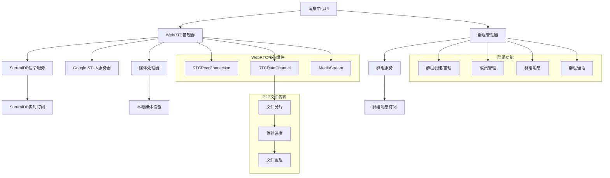

# 设计文档

## 概述

WebRTC消息中心模块设计基于现有的消息系统架构，集成WebRTC技术栈实现多媒体文件传输和实时音视频通信功能。系统采用P2P优先、服务器中继备用的混合架构，确保在各种网络环境下的通信质量。

## 架构设计

### 整体架构



### 技术栈选择

- **WebRTC API**: 浏览器原生WebRTC支持
- **信令协议**: 基于SurrealDB Live Query的实时信令
- **媒体编解码**: VP8/VP9 (视频), Opus (音频)
- **文件传输**: RTCDataChannel P2P直传
- **STUN服务器**: Google公开STUN服务器
- **UI框架**: React + Material-UI
- **状态管理**: React Context + TanStack Query

### 群组功能设计决策

#### 群组类型设计
- **普通群组**: 用户自由创建的聊天群组
- **案件相关群组**: 与特定破产案件关联的工作群组，自动包含案件相关人员
- **部门群组**: 按组织架构创建的部门内部群组

#### 消息路由策略
- **统一消息表**: 使用`target_type`和`target_id`字段区分私聊和群聊消息
- **群组消息广播**: 群组消息通过SurrealDB Live Query实时推送给所有群组成员
- **已读状态管理**: 独立的已读状态表记录每个用户对每条群组消息的阅读状态

#### 关联表设计
- **群组成员关联**: 使用`has_group_member`关联表连接`message_group`和`user`，遵循现有系统的关联表模式
- **关联表权限**: 成员只能查看自己的群组关系，管理员可以管理所有关系
- **查询优化**: 通过关联表可以高效查询用户所属群组和群组成员列表

#### 权限控制设计
- **群组角色**: 群主(owner)、管理员(admin)、普通成员(member)三级权限
- **操作权限**: 群主可删除群组和管理所有成员，管理员可管理普通成员，普通成员只能查看和发言
- **案件群组特殊权限**: 案件相关群组的权限与案件角色权限联动
- **关联表权限控制**: 基于SurrealDB的关联表权限系统，确保用户只能访问自己相关的群组数据

## 组件设计

### WebRTCManager - WebRTC核心管理器

```typescript
interface WebRTCManager {
  // 连接管理
  createPeerConnection(userId: string): RTCPeerConnection;
  closePeerConnection(userId: string): void;
  
  // 信令处理
  sendOffer(userId: string, offer: RTCSessionDescription): void;
  sendAnswer(userId: string, answer: RTCSessionDescription): void;
  sendIceCandidate(userId: string, candidate: RTCIceCandidate): void;
  
  // 媒体流管理
  getUserMedia(constraints: MediaStreamConstraints): Promise<MediaStream>;
  shareScreen(): Promise<MediaStream>;
  stopMediaStream(stream: MediaStream): void;
  
  // 通话管理
  initiateCall(userId: string, type: 'audio' | 'video'): void;
  acceptCall(callId: string): void;
  rejectCall(callId: string): void;
  endCall(callId: string): void;
}
```

### MediaFileHandler - 多媒体文件处理器

```typescript
interface MediaFileHandler {
  // P2P文件传输
  sendFile(file: File, targetUserId: string): Promise<string>;
  receiveFile(senderId: string, transferId: string): Promise<File>;
  
  // 文件分片传输
  splitFileToChunks(file: File, chunkSize: number): ArrayBuffer[];
  reassembleFile(chunks: ArrayBuffer[], metadata: FileMetadata): File;
  
  // 断点续传
  resumeFileTransfer(transferId: string): Promise<void>;
  pauseFileTransfer(transferId: string): Promise<void>;
  cancelFileTransfer(transferId: string): Promise<void>;
  getTransferProgress(transferId: string): Promise<TransferProgress>;
  
  // 文件预处理
  compressImage(file: File, quality: number): Promise<File>;
  compressVideo(file: File, quality: 'low' | 'medium' | 'high'): Promise<File>;
  generateThumbnail(file: File): Promise<string>;
  extractMetadata(file: File): Promise<FileMetadata>;
  validateFileType(file: File, allowedTypes: string[]): boolean;
  validateFileSize(file: File, maxSize: number): boolean;
  
  // 文件预览
  createPreviewUrl(file: File): string;
  revokePreviewUrl(url: string): void;
  generatePreviewThumbnail(file: File, size: {width: number, height: number}): Promise<string>;
  
  // 传输进度和状态
  onTransferProgress(transferId: string, callback: (progress: TransferProgress) => void): void;
  onTransferComplete(transferId: string, callback: (file: File) => void): void;
  onTransferError(transferId: string, callback: (error: TransferError) => void): void;
  
  // 缓存管理
  cacheFile(file: File, cacheKey: string): Promise<void>;
  getCachedFile(cacheKey: string): Promise<File | null>;
  clearFileCache(pattern?: string): Promise<void>;
  
  // 多文件处理
  sendMultipleFiles(files: File[], targetUserId: string): Promise<string[]>;
  createFilePackage(files: File[], packageName: string): Promise<File>;
  extractFilePackage(packageFile: File): Promise<File[]>;
}

interface TransferProgress {
  transferId: string;
  fileName: string;
  totalSize: number;
  transferredSize: number;
  percentage: number;
  speed: number; // bytes per second
  estimatedTimeRemaining: number; // seconds
  status: 'preparing' | 'transferring' | 'paused' | 'completed' | 'failed' | 'cancelled';
}

interface TransferError {
  transferId: string;
  errorCode: string;
  errorMessage: string;
  canRetry: boolean;
  retryAfter?: number; // seconds
}
```

### GroupManager - 群组管理器

```typescript
interface GroupManager {
  // 群组创建和管理
  createGroup(name: string, description?: string, caseId?: string): Promise<string>;
  updateGroup(groupId: string, updates: Partial<GroupInfo>): Promise<void>;
  deleteGroup(groupId: string): Promise<void>;
  searchGroups(keyword: string, type?: 'normal' | 'case_related' | 'department'): Promise<GroupInfo[]>;
  
  // 成员管理（使用关联表）
  addMembers(groupId: string, userIds: string[]): Promise<void>;
  removeMembers(groupId: string, userIds: string[]): Promise<void>;
  updateMemberRole(groupId: string, userId: string, role: 'owner' | 'admin' | 'member'): Promise<void>;
  updateMemberNickname(groupId: string, userId: string, nickname: string): Promise<void>;
  muteMember(groupId: string, userId: string, isMuted: boolean): Promise<void>;
  transferOwnership(groupId: string, newOwnerId: string): Promise<void>;
  
  // 群组信息查询（基于关联表查询）
  getGroupInfo(groupId: string): Promise<GroupInfo>;
  getGroupMembers(groupId: string): Promise<GroupMember[]>;
  getUserGroups(userId: string): Promise<GroupInfo[]>;
  checkMemberPermission(groupId: string, userId: string, action: string): Promise<boolean>;
  
  // 群组消息管理
  markMessageAsRead(messageId: string, userId: string, groupId: string): Promise<void>;
  markAllMessagesAsRead(groupId: string, userId: string): Promise<void>;
  getUnreadCount(groupId: string, userId: string): Promise<number>;
  pinMessage(messageId: string, groupId: string): Promise<void>;
  unpinMessage(messageId: string, groupId: string): Promise<void>;
  getPinnedMessages(groupId: string): Promise<Message[]>;
  
  // 批量操作
  batchAddMembers(operations: Array<{groupId: string, userIds: string[]}>): Promise<void>;
  batchUpdateReadStatus(groupId: string, userId: string, messageIds: string[]): Promise<void>;
}

interface GroupInfo {
  id: string;
  group_name: string;
  group_description?: string;
  group_avatar?: string;
  group_type: 'normal' | 'case_related' | 'department';
  case_id?: string;
  created_by: string;
  created_at: string;
  member_count: number;
  unread_count?: number;
}

interface GroupMember {
  relation_id: string; // 关联表记录ID
  user_id: string;
  role: 'owner' | 'admin' | 'member';
  joined_at: string;
  last_read_at?: string;
  is_muted: boolean;
  nickname?: string;
  user_info: {
    name: string;
    avatar?: string;
    is_online: boolean;
  };
}
```

### CallManager - 通话管理器

```typescript
interface CallManager {
  // 通话状态
  currentCalls: Map<string, CallSession>;
  
  // 私聊通话控制
  startPrivateCall(targetUserId: string, type: 'audio' | 'video'): Promise<string>;
  
  // 群组通话控制
  startGroupCall(groupId: string, type: 'audio' | 'video'): Promise<string>;
  joinCall(callId: string): Promise<void>;
  leaveCall(callId: string): void;
  
  // 媒体控制
  toggleMute(callId: string): void;
  toggleVideo(callId: string): void;
  switchCamera(callId: string): void;
  adjustVolume(callId: string, volume: number): void;
  
  // 会议功能
  createConference(participants: string[], groupId?: string): Promise<string>;
  inviteToConference(conferenceId: string, userId: string): void;
  recordConference(conferenceId: string): void;
  stopRecording(conferenceId: string): void;
  
  // 群组会议特有功能
  muteAllParticipants(callId: string): void;
  kickParticipant(callId: string, userId: string): void;
  transferCallOwnership(callId: string, newOwnerId: string): void;
  setParticipantPermissions(callId: string, userId: string, permissions: CallPermissions): void;
  
  // 通话质量管理
  getCallQuality(callId: string): Promise<CallQualityMetrics>;
  adjustQualitySettings(callId: string, settings: QualitySettings): void;
  enableAdaptiveQuality(callId: string, enabled: boolean): void;
  
  // 网络适应性
  handleNetworkChange(callId: string, networkQuality: NetworkQuality): void;
  attemptReconnection(callId: string): Promise<boolean>;
  switchToAudioOnly(callId: string): void;
  
  // 事件监听
  onCallStateChange(callback: (callId: string, state: CallState) => void): void;
  onQualityChange(callback: (callId: string, quality: CallQualityMetrics) => void): void;
  onNetworkIssue(callback: (callId: string, issue: NetworkIssue) => void): void;
}

interface CallPermissions {
  canMute: boolean;
  canUnmute: boolean;
  canKick: boolean;
  canInvite: boolean;
  canRecord: boolean;
  canShareScreen: boolean;
}

interface CallQualityMetrics {
  bandwidth: number;
  latency: number;
  packetLoss: number;
  jitter: number;
  audioQuality: number; // 0-100
  videoQuality: number; // 0-100
  connectionState: 'excellent' | 'good' | 'fair' | 'poor' | 'disconnected';
}

interface NetworkIssue {
  type: 'high_latency' | 'packet_loss' | 'low_bandwidth' | 'connection_unstable';
  severity: 'low' | 'medium' | 'high' | 'critical';
  timestamp: string;
  suggestedAction?: string;
}
```

### MessageService - 消息服务

```typescript
interface MessageService {
  // 发送消息
  sendPrivateMessage(targetUserId: string, content: string, type?: MessageType): Promise<string>;
  sendGroupMessage(groupId: string, content: string, type?: MessageType): Promise<string>;
  
  // 文件消息
  sendPrivateFile(targetUserId: string, file: File): Promise<string>;
  sendGroupFile(groupId: string, file: File): Promise<string>;
  
  // 消息操作
  editMessage(messageId: string, newContent: string): Promise<void>;
  recallMessage(messageId: string, reason?: string): Promise<void>;
  forwardMessage(messageId: string, targetId: string, targetType: 'user' | 'group'): Promise<string>;
  
  // 消息查询
  getPrivateMessages(userId: string, limit?: number, offset?: number): Promise<Message[]>;
  getGroupMessages(groupId: string, limit?: number, offset?: number): Promise<Message[]>;
  searchMessages(query: string, filters?: MessageSearchFilters): Promise<Message[]>;
  getMessageHistory(targetId: string, targetType: 'user' | 'group', beforeMessageId?: string): Promise<Message[]>;
  
  // 消息状态
  markAsRead(messageId: string, groupId?: string): Promise<void>;
  markMultipleAsRead(messageIds: string[], groupId?: string): Promise<void>;
  deleteMessage(messageId: string): Promise<void>;
  getMessageReadStatus(messageId: string): Promise<MessageReadStatus>;
  
  // @提及功能
  mentionUsers(groupId: string, userIds: string[], content: string): Promise<string>;
  getMentions(userId: string): Promise<Message[]>;
  clearMentions(userId: string, messageIds: string[]): Promise<void>;
  
  // 草稿功能
  saveDraft(targetId: string, targetType: 'user' | 'group', content: string): Promise<void>;
  getDraft(targetId: string, targetType: 'user' | 'group'): Promise<string | null>;
  clearDraft(targetId: string, targetType: 'user' | 'group'): Promise<void>;
}

interface MessageSearchFilters {
  messageType?: MessageType;
  dateFrom?: string;
  dateTo?: string;
  sender?: string;
  hasAttachment?: boolean;
  targetType?: 'user' | 'group';
  targetId?: string;
}

interface MessageReadStatus {
  totalRecipients: number;
  readCount: number;
  unreadCount: number;
  readByUsers: Array<{
    userId: string;
    userName: string;
    readAt: string;
  }>;
}

enum MessageType {
  TEXT = 'text',
  IMAGE = 'image',
  VIDEO = 'video',
  AUDIO = 'audio',
  FILE = 'file',
  CALL_REQUEST = 'call_request',
  CALL_END = 'call_end'
}
```

### SignalingService - 信令服务

```typescript
interface SignalingService {
  // 私聊信令
  sendPrivateSignal(type: SignalType, data: any, targetUserId: string): void;
  
  // 群组信令
  sendGroupSignal(type: SignalType, data: any, groupId: string): void;
  
  // 信令监听
  onSignalReceived(callback: (signal: SignalMessage) => void): void;
  
  // 连接状态
  isConnected(): boolean;
  reconnect(): Promise<void>;
}

enum SignalType {
  OFFER = 'offer',
  ANSWER = 'answer',
  ICE_CANDIDATE = 'ice-candidate',
  CALL_REQUEST = 'call-request',
  CALL_ACCEPT = 'call-accept',
  CALL_REJECT = 'call-reject',
  CALL_END = 'call-end',
  CONFERENCE_INVITE = 'conference-invite',
  GROUP_CALL_REQUEST = 'group-call-request',
  GROUP_CALL_JOIN = 'group-call-join',
  GROUP_CALL_LEAVE = 'group-call-leave'
}

interface SignalMessage {
  signal_type: SignalType;
  from_user: string;
  to_user?: string; // 私聊目标用户
  group_id?: string; // 群组ID
  signal_data: any;
  call_id?: string;
  created_at: string;
}
```

## 数据模型

### 群组表设计

```sql
-- 群组表
DEFINE TABLE message_group SCHEMAFULL;
DEFINE FIELD group_name ON message_group TYPE string;
DEFINE FIELD group_description ON message_group TYPE option<string>;
DEFINE FIELD group_avatar ON message_group TYPE option<string>; -- 群组头像URL
DEFINE FIELD group_type ON message_group TYPE string DEFAULT 'normal'; -- 'normal', 'case_related', 'department'
DEFINE FIELD case_id ON message_group TYPE option<record<case>>; -- 关联案件ID（如果是案件相关群组）
DEFINE FIELD created_by ON message_group TYPE record<user>;
DEFINE FIELD created_at ON message_group TYPE datetime DEFAULT time::now();
DEFINE FIELD updated_at ON message_group TYPE datetime VALUE time::now();
DEFINE FIELD is_active ON message_group TYPE bool DEFAULT true;
DEFINE FIELD max_members ON message_group TYPE int DEFAULT 100; -- 最大成员数限制

-- 群组成员关系表（使用关联表，简化权限控制）
DEFINE TABLE has_group_member TYPE RELATION IN message_group OUT user SCHEMAFULL PERMISSIONS 
  FOR select WHERE ($auth.id = out) OR 
                  ($auth.id IN (SELECT out FROM has_group_member WHERE in = $parent.in AND role IN ['owner', 'admin'])) OR
                  ($auth.id->has_role->role->can_execute_operation->operation_metadata[WHERE tables CONTAINS 'has_group_member' AND operation_type = 'read']),
  FOR create WHERE ($auth.id->has_role->role->can_execute_operation->operation_metadata[WHERE tables CONTAINS 'has_group_member' AND operation_type = 'create']) OR
                  ($auth.id IN (SELECT out FROM has_group_member WHERE in = $parent.in AND role IN ['owner', 'admin'])),
  FOR update WHERE ($auth.id = out) OR 
                  ($auth.id IN (SELECT out FROM has_group_member WHERE in = $parent.in AND role IN ['owner', 'admin'])) OR
                  ($auth.id->has_role->role->can_execute_operation->operation_metadata[WHERE tables CONTAINS 'has_group_member' AND operation_type = 'update']),
  FOR delete WHERE ($auth.id = out) OR 
                  ($auth.id IN (SELECT out FROM has_group_member WHERE in = $parent.in AND role = 'owner')) OR
                  ($auth.id->has_role->role->can_execute_operation->operation_metadata[WHERE tables CONTAINS 'has_group_member' AND operation_type = 'delete']);

DEFINE FIELD role ON has_group_member TYPE string DEFAULT 'member' ASSERT $value INSIDE ['owner', 'admin', 'member'] PERMISSIONS 
  FOR select FULL,
  FOR create FULL,
  FOR update WHERE ($auth.id IN (SELECT out FROM has_group_member WHERE in = $parent.in AND role IN ['owner', 'admin'])),
  FOR delete WHERE ($auth.id IN (SELECT out FROM has_group_member WHERE in = $parent.in AND role = 'owner'));

DEFINE FIELD joined_at ON has_group_member TYPE datetime DEFAULT time::now() PERMISSIONS FULL;
DEFINE FIELD last_read_at ON has_group_member TYPE option<datetime> PERMISSIONS 
  FOR select, update WHERE ($auth.id = out) OR ($auth.id IN (SELECT out FROM has_group_member WHERE in = $parent.in AND role IN ['owner', 'admin']));
DEFINE FIELD is_muted ON has_group_member TYPE bool DEFAULT false PERMISSIONS 
  FOR select, update WHERE ($auth.id = out) OR ($auth.id IN (SELECT out FROM has_group_member WHERE in = $parent.in AND role IN ['owner', 'admin']));
DEFINE FIELD nickname ON has_group_member TYPE option<string> PERMISSIONS 
  FOR select FULL,
  FOR update WHERE ($auth.id = out) OR ($auth.id IN (SELECT out FROM has_group_member WHERE in = $parent.in AND role IN ['owner', 'admin']));

-- 群组成员关系索引
DEFINE INDEX group_member_unique ON has_group_member COLUMNS in, out UNIQUE;
DEFINE INDEX group_member_role_idx ON has_group_member COLUMNS in, role;
```

### 消息表扩展

```sql
-- 扩展现有message表，支持群组消息和多种消息类型
-- 在现有message表基础上增加字段
DEFINE FIELD message_type ON message TYPE string DEFAULT 'text' ASSERT $value INSIDE ['text', 'image', 'video', 'audio', 'file', 'call_request', 'call_end', 'system']; 
DEFINE FIELD file_metadata ON message TYPE option<object>; -- 文件元数据
DEFINE FIELD call_metadata ON message TYPE option<object>; -- 通话元数据
DEFINE FIELD target_type ON message TYPE string DEFAULT 'user' ASSERT $value INSIDE ['user', 'group']; -- 消息目标类型
DEFINE FIELD target_id ON message TYPE record; -- 统一的目标ID字段，可以是用户或群组
DEFINE FIELD group_id ON message TYPE option<record<message_group>>; -- 群组消息时的群组ID（冗余字段用于快速查询）
DEFINE FIELD reply_to ON message TYPE option<record<message>>; -- 回复的消息ID
DEFINE FIELD is_pinned ON message TYPE bool DEFAULT false; -- 是否置顶（群组消息）
DEFINE FIELD mentioned_users ON message TYPE option<array<record<user>>>; -- @提及的用户
DEFINE FIELD is_recalled ON message TYPE bool DEFAULT false; -- 是否已撤回
DEFINE FIELD recalled_at ON message TYPE option<datetime>; -- 撤回时间
DEFINE FIELD edit_history ON message TYPE option<array<object>>; -- 编辑历史

-- 消息表索引优化
DEFINE INDEX message_target_idx ON message COLUMNS target_type, target_id, created_at;
DEFINE INDEX message_group_idx ON message COLUMNS group_id, created_at;
DEFINE INDEX message_type_idx ON message COLUMNS message_type;
DEFINE INDEX message_mentioned_idx ON message COLUMNS mentioned_users;

-- 文件元数据结构示例
-- {
--   "file_name": "example.jpg",
--   "file_size": 1024000,
--   "file_hash": "sha256hash",
--   "thumbnail_data": "base64data",
--   "duration": 120, // 音视频时长(秒)
--   "dimensions": {"width": 1920, "height": 1080},
--   "transfer_status": "pending" // 'pending', 'completed', 'failed'
-- }

-- 通话元数据结构示例
-- {
--   "call_id": "uuid",
--   "call_type": "video", // 'audio', 'video'
--   "duration": 300, // 通话时长(秒)
--   "participants": ["user1", "user2"],
--   "status": "completed" // 'missed', 'rejected', 'completed'
-- }

-- 通话记录表
DEFINE TABLE call_record SCHEMAFULL;
DEFINE FIELD call_id ON call_record TYPE string;
DEFINE FIELD call_type ON call_record TYPE string ASSERT $value INSIDE ['audio', 'video', 'conference']; 
DEFINE FIELD call_context ON call_record TYPE string ASSERT $value INSIDE ['private', 'group']; -- 通话上下文
DEFINE FIELD group_id ON call_record TYPE option<record<message_group>>; -- 群组通话时的群组ID
DEFINE FIELD initiator ON call_record TYPE record<user>;
DEFINE FIELD participants ON call_record TYPE array<record<user>>;
DEFINE FIELD start_time ON call_record TYPE datetime DEFAULT time::now();
DEFINE FIELD end_time ON call_record TYPE option<datetime>;
DEFINE FIELD duration ON call_record TYPE option<int>; -- 通话时长(秒)
DEFINE FIELD status ON call_record TYPE string ASSERT $value INSIDE ['completed', 'missed', 'rejected', 'failed']; 
DEFINE FIELD recording_url ON call_record TYPE option<string>;
DEFINE FIELD case_id ON call_record TYPE option<record<case>>;
DEFINE FIELD quality_metrics ON call_record TYPE option<object>; -- 通话质量指标
DEFINE FIELD created_at ON call_record TYPE datetime DEFAULT time::now();

-- 通话记录索引
DEFINE INDEX call_record_call_id ON call_record COLUMNS call_id UNIQUE;
DEFINE INDEX call_record_initiator_idx ON call_record COLUMNS initiator, start_time;
DEFINE INDEX call_record_group_idx ON call_record COLUMNS group_id, start_time;
DEFINE INDEX call_record_case_idx ON call_record COLUMNS case_id, start_time;

-- WebRTC信令消息表
DEFINE TABLE webrtc_signal SCHEMAFULL;
DEFINE FIELD signal_type ON webrtc_signal TYPE string ASSERT $value INSIDE ['offer', 'answer', 'ice-candidate', 'call-request', 'call-accept', 'call-reject', 'call-end', 'conference-invite', 'group-call-request', 'group-call-join', 'group-call-leave'];
DEFINE FIELD from_user ON webrtc_signal TYPE record<user>;
DEFINE FIELD to_user ON webrtc_signal TYPE option<record<user>>; -- 私聊时的目标用户
DEFINE FIELD group_id ON webrtc_signal TYPE option<record<message_group>>; -- 群组通话时的群组ID
DEFINE FIELD signal_data ON webrtc_signal TYPE object;
DEFINE FIELD call_id ON webrtc_signal TYPE option<string>;
DEFINE FIELD created_at ON webrtc_signal TYPE datetime DEFAULT time::now();
DEFINE FIELD expires_at ON webrtc_signal TYPE datetime VALUE (time::now() + 1h); -- 信令消息1小时后过期
DEFINE FIELD processed ON webrtc_signal TYPE bool DEFAULT false;

-- WebRTC信令索引
DEFINE INDEX webrtc_signal_to_user_idx ON webrtc_signal COLUMNS to_user, created_at;
DEFINE INDEX webrtc_signal_group_idx ON webrtc_signal COLUMNS group_id, created_at;
DEFINE INDEX webrtc_signal_call_idx ON webrtc_signal COLUMNS call_id;
DEFINE INDEX webrtc_signal_expires_idx ON webrtc_signal COLUMNS expires_at; -- 用于清理过期信令
DEFINE FIELD group_id ON webrtc_signal TYPE option<record<message_group>>; -- 群组通话时的群组ID
DEFINE FIELD signal_data ON webrtc_signal TYPE object;
DEFINE FIELD call_id ON webrtc_signal TYPE option<string>;
DEFINE FIELD created_at ON webrtc_signal TYPE datetime DEFAULT time::now();
DEFINE FIELD processed ON webrtc_signal TYPE bool DEFAULT false;

-- 群组消息已读状态表（优化版本）
DEFINE TABLE message_read_status SCHEMAFULL;
DEFINE FIELD message_id ON message_read_status TYPE record<message>;
DEFINE FIELD user_id ON message_read_status TYPE record<user>;
DEFINE FIELD read_at ON message_read_status TYPE datetime DEFAULT time::now();
DEFINE FIELD group_id ON message_read_status TYPE record<message_group>;

-- 群组消息已读状态索引
DEFINE INDEX message_read_unique ON message_read_status COLUMNS message_id, user_id UNIQUE;
DEFINE INDEX message_read_group_user_idx ON message_read_status COLUMNS group_id, user_id, read_at;

-- 群组最后已读位置表（性能优化）
DEFINE TABLE group_read_position SCHEMAFULL;
DEFINE FIELD group_id ON group_read_position TYPE record<message_group>;
DEFINE FIELD user_id ON group_read_position TYPE record<user>;
DEFINE FIELD last_read_message_id ON group_read_position TYPE option<record<message>>;
DEFINE FIELD last_read_time ON group_read_position TYPE datetime DEFAULT time::now();
DEFINE FIELD unread_count ON group_read_position TYPE int DEFAULT 0;

-- 群组已读位置唯一索引
DEFINE INDEX group_read_position_unique ON group_read_position COLUMNS group_id, user_id UNIQUE;
```

### 用户在线状态表

```sql
-- 用户WebRTC状态
DEFINE TABLE user_webrtc_status SCHEMAFULL;
DEFINE FIELD user_id ON user_webrtc_status TYPE record<user>;
DEFINE FIELD is_online ON user_webrtc_status TYPE bool DEFAULT false;
DEFINE FIELD supports_video ON user_webrtc_status TYPE bool DEFAULT false;
DEFINE FIELD supports_audio ON user_webrtc_status TYPE bool DEFAULT false;
DEFINE FIELD current_call_id ON user_webrtc_status TYPE option<string>;
DEFINE FIELD last_seen ON user_webrtc_status TYPE datetime VALUE time::now();
DEFINE FIELD device_info ON user_webrtc_status TYPE object;
```

## 用户界面设计

### 消息输入增强

```typescript
// 扩展现有的ChatInput组件，支持群组和私聊
interface EnhancedChatInputProps {
  chatType: 'private' | 'group';
  targetId: string; // 用户ID或群组ID
  onSendMessage: (message: string, mentionedUsers?: string[]) => void;
  onSendFile: (file: File, type: 'image' | 'video' | 'audio') => void;
  onStartCall: (type: 'audio' | 'video') => void;
  disabled?: boolean;
  supportedFileTypes: string[];
  maxFileSize: number;
  
  // 群组特有功能
  groupMembers?: GroupMember[]; // 用于@提及功能
  onMentionUser?: (userId: string) => void;
  showMemberList?: boolean;
}

// 群组聊天界面组件
interface GroupChatInterfaceProps {
  groupId: string;
  groupInfo: GroupInfo;
  messages: Message[];
  currentUser: User;
  onSendMessage: (content: string, mentionedUsers?: string[]) => void;
  onSendFile: (file: File) => void;
  onStartGroupCall: (type: 'audio' | 'video') => void;
  onPinMessage: (messageId: string) => void;
  onDeleteMessage: (messageId: string) => void;
}

// 私聊界面组件
interface PrivateChatInterfaceProps {
  targetUserId: string;
  targetUser: User;
  messages: Message[];
  currentUser: User;
  onSendMessage: (content: string) => void;
  onSendFile: (file: File) => void;
  onStartCall: (type: 'audio' | 'video') => void;
}
```

### 消息卡片组件

```typescript
interface MessageCardProps {
  message: Message;
  chatType: 'private' | 'group';
  currentUserId: string;
  onPreview?: (file: File) => void;
  onCallBack?: (callId: string) => void;
  onReply?: (message: Message) => void;
  onPin?: (messageId: string) => void; // 群组消息置顶
  onDelete?: (messageId: string) => void;
  showThumbnail: boolean;
  showSenderInfo: boolean; // 群组消息显示发送者信息
}

// 扩展Message类型，支持群组消息
interface Message {
  id: string;
  content: string;
  message_type: 'text' | 'image' | 'video' | 'audio' | 'call_request' | 'call_end';
  file_metadata?: FileMetadata;
  call_metadata?: CallMetadata;
  sender_id: string;
  sender_info?: {
    name: string;
    avatar?: string;
    nickname?: string; // 群内昵称
  };
  target_type: 'user' | 'group';
  target_id: string;
  group_id?: string;
  reply_to?: Message; // 回复的消息
  is_pinned: boolean;
  mentioned_users?: string[]; // @提及的用户
  read_status?: {
    read_count: number;
    total_count: number;
    read_by: string[]; // 已读用户列表
  };
  created_at: string;
}

interface FileMetadata {
  file_name: string;
  file_size: number;
  file_hash: string;
  thumbnail_data?: string;
  duration?: number;
  dimensions?: { width: number; height: number };
  transfer_status: 'pending' | 'completed' | 'failed';
}

interface CallMetadata {
  call_id: string;
  call_type: 'audio' | 'video';
  duration?: number;
  participants: string[];
  status: 'missed' | 'rejected' | 'completed';
}
```

### 群组管理界面组件

```typescript
// 群组信息组件
interface GroupInfoProps {
  groupInfo: GroupInfo;
  members: GroupMember[];
  currentUserRole: 'owner' | 'admin' | 'member';
  onUpdateGroup: (updates: Partial<GroupInfo>) => void;
  onAddMembers: (userIds: string[]) => void;
  onRemoveMember: (userId: string) => void;
  onUpdateMemberRole: (userId: string, role: string) => void;
  onLeaveGroup: () => void;
  onDeleteGroup: () => void;
}

// 群组列表组件
interface GroupListProps {
  groups: GroupInfo[];
  onSelectGroup: (groupId: string) => void;
  onCreateGroup: () => void;
  currentUserId: string;
}

// 群组创建组件
interface GroupCreateProps {
  onCreateGroup: (name: string, description?: string, memberIds?: string[]) => void;
  availableUsers: User[];
  caseId?: string; // 如果是案件相关群组
}
```

### 通话界面组件

```typescript
// 语音通话界面（支持群组和私聊）
interface AudioCallInterfaceProps {
  callId: string;
  callType: 'private' | 'group';
  participants: User[];
  duration: number;
  isMuted: boolean;
  isOwner?: boolean; // 群组通话中是否为发起者
  onToggleMute: () => void;
  onEndCall: () => void;
  onToggleSpeaker: () => void;
  
  // 群组通话特有功能
  onMuteAll?: () => void;
  onKickParticipant?: (userId: string) => void;
  onInviteMore?: () => void;
}

// 视频通话界面（支持群组和私聊，移动端优化）
interface VideoCallInterfaceProps {
  callId: string;
  callType: 'private' | 'group';
  localStream: MediaStream;
  remoteStreams: Map<string, MediaStream>;
  participants: User[];
  isOwner?: boolean;
  isMobile?: boolean; // 移动端适配
  onToggleVideo: () => void;
  onToggleMute: () => void;
  onSwitchCamera: () => void;
  onShareScreen: () => void;
  onEndCall: () => void;
  
  // 群组视频通话特有功能
  onMuteAll?: () => void;
  onKickParticipant?: (userId: string) => void;
  onInviteMore?: () => void;
  onSwitchLayout?: (layout: 'grid' | 'speaker' | 'gallery' | 'pip') => void; // 增加画中画模式
  
  // 移动端特有功能
  onMinimize?: () => void;
  onMaximize?: () => void;
  enablePictureInPicture?: boolean;
  supportedOrientations?: ('portrait' | 'landscape')[];
}

// 移动端优化组件
interface MobileOptimizedChatProps {
  chatType: 'private' | 'group';
  targetId: string;
  isFullScreen?: boolean;
  keyboardHeight?: number;
  onKeyboardShow?: (height: number) => void;
  onKeyboardHide?: () => void;
  enableHapticFeedback?: boolean;
  supportSwipeGestures?: boolean;
  
  // 移动端手势支持
  onSwipeLeft?: () => void;
  onSwipeRight?: () => void;
  onLongPress?: (messageId: string) => void;
  onDoubleTap?: (messageId: string) => void;
}

// 移动端文件选择组件
interface MobileFilePickerProps {
  onFileSelect: (files: File[]) => void;
  supportedTypes: string[];
  maxFileSize: number;
  allowMultiple?: boolean;
  enableCamera?: boolean;
  enableGallery?: boolean;
  enableDocument?: boolean;
  showCompressionOptions?: boolean;
  
  // 移动端特有功能
  enableImageEditing?: boolean;
  enableVideoTrimming?: boolean;
  supportLivePhoto?: boolean;
}
  isOwner?: boolean;
  onToggleVideo: () => void;
  onToggleMute: () => void;
  onSwitchCamera: () => void;
  onShareScreen: () => void;
  onEndCall: () => void;
  
  // 群组视频通话特有功能
  onMuteAll?: () => void;
  onKickParticipant?: (userId: string) => void;
  onInviteMore?: () => void;
  onSwitchLayout?: (layout: 'grid' | 'speaker' | 'gallery') => void;
}
```

## 错误处理

### WebRTC连接错误

```typescript
enum WebRTCError {
  MEDIA_PERMISSION_DENIED = 'media_permission_denied',
  NETWORK_CONNECTION_FAILED = 'network_connection_failed',
  PEER_CONNECTION_FAILED = 'peer_connection_failed',
  SIGNALING_ERROR = 'signaling_error',
  CODEC_NOT_SUPPORTED = 'codec_not_supported',
  BANDWIDTH_INSUFFICIENT = 'bandwidth_insufficient'
}

interface ErrorHandler {
  handleWebRTCError(error: WebRTCError, context: any): void;
  showUserFriendlyError(error: WebRTCError): void;
  attemptRecovery(error: WebRTCError): Promise<boolean>;
}
```

### 网络适应性

```typescript
interface NetworkAdaptation {
  // 网络质量检测
  measureNetworkQuality(): Promise<NetworkQuality>;
  startNetworkMonitoring(callId: string): void;
  stopNetworkMonitoring(callId: string): void;
  
  // 自适应码率
  adjustBitrate(quality: NetworkQuality, mediaType: 'audio' | 'video'): void;
  enableAutoBitrate(callId: string, enabled: boolean): void;
  setMinMaxBitrate(callId: string, min: number, max: number): void;
  
  // 连接降级策略
  fallbackToAudio(): void;
  reducVideoQuality(level: 'low' | 'medium'): void;
  enableDataSaver(enabled: boolean): void;
  
  // 重连机制
  attemptReconnection(maxAttempts: number): Promise<boolean>;
  setReconnectionStrategy(strategy: ReconnectionStrategy): void;
  
  // P2P文件传输适应性
  retryFileTransfer(fileId: string, maxRetries: number): Promise<boolean>;
  adjustChunkSize(networkQuality: NetworkQuality): number;
  enableProgressiveDownload(transferId: string): void;
  
  // 移动网络优化
  detectConnectionType(): Promise<ConnectionType>;
  optimizeForMobile(enabled: boolean): void;
  setDataUsageLimit(limitMB: number): void;
  getDataUsageStats(): Promise<DataUsageStats>;
  
  // 网络状态监听
  onNetworkChange(callback: (change: NetworkChange) => void): void;
  onConnectionStateChange(callback: (state: ConnectionState) => void): void;
  onBandwidthChange(callback: (bandwidth: number) => void): void;
}

interface NetworkQuality {
  bandwidth: number; // kbps
  latency: number; // ms
  packetLoss: number; // percentage (0-100)
  jitter: number; // ms
  quality: 'excellent' | 'good' | 'fair' | 'poor' | 'critical';
  connectionType: ConnectionType;
  isStable: boolean;
  timestamp: string;
}

interface ReconnectionStrategy {
  maxAttempts: number;
  initialDelay: number; // ms
  maxDelay: number; // ms
  backoffMultiplier: number;
  jitterEnabled: boolean;
}

interface ConnectionType {
  type: 'wifi' | '4g' | '3g' | '2g' | 'ethernet' | 'unknown';
  effectiveType: 'slow-2g' | '2g' | '3g' | '4g';
  downlink: number; // Mbps
  rtt: number; // ms
}

interface DataUsageStats {
  totalUsed: number; // MB
  audioUsage: number; // MB
  videoUsage: number; // MB
  fileTransferUsage: number; // MB
  period: 'today' | 'week' | 'month';
  lastReset: string;
}

interface NetworkChange {
  previousState: NetworkQuality;
  currentState: NetworkQuality;
  changeType: 'improvement' | 'degradation' | 'connection_type_change';
  suggestedActions: string[];
}
```

## 测试策略

### 单元测试覆盖

- WebRTC管理器核心功能
- 群组管理器功能测试
- 信令服务消息处理
- 文件上传和预处理
- 通话状态管理
- 群组消息路由
- 已读状态管理
- 错误处理机制

### 集成测试

- 端到端通话流程（私聊和群组）
- 多用户会议功能
- 群组消息实时同步
- P2P文件传输完整性
- 群组成员权限控制
- 网络异常恢复
- 跨浏览器兼容性

### 性能测试

- 多人群组会议性能
- 大群组消息广播性能
- P2P大文件传输性能
- 群组消息已读状态查询性能
- 内存使用监控
- 网络带宽优化
- 移动端性能

### 群组功能专项测试

- 群组创建和删除流程
- 成员添加和移除功能
- 群组权限控制验证
- 群组消息@提及功能
- 群组通话邀请和管理
- 大群组（100人）消息性能
- 群组消息历史查询性能

## 安全考虑

### 通信安全

- DTLS加密的媒体传输
- SRTP安全实时传输协议
- 信令消息加密
- 用户身份验证
- 权限控制检查

### 隐私保护

- 通话录音权限控制
- 文件访问权限验证
- 敏感信息脱敏
- 数据保留策略
- 审计日志记录

## 配置管理

### SurrealDB配置表

```sql
-- 系统配置表
DEFINE TABLE system_config SCHEMAFULL;
DEFINE FIELD config_key ON system_config TYPE string;
DEFINE FIELD config_value ON system_config TYPE object;
DEFINE FIELD description ON system_config TYPE option<string>;
DEFINE FIELD created_at ON system_config TYPE datetime DEFAULT time::now();
DEFINE FIELD updated_at ON system_config TYPE datetime VALUE time::now();

-- WebRTC配置项
INSERT INTO system_config {
  config_key: 'rtc',
  config_value: {
    // WebRTC服务器配置
    stun_servers: ['stun:stun.l.google.com:19302', 'stun:stun1.l.google.com:19302'],
    
    // P2P文件传输限制
    max_file_size: 104857600, // 100MB in bytes
    file_chunk_size: 65536,   // 64KB in bytes
    supported_image_types: ['jpg', 'jpeg', 'png', 'gif', 'webp', 'bmp'],
    supported_video_types: ['mp4', 'webm', 'mov', 'avi', 'wmv'],
    supported_audio_types: ['mp3', 'wav', 'ogg', 'aac', 'm4a'],
    supported_document_types: ['pdf', 'doc', 'docx', 'xls', 'xlsx', 'ppt', 'pptx', 'txt'],
    
    // 功能开关
    enable_voice_call: true,
    enable_video_call: true,
    enable_screen_share: true,
    enable_file_transfer: true,
    enable_group_chat: true,
    enable_group_call: true,
    enable_message_recall: true,
    enable_message_edit: true,
    max_conference_participants: 8,
    max_group_members: 100,
    
    // 超时设置
    file_transfer_timeout: 300000, // 5分钟
    call_timeout: 30000,          // 30秒
    signal_expiry: 3600000,       // 信令1小时过期
    message_recall_timeout: 120,  // 消息撤回时限(秒)
    
    // 网络质量阈值
    network_quality_thresholds: {
      excellent: { bandwidth: 2000, latency: 50, packet_loss: 0.1 },
      good: { bandwidth: 1000, latency: 100, packet_loss: 0.5 },
      fair: { bandwidth: 500, latency: 200, packet_loss: 1.0 },
      poor: { bandwidth: 200, latency: 300, packet_loss: 2.0 }
    },
    
    // 质量设置
    video_quality: {
      low: { width: 320, height: 240, framerate: 15, bitrate: 150000 },
      medium: { width: 640, height: 480, framerate: 24, bitrate: 500000 },
      high: { width: 1280, height: 720, framerate: 30, bitrate: 1000000 },
      ultra: { width: 1920, height: 1080, framerate: 30, bitrate: 2000000 }
    },
    audio_quality: {
      low: { bitrate: 32000, sampleRate: 16000 },
      medium: { bitrate: 64000, sampleRate: 44100 },
      high: { bitrate: 128000, sampleRate: 48000 }
    },
    
    // 数据清理配置
    cleanup_config: {
      signal_retention_hours: 24,        // 信令消息保留24小时
      call_record_retention_days: 365,   // 通话记录保留1年
      file_cache_retention_days: 30,     // 文件缓存保留30天
      read_status_retention_days: 90     // 已读状态保留90天
    },
    
    // 性能优化配置
    performance_config: {
      message_batch_size: 50,            // 消息批量加载大小
      max_concurrent_transfers: 3,       // 最大并发文件传输数
      chunk_upload_concurrency: 2,      // 分片上传并发数
      enable_message_pagination: true,  // 启用消息分页
      cache_message_count: 100          // 本地缓存消息数量
    }
  },
  description: 'WebRTC功能配置项'
};

-- 添加数据清理定时任务配置
INSERT INTO system_config {
  config_key: 'cleanup_schedule',
  config_value: {
    enabled: true,
    schedules: [
      {
        name: 'clean_expired_signals',
        cron: '0 */6 * * *', // 每6小时清理一次过期信令
        query: 'DELETE webrtc_signal WHERE expires_at < time::now()',
        enabled: true
      },
      {
        name: 'clean_old_call_records',
        cron: '0 2 * * *', // 每天凌晨2点清理
        query: 'DELETE call_record WHERE start_time < (time::now() - 365d)',
        enabled: true
      },
      {
        name: 'optimize_read_status',
        cron: '0 3 * * 0', // 每周日凌晨3点优化已读状态
        query: 'DELETE message_read_status WHERE read_at < (time::now() - 90d)',
        enabled: true
      }
    ]
  },
  description: '数据清理定时任务配置'
};
```

### 客户端配置缓存

```typescript
interface RTCConfigService {
  // 获取配置
  getRTCConfig(): Promise<RTCConfig>;
  
  // 缓存配置到本地
  cacheConfigLocally(config: RTCConfig): void;
  
  // 从本地获取缓存配置
  getCachedConfig(): RTCConfig | null;
  
  // 监听配置变更
  onConfigUpdate(callback: (config: RTCConfig) => void): void;
}

interface RTCConfig {
  stun_servers: string[];
  max_file_size: number;
  file_chunk_size: number;
  supported_image_types: string[];
  supported_video_types: string[];
  supported_audio_types: string[];
  enable_voice_call: boolean;
  enable_video_call: boolean;
  enable_screen_share: boolean;
  enable_file_transfer: boolean;
  enable_group_chat: boolean;
  enable_group_call: boolean;
  max_conference_participants: number;
  max_group_members: number;
  file_transfer_timeout: number;
  call_timeout: number;
  video_quality: QualitySettings;
  audio_quality: QualitySettings;
}

interface QualitySettings {
  low: MediaQuality;
  medium: MediaQuality;
  high: MediaQuality;
}

interface MediaQuality {
  width?: number;
  height?: number;
  framerate?: number;
  bitrate: number;
  sampleRate?: number;
}
```

### 关联表查询示例

```sql
-- 查询用户所属的所有群组
SELECT 
  in.* as group_info,
  role,
  joined_at,
  is_muted,
  nickname
FROM has_group_member 
WHERE out = $user_id;

-- 查询群组的所有成员
SELECT 
  out.* as user_info,
  role,
  joined_at,
  last_read_at,
  is_muted,
  nickname
FROM has_group_member 
WHERE in = $group_id
ORDER BY joined_at ASC;

-- 添加群组成员（使用RELATE语句）
RELATE $group_id->has_group_member->$user_id SET {
  role: 'member',
  joined_at: time::now(),
  is_muted: false
};

-- 更新成员角色
UPDATE has_group_member 
SET role = $new_role 
WHERE in = $group_id AND out = $user_id;

-- 移除群组成员
DELETE has_group_member 
WHERE in = $group_id AND out = $user_id;
```

### 配置同步机制

```typescript
### 配置同步机制

```typescript
// 页面加载时自动获取并缓存配置
class RTCConfigManager {
  private config: RTCConfig | null = null;
  private subscribers: ((config: RTCConfig) => void)[] = [];
  
  async initialize(): Promise<void> {
    // 1. 尝试从本地缓存获取
    this.config = this.getCachedConfig();
    
    // 2. 从服务器获取最新配置
    try {
      const serverConfig = await this.fetchConfigFromServer();
      if (serverConfig && this.isConfigNewer(serverConfig)) {
        this.config = serverConfig;
        this.cacheConfigLocally(serverConfig);
        this.notifySubscribers(serverConfig);
      }
    } catch (error) {
      console.warn('Failed to fetch RTC config from server:', error);
    }
    
    // 3. 订阅配置变更
    this.subscribeToConfigChanges();
  }
  
  private async fetchConfigFromServer(): Promise<RTCConfig> {
    const result = await surrealClient.query(
      "SELECT config_value FROM system_config WHERE config_key = 'rtc'"
    );
    return result[0]?.config_value;
  }
  
  private subscribeToConfigChanges(): void {
    surrealClient.live(
      "SELECT * FROM system_config WHERE config_key = 'rtc'",
      (action, result) => {
        if (action === 'UPDATE' && result?.config_value) {
          this.config = result.config_value;
          this.cacheConfigLocally(result.config_value);
          this.notifySubscribers(result.config_value);
        }
      }
    );
  }
}
```

## 移动端性能优化

### 资源管理策略

```typescript
interface MobileOptimization {
  // 内存管理
  enableMemoryOptimization(): void;
  clearUnusedResources(): void;
  optimizeImageLoading(): void;
  
  // 电池优化
  enableBatterySaver(enabled: boolean): void;
  reduceCPUUsage(): void;
  optimizeNetworkUsage(): void;
  
  // 存储优化
  compressLocalStorage(): void;
  cleanupTempFiles(): void;
  manageCacheSize(maxSizeMB: number): void;
  
  // 渲染优化
  enableVirtualScrolling(): void;
  optimizeAnimations(): void;
  reduceDOMUpdates(): void;
}

// 移动端网络策略
interface MobileNetworkStrategy {
  // 数据节省模式
  enableDataSaver(enabled: boolean): void;
  compressImages(quality: number): void;
  disableAutoVideoDownload(): void;
  
  // 智能预加载
  preloadNearbyMessages(): void;
  prefetchUserProfiles(): void;
  cacheFrequentlyUsedFiles(): void;
  
  // 离线支持
  enableOfflineMode(): void;
  syncWhenOnline(): void;
  queueOfflineOperations(): void;
}
```

### 性能监控

```typescript
interface PerformanceMonitor {
  // 性能指标收集
  trackMemoryUsage(): void;
  trackNetworkUsage(): void;
  trackBatteryUsage(): void;
  trackRenderPerformance(): void;
  
  // 异常监控
  monitorCrashes(): void;
  monitorANRs(): void; // Android Not Responding
  monitorMemoryLeaks(): void;
  
  // 用户体验指标
  trackLoadTimes(): void;
  trackUserInteractions(): void;
  trackErrorRates(): void;
}
```

## 测试策略补充

### 移动端专项测试

- **多设备兼容性**: iPhone、Android各版本测试
- **网络环境测试**: 2G/3G/4G/5G/WiFi场景
- **电池性能测试**: 长时间通话对电池消耗影响
- **内存压力测试**: 大群组聊天的内存使用情况
- **离线功能测试**: 网络中断后的数据同步

### 压力测试场景

- **100人大群组**: 消息发送、已读状态、成员管理性能
- **高并发通话**: 多个群组同时进行视频会议
- **大文件传输**: 100MB文件在各种网络环境下的传输
- **长时间运行**: 应用24小时持续运行的稳定性

### 自动化测试覆盖

```typescript
// E2E测试用例示例
describe('群组视频通话', () => {
  test('创建群组并发起8人视频会议', async () => {
    // 创建群组
    const groupId = await createGroup('测试群组', participants);
    
    // 发起群组视频通话
    const callId = await startGroupCall(groupId, 'video');
    
    // 验证所有成员收到邀请
    await verifyAllParticipantsInvited(participants);
    
    // 验证通话质量
    await monitorCallQuality(callId, 30000); // 30秒
    
    // 结束通话
    await endCall(callId);
    
    // 验证通话记录
    const record = await getCallRecord(callId);
    expect(record.status).toBe('completed');
  });
});
```

## 安全考虑补充

### 数据加密

- **端到端加密**: 群组消息和文件传输
- **密钥管理**: 每个群组独立密钥
- **身份验证**: 防止中间人攻击
- **数据完整性**: 消息篡改检测

### 隐私保护增强

- **敏感数据处理**: 通话录音、文件内容扫描
- **用户同意机制**: 明确的权限申请流程
- **数据最小化**: 只收集必要的用户数据
- **审计追踪**: 敏感操作的完整日志记录

这些修复和增强确保了WebRTC消息中心模块的设计更加完善、安全和高性能。