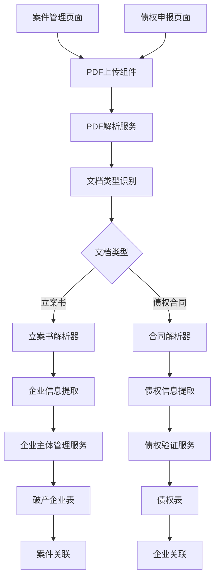
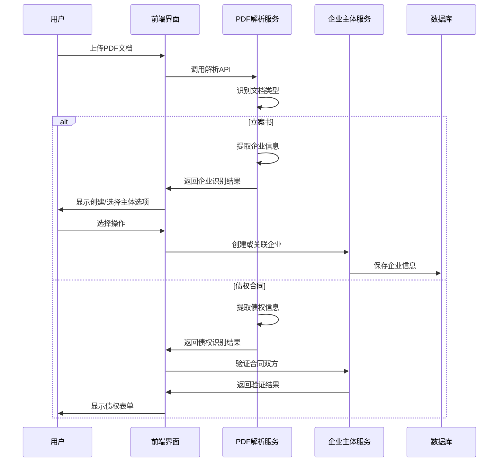

# 破产企业主体管理设计文档

## 概述

本设计文档描述了破产企业主体管理功能的技术架构，该功能通过交互式PDF识别流程，支持从立案书和债权合同中智能识别企业和债权信息，建立企业与案件、债权的关联关系。系统将扩展现有的PDF解析服务，新增破产企业主体表，并提供完整的交互式识别流程。

## 架构

### 系统架构图



### 数据流架构



## 组件和接口

### 1. 数据库表设计

#### 破产企业表 (bankruptcy_entity)

```sql
-- 破产企业主体表
DEFINE TABLE bankruptcy_entity TYPE NORMAL SCHEMAFULL PERMISSIONS 
  FOR select WHERE $auth.id->has_role->role->can_execute_operation->operation_metadata[WHERE tables CONTAINS 'bankruptcy_entity' AND operation_type = 'read'] OR $auth.id->has_case_role->role->can_execute_operation->operation_metadata[WHERE tables CONTAINS 'bankruptcy_entity' AND operation_type = 'read'],
  FOR create WHERE $auth.id->has_role->role->can_execute_operation->operation_metadata[WHERE tables CONTAINS 'bankruptcy_entity' AND operation_type = 'create'] OR $auth.id->has_case_role->role->can_execute_operation->operation_metadata[WHERE tables CONTAINS 'bankruptcy_entity' AND operation_type = 'create'],
  FOR update WHERE $auth.id->has_role->role->can_execute_operation->operation_metadata[WHERE tables CONTAINS 'bankruptcy_entity' AND operation_type = 'update'] OR $auth.id->has_case_role->role->can_execute_operation->operation_metadata[WHERE tables CONTAINS 'bankruptcy_entity' AND operation_type = 'update'],
  FOR delete WHERE $auth.id->has_role->role->can_execute_operation->operation_metadata[WHERE tables CONTAINS 'bankruptcy_entity' AND operation_type = 'delete'] OR $auth.id->has_case_role->role->can_execute_operation->operation_metadata[WHERE tables CONTAINS 'bankruptcy_entity' AND operation_type = 'delete'];

-- 基本信息字段
DEFINE FIELD name ON bankruptcy_entity TYPE string PERMISSIONS FULL;
DEFINE FIELD unified_social_credit_code ON bankruptcy_entity TYPE option<string> PERMISSIONS FULL;
DEFINE FIELD legal_representative ON bankruptcy_entity TYPE option<string> PERMISSIONS FULL;
DEFINE FIELD registered_address ON bankruptcy_entity TYPE option<string> PERMISSIONS FULL;
DEFINE FIELD business_address ON bankruptcy_entity TYPE option<string> PERMISSIONS FULL;
DEFINE FIELD registered_capital ON bankruptcy_entity TYPE option<decimal> PERMISSIONS FULL;
DEFINE FIELD establishment_date ON bankruptcy_entity TYPE option<datetime> PERMISSIONS FULL;
DEFINE FIELD business_scope ON bankruptcy_entity TYPE option<string> PERMISSIONS FULL;
DEFINE FIELD entity_type ON bankruptcy_entity TYPE string DEFAULT '有限责任公司' PERMISSIONS FULL;
DEFINE FIELD entity_status ON bankruptcy_entity TYPE string DEFAULT '正常' PERMISSIONS FULL;

-- 识别相关字段
DEFINE FIELD source_document_type ON bankruptcy_entity TYPE string ASSERT $value INSIDE ['立案书', '债权合同', '手动创建'] PERMISSIONS FULL;
DEFINE FIELD source_document_id ON bankruptcy_entity TYPE option<record<document>> PERMISSIONS FULL;
DEFINE FIELD recognition_confidence ON bankruptcy_entity TYPE option<decimal> PERMISSIONS FULL;
DEFINE FIELD recognition_data ON bankruptcy_entity TYPE option<object> PERMISSIONS FULL;
DEFINE FIELD is_verified ON bankruptcy_entity TYPE bool DEFAULT false PERMISSIONS FULL;
DEFINE FIELD verified_by ON bankruptcy_entity TYPE option<record<user>> PERMISSIONS FULL;
DEFINE FIELD verified_at ON bankruptcy_entity TYPE option<datetime> PERMISSIONS FULL;

-- 审计字段
DEFINE FIELD created_at ON bankruptcy_entity TYPE datetime DEFAULT time::now() READONLY ASSERT $value != NONE PERMISSIONS FULL;
DEFINE FIELD created_by ON bankruptcy_entity TYPE record<user> DEFAULT $auth.id PERMISSIONS FULL;
DEFINE FIELD updated_at ON bankruptcy_entity TYPE datetime READONLY VALUE time::now() ASSERT $value != NONE PERMISSIONS FULL;
DEFINE FIELD updated_by ON bankruptcy_entity TYPE record<user> VALUE $auth.id PERMISSIONS FULL;

-- 索引定义
DEFINE INDEX bankruptcy_entity_name_idx ON bankruptcy_entity FIELDS name;
DEFINE INDEX bankruptcy_entity_credit_code_idx ON bankruptcy_entity FIELDS unified_social_credit_code UNIQUE;
DEFINE INDEX bankruptcy_entity_legal_rep_idx ON bankruptcy_entity FIELDS legal_representative;
DEFINE INDEX bankruptcy_entity_source_doc_idx ON bankruptcy_entity FIELDS source_document_id;

-- 全文搜索索引
DEFINE ANALYZER entity_search_analyzer TOKENIZERS blank,punct,camel,class FILTERS lowercase,ascii;
DEFINE INDEX bankruptcy_entity_fulltext_name_idx ON bankruptcy_entity FIELDS name SEARCH ANALYZER entity_search_analyzer BM25 HIGHLIGHTS;
DEFINE INDEX bankruptcy_entity_fulltext_address_idx ON bankruptcy_entity FIELDS registered_address SEARCH ANALYZER entity_search_analyzer BM25 HIGHLIGHTS;
```

#### 案件企业关联关系表 (has_bankruptcy_entity)

```sql
-- 案件与破产企业关联关系表 (关系表类型)
DEFINE TABLE has_bankruptcy_entity TYPE RELATION IN case OUT bankruptcy_entity SCHEMAFULL PERMISSIONS 
  FOR select WHERE $auth.id->has_role->role->can_execute_operation->operation_metadata[WHERE tables CONTAINS 'has_bankruptcy_entity' AND operation_type = 'read'] OR $auth.id->has_case_role->role->can_execute_operation->operation_metadata[WHERE tables CONTAINS 'has_bankruptcy_entity' AND operation_type = 'read'],
  FOR create WHERE $auth.id->has_role->role->can_execute_operation->operation_metadata[WHERE tables CONTAINS 'has_bankruptcy_entity' AND operation_type = 'create'] OR $auth.id->has_case_role->role->can_execute_operation->operation_metadata[WHERE tables CONTAINS 'has_bankruptcy_entity' AND operation_type = 'create'],
  FOR update WHERE $auth.id->has_role->role->can_execute_operation->operation_metadata[WHERE tables CONTAINS 'has_bankruptcy_entity' AND operation_type = 'update'] OR $auth.id->has_case_role->role->can_execute_operation->operation_metadata[WHERE tables CONTAINS 'has_bankruptcy_entity' AND operation_type = 'update'],
  FOR delete WHERE $auth.id->has_role->role->can_execute_operation->operation_metadata[WHERE tables CONTAINS 'has_bankruptcy_entity' AND operation_type = 'delete'] OR $auth.id->has_case_role->role->can_execute_operation->operation_metadata[WHERE tables CONTAINS 'has_bankruptcy_entity' AND operation_type = 'delete'];

-- 关系属性字段
DEFINE FIELD relationship_type ON has_bankruptcy_entity TYPE string DEFAULT '主要债务人' ASSERT $value INSIDE ['主要债务人', '关联企业', '担保人'] PERMISSIONS FULL;
DEFINE FIELD associated_at ON has_bankruptcy_entity TYPE datetime DEFAULT time::now() PERMISSIONS FULL;
DEFINE FIELD associated_by ON has_bankruptcy_entity TYPE record<user> DEFAULT $auth.id PERMISSIONS FULL;
DEFINE FIELD is_primary ON has_bankruptcy_entity TYPE bool DEFAULT true PERMISSIONS FULL;
DEFINE FIELD notes ON has_bankruptcy_entity TYPE option<string> PERMISSIONS FULL;

-- 审计字段
DEFINE FIELD created_at ON has_bankruptcy_entity TYPE datetime DEFAULT time::now() READONLY ASSERT $value != NONE PERMISSIONS FULL;
DEFINE FIELD created_by ON has_bankruptcy_entity TYPE record<user> DEFAULT $auth.id PERMISSIONS FULL;
DEFINE FIELD updated_at ON has_bankruptcy_entity TYPE datetime READONLY VALUE time::now() ASSERT $value != NONE PERMISSIONS FULL;
DEFINE FIELD updated_by ON has_bankruptcy_entity TYPE record<user> VALUE $auth.id PERMISSIONS FULL;

-- 创建关系的示例语法：
-- RELATE case:some_case_id->has_bankruptcy_entity->bankruptcy_entity:some_entity_id 
--   SET relationship_type = '主要债务人', is_primary = true, associated_at = time::now();
```

#### 债权企业关联关系表 (claim_bankruptcy_entity)

```sql
-- 债权与破产企业关联关系表 (关系表类型)
DEFINE TABLE claim_bankruptcy_entity TYPE RELATION IN claim OUT bankruptcy_entity SCHEMAFULL PERMISSIONS 
  FOR select WHERE $auth.id->has_role->role->can_execute_operation->operation_metadata[WHERE tables CONTAINS 'claim_bankruptcy_entity' AND operation_type = 'read'] OR $auth.id->has_case_role->role->can_execute_operation->operation_metadata[WHERE tables CONTAINS 'claim_bankruptcy_entity' AND operation_type = 'read'] OR (in.created_by = $auth.id),
  FOR create WHERE $auth.id->has_role->role->can_execute_operation->operation_metadata[WHERE tables CONTAINS 'claim_bankruptcy_entity' AND operation_type = 'create'] OR $auth.id->has_case_role->role->can_execute_operation->operation_metadata[WHERE tables CONTAINS 'claim_bankruptcy_entity' AND operation_type = 'create'],
  FOR update WHERE $auth.id->has_role->role->can_execute_operation->operation_metadata[WHERE tables CONTAINS 'claim_bankruptcy_entity' AND operation_type = 'update'] OR $auth.id->has_case_role->role->can_execute_operation->operation_metadata[WHERE tables CONTAINS 'claim_bankruptcy_entity' AND operation_type = 'update'],
  FOR delete WHERE $auth.id->has_role->role->can_execute_operation->operation_metadata[WHERE tables CONTAINS 'claim_bankruptcy_entity' AND operation_type = 'delete'] OR $auth.id->has_case_role->role->can_execute_operation->operation_metadata[WHERE tables CONTAINS 'claim_bankruptcy_entity' AND operation_type = 'delete'];

-- 关系属性字段
DEFINE FIELD debt_type ON claim_bankruptcy_entity TYPE string DEFAULT '合同债务' ASSERT $value INSIDE ['合同债务', '侵权债务', '担保债务', '其他债务'] PERMISSIONS FULL;
DEFINE FIELD contract_date ON claim_bankruptcy_entity TYPE option<datetime> PERMISSIONS FULL;
DEFINE FIELD maturity_date ON claim_bankruptcy_entity TYPE option<datetime> PERMISSIONS FULL;
DEFINE FIELD associated_at ON claim_bankruptcy_entity TYPE datetime DEFAULT time::now() PERMISSIONS FULL;
DEFINE FIELD associated_by ON claim_bankruptcy_entity TYPE record<user> DEFAULT $auth.id PERMISSIONS FULL;

-- 审计字段
DEFINE FIELD created_at ON claim_bankruptcy_entity TYPE datetime DEFAULT time::now() READONLY ASSERT $value != NONE PERMISSIONS FULL;
DEFINE FIELD created_by ON claim_bankruptcy_entity TYPE record<user> DEFAULT $auth.id PERMISSIONS FULL;
DEFINE FIELD updated_at ON claim_bankruptcy_entity TYPE datetime READONLY VALUE time::now() ASSERT $value != NONE PERMISSIONS FULL;
DEFINE FIELD updated_by ON claim_bankruptcy_entity TYPE record<user> VALUE $auth.id PERMISSIONS FULL;

-- 创建债权与企业关联的示例语法：
-- RELATE claim:some_claim_id->claim_bankruptcy_entity->bankruptcy_entity:some_entity_id 
--   SET debt_type = '合同债务', contract_date = '2023-01-01T00:00:00Z', associated_at = time::now();

-- 查询债权关联的企业：
-- SELECT *, ->claim_bankruptcy_entity.* as relation_info 
-- FROM claim:some_claim_id->claim_bankruptcy_entity->bankruptcy_entity;

-- 查询企业关联的债权：
-- SELECT *, <-claim_bankruptcy_entity.* as relation_info 
-- FROM bankruptcy_entity:some_entity_id<-claim_bankruptcy_entity<-claim;
```

### 2. 服务层设计

#### BankruptcyEntityService

```typescript
interface BankruptcyEntityService {
  // 企业主体管理
  createEntity(entityData: BankruptcyEntityCreateData): Promise<BankruptcyEntity>;
  updateEntity(entityId: string, entityData: BankruptcyEntityUpdateData): Promise<BankruptcyEntity>;
  getEntity(entityId: string): Promise<BankruptcyEntity>;
  searchEntities(searchParams: EntitySearchParams): Promise<BankruptcyEntity[]>;
  
  // 案件关联管理 (使用RELATE语法)
  associateWithCase(entityId: string, caseId: string, relationshipType: string): Promise<void>;
  getCaseEntities(caseId: string): Promise<BankruptcyEntity[]>;
  getEntityCases(entityId: string): Promise<Case[]>;
  updateEntityRelation(caseId: string, entityId: string, relationData: EntityRelationData): Promise<void>;
  removeEntityFromCase(caseId: string, entityId: string): Promise<void>;
  
  // 识别结果处理
  processRecognitionResult(recognitionData: EntityRecognitionData): Promise<EntityProcessResult>;
  verifyEntity(entityId: string, verificationData: EntityVerificationData): Promise<void>;
  
  // 冲突检测
  checkEntityConflicts(entityData: BankruptcyEntityCreateData): Promise<EntityConflictResult>;
  suggestEntityMerge(entityId1: string, entityId2: string): Promise<EntityMergeResult>;
}

// 服务实现中的关系操作示例
class BankruptcyEntityServiceImpl implements BankruptcyEntityService {
  // 关联企业到案件
  async associateWithCase(entityId: string, caseId: string, relationshipType: string): Promise<void> {
    const query = `
      RELATE case:${caseId}->has_bankruptcy_entity->bankruptcy_entity:${entityId} 
      SET relationship_type = $relationshipType, 
          is_primary = $isPrimary, 
          associated_at = time::now(),
          associated_by = $auth.id;
    `;
    await this.db.query(query, { 
      relationshipType, 
      isPrimary: relationshipType === '主要债务人' 
    });
  }

  // 获取案件关联的企业
  async getCaseEntities(caseId: string): Promise<BankruptcyEntity[]> {
    const query = `
      SELECT *, ->has_bankruptcy_entity.* as relation_info 
      FROM case:${caseId}->has_bankruptcy_entity->bankruptcy_entity
      ORDER BY relation_info.is_primary DESC, relation_info.associated_at ASC;
    `;
    return await this.db.query(query);
  }

  // 获取企业关联的案件
  async getEntityCases(entityId: string): Promise<Case[]> {
    const query = `
      SELECT *, <-has_bankruptcy_entity.* as relation_info 
      FROM bankruptcy_entity:${entityId}<-has_bankruptcy_entity<-case
      ORDER BY relation_info.associated_at DESC;
    `;
    return await this.db.query(query);
  }

  // 更新关系信息
  async updateEntityRelation(caseId: string, entityId: string, relationData: EntityRelationData): Promise<void> {
    const query = `
      UPDATE case:${caseId}->has_bankruptcy_entity->bankruptcy_entity:${entityId}
      SET relationship_type = $relationshipType,
          is_primary = $isPrimary,
          notes = $notes,
          updated_at = time::now(),
          updated_by = $auth.id;
    `;
    await this.db.query(query, relationData);
  }

  // 移除企业与案件的关联
  async removeEntityFromCase(caseId: string, entityId: string): Promise<void> {
    const query = `
      DELETE case:${caseId}->has_bankruptcy_entity->bankruptcy_entity:${entityId};
    `;
    await this.db.query(query);
  }
}
```

#### PDFParseService 扩展

```typescript
interface ExtendedPDFParseService extends PDFParseService {
  // 文档类型识别
  identifyDocumentType(fileId: string): Promise<DocumentTypeResult>;
  
  // 立案书解析
  parseFilingDocument(fileId: string): Promise<FilingDocumentParseResult>;
  
  // 合同解析
  parseContractDocument(fileId: string): Promise<ContractParseResult>;
  
  // 企业信息提取
  extractEntityInfo(parseResult: ParseResult): Promise<EntityExtractionResult>;
  
  // 债权信息提取
  extractClaimInfo(parseResult: ParseResult): Promise<ClaimExtractionResult>;
}
```

### 3. 前端组件设计

#### EntityRecognitionDialog

```typescript
interface EntityRecognitionDialogProps {
  recognitionResult: EntityRecognitionResult;
  onCreateEntity: (entityData: BankruptcyEntityCreateData) => void;
  onSelectEntity: (entityId: string) => void;
  onCancel: () => void;
}
```

#### EntitySelectionDialog

```typescript
interface EntitySelectionDialogProps {
  entities: BankruptcyEntity[];
  onSelect: (entityId: string) => void;
  onCreateNew: () => void;
  onCancel: () => void;
}
```

#### CaseMergeDialog

```typescript
interface CaseMergeDialogProps {
  existingCase: Case;
  newCaseData: CaseCreateData;
  onMerge: (mergeStrategy: CaseMergeStrategy) => void;
  onCreateSeparate: () => void;
  onCancel: () => void;
}
```

## 数据模型

### 核心数据类型

```typescript
interface BankruptcyEntity {
  id: string;
  name: string;
  unifiedSocialCreditCode?: string;
  legalRepresentative?: string;
  registeredAddress?: string;
  businessAddress?: string;
  registeredCapital?: number;
  establishmentDate?: Date;
  businessScope?: string;
  entityType: string;
  entityStatus: string;
  sourceDocumentType: '立案书' | '债权合同' | '手动创建';
  sourceDocumentId?: string;
  recognitionConfidence?: number;
  recognitionData?: any;
  isVerified: boolean;
  verifiedBy?: string;
  verifiedAt?: Date;
  createdAt: Date;
  createdBy: string;
  updatedAt: Date;
  updatedBy: string;
}

interface EntityRecognitionResult {
  documentType: '立案书' | '债权合同';
  entityInfo: Partial<BankruptcyEntity>;
  confidence: number;
  extractedFields: ExtractedField[];
  suggestedActions: EntityAction[];
}

interface EntityConflictResult {
  hasConflicts: boolean;
  conflictingEntities: BankruptcyEntity[];
  conflictReasons: string[];
  suggestedResolution: 'merge' | 'create_new' | 'select_existing';
}

interface CaseMergeStrategy {
  action: 'merge_cases' | 'merge_entities' | 'create_separate';
  targetCaseId?: string;
  mergeReason?: string;
}
```

### 解析结果类型

```typescript
interface FilingDocumentParseResult {
  caseInfo: {
    caseName: string;
    caseNumber: string;
    acceptanceDate: Date;
    court: string;
    caseManager: string;
  };
  entityInfo: Partial<BankruptcyEntity>;
  confidence: number;
}

interface ContractParseResult {
  contractInfo: {
    contractAmount: number;
    interestRate: number;
    contractDate: Date;
    maturityDate?: Date;
    contractType: string;
  };
  parties: {
    creditor: Partial<BankruptcyEntity>;
    debtor: Partial<BankruptcyEntity>;
  };
  claimInfo: {
    principal: number;
    interest: number;
    otherAmount?: number;
    totalAmount: number;
    currency: string;
    nature: string;
    briefDescription?: string;
  };
  confidence: number;
}
```

## 错误处理

### 错误类型定义

```typescript
enum EntityManagementErrorCode {
  ENTITY_NOT_FOUND = 'ENTITY_NOT_FOUND',
  DUPLICATE_ENTITY = 'DUPLICATE_ENTITY',
  INVALID_RECOGNITION_DATA = 'INVALID_RECOGNITION_DATA',
  CASE_CONFLICT = 'CASE_CONFLICT',
  VERIFICATION_FAILED = 'VERIFICATION_FAILED',
  PERMISSION_DENIED = 'PERMISSION_DENIED',
  DOCUMENT_TYPE_UNKNOWN = 'DOCUMENT_TYPE_UNKNOWN',
  EXTRACTION_FAILED = 'EXTRACTION_FAILED'
}

interface EntityManagementError {
  code: EntityManagementErrorCode;
  message: string;
  details?: any;
  suggestions?: string[];
}
```

### 错误处理策略

1. **识别失败处理**：提供手动输入选项，记录失败原因用于模型优化
2. **冲突处理**：提供明确的冲突解决选项，支持用户决策
3. **验证失败处理**：提供详细的验证失败原因和修正建议
4. **权限错误处理**：提供清晰的权限说明和申请流程

## 测试策略

### 单元测试

1. **服务层测试**
   - BankruptcyEntityService 各方法功能测试
   - PDF解析扩展功能测试
   - 数据验证和转换测试

2. **组件测试**
   - 企业识别对话框交互测试
   - 企业选择组件功能测试
   - 案件合并对话框测试

### 集成测试

1. **PDF识别流程测试**
   - 立案书识别完整流程
   - 债权合同识别完整流程
   - 错误处理流程测试

2. **数据库集成测试**
   - 企业主体CRUD操作测试
   - 关联关系管理测试
   - 权限控制测试

### 端到端测试

1. **用户场景测试**
   - 案件管理人上传立案书创建企业
   - 债权人上传合同申报债权
   - 企业信息查看和管理

2. **性能测试**
   - 大文件PDF解析性能
   - 批量企业处理性能
   - 并发用户操作测试

## 安全考虑

### 数据安全

1. **敏感信息保护**：企业统一社会信用代码、法定代表人等信息加密存储
2. **访问控制**：基于角色的细粒度权限控制
3. **审计日志**：记录所有企业信息的创建、修改、删除操作

### 业务安全

1. **身份验证**：债权合同上传时验证合同双方身份
2. **数据一致性**：确保企业与案件、债权的关联关系正确
3. **防重复提交**：避免重复创建相同企业主体

### 系统安全

1. **文件上传安全**：限制文件类型和大小，扫描恶意文件
2. **SQL注入防护**：使用参数化查询和权限控制
3. **XSS防护**：前端输入验证和输出转义