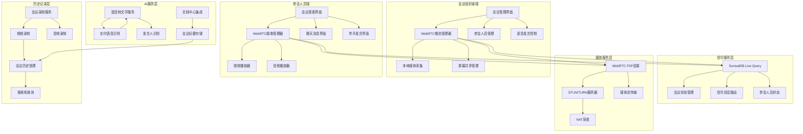

# 设计文档

## 概述

WebRTC会议系统设计基于一对多直播架构，案件管理人作为会议组织者进行视频推流，参会人员观看直播并通过语音和文字进行互动。系统采用SurrealDB Live Query作为信令服务，结合WebRTC技术实现高质量的实时音视频通信，并集成语音转文字和会议历史记录功能。

## 架构设计

### 整体架构



### 技术栈选择

- **WebRTC API**: 浏览器原生WebRTC支持，用于音视频传输
- **信令协议**: SurrealDB Live Query实时信令，替代传统WebSocket
- **媒体编解码**: VP8/VP9 (视频), Opus (音频)
- **STUN/TURN服务**: Google公开STUN服务器 + 自建TURN服务器
- **语音转文字**: Web Speech API + 云端语音识别服务备用
- **UI框架**: React + Material-UI + 移动端优化
- **状态管理**: React Context + TanStack Query
- **文档存储**: 集成现有文档中心系统

### 架构决策

#### 一对多直播架构
- **推流端**: 案件管理人使用WebRTC推送音视频流
- **观看端**: 参会人员接收并播放直播流
- **信令协调**: 通过SurrealDB Live Query协调所有连接

#### SurrealDB信令服务
- **实时性**: 利用Live Query的毫秒级推送能力
- **可靠性**: 数据库级别的消息持久化和重传
- **扩展性**: 支持大量并发参会人员

#### 语音发言权限控制
- **举手机制**: 参会人员请求发言权限
- **权限管理**: 组织者控制发言权限分配
- **音频混合**: 支持多人同时发言的音频混合

## 组件设计

### MeetingManager - 会议管理器

```typescript
interface MeetingManager {
  // 会议生命周期管理
  createMeeting(config: MeetingConfig): Promise<string>;
  startMeeting(meetingId: string): Promise<void>;
  endMeeting(meetingId: string): Promise<void>;
  joinMeeting(meetingId: string, userId: string): Promise<MeetingSession>;
  leaveMeeting(meetingId: string, userId: string): Promise<void>;
  
  // 会议状态管理
  getMeetingInfo(meetingId: string): Promise<MeetingInfo>;
  getParticipants(meetingId: string): Promise<Participant[]>;
  updateMeetingStatus(meetingId: string, status: MeetingStatus): Promise<void>;
  
  // 权限管理
  grantSpeakingPermission(meetingId: string, userId: string): Promise<void>;
  revokeSpeakingPermission(meetingId: string, userId: string): Promise<void>;
  muteParticipant(meetingId: string, userId: string): Promise<void>;
  removeParticipant(meetingId: string, userId: string): Promise<void>;
  
  // 会议录制
  startRecording(meetingId: string, options: RecordingOptions): Promise<string>;
  stopRecording(meetingId: string): Promise<RecordingResult>;
  
  // 事件监听
  onMeetingStateChange(callback: (meetingId: string, state: MeetingState) => void): void;
  onParticipantJoin(callback: (meetingId: string, participant: Participant) => void): void;
  onParticipantLeave(callback: (meetingId: string, userId: string) => void): void;
  onSpeakingRequest(callback: (meetingId: string, userId: string) => void): void;
}

interface MeetingConfig {
  title: string;
  description?: string;
  caseId?: string;
  scheduledTime?: string;
  maxParticipants: number;
  allowRecording: boolean;
  enableSpeechToText: boolean;
  invitedUsers: string[];
}

interface MeetingInfo {
  id: string;
  title: string;
  description?: string;
  caseId?: string;
  organizerId: string;
  status: MeetingStatus;
  startTime?: string;
  endTime?: string;
  participantCount: number;
  isRecording: boolean;
  recordingUrl?: string;
  speechToTextEnabled: boolean;
}

enum MeetingStatus {
  SCHEDULED = 'scheduled',
  STARTING = 'starting',
  ACTIVE = 'active',
  PAUSED = 'paused',
  ENDED = 'ended',
  CANCELLED = 'cancelled'
}

interface Participant {
  userId: string;
  userName: string;
  userAvatar?: string;
  role: 'organizer' | 'participant';
  joinTime: string;
  isOnline: boolean;
  isSpeaking: boolean;
  hasSpeakingPermission: boolean;
  isMuted: boolean;
  isHandRaised: boolean;
  connectionQuality: 'excellent' | 'good' | 'fair' | 'poor';
}
```

### StreamingManager - 推流管理器

```typescript
interface StreamingManager {
  // 推流控制
  startStreaming(meetingId: string, mediaConfig: MediaConfig): Promise<void>;
  stopStreaming(meetingId: string): Promise<void>;
  pauseStreaming(meetingId: string): Promise<void>;
  resumeStreaming(meetingId: string): Promise<void>;
  
  // 媒体设备管理
  getAvailableDevices(): Promise<MediaDeviceInfo[]>;
  switchCamera(deviceId: string): Promise<void>;
  switchMicrophone(deviceId: string): Promise<void>;
  toggleVideo(): Promise<void>;
  toggleAudio(): Promise<void>;
  
  // 屏幕共享
  startScreenShare(): Promise<void>;
  stopScreenShare(): Promise<void>;
  switchBetweenCameraAndScreen(): Promise<void>;
  
  // 流质量控制
  adjustVideoQuality(quality: VideoQuality): Promise<void>;
  adjustAudioQuality(quality: AudioQuality): Promise<void>;
  getStreamingStats(): Promise<StreamingStats>;
  
  // 多路推流支持
  addSecondaryStream(streamType: 'screen' | 'document'): Promise<string>;
  removeSecondaryStream(streamId: string): Promise<void>;
  switchPrimaryStream(streamId: string): Promise<void>;
  
  // 事件监听
  onStreamingStateChange(callback: (state: StreamingState) => void): void;
  onDeviceChange(callback: (devices: MediaDeviceInfo[]) => void): void;
  onQualityChange(callback: (stats: StreamingStats) => void): void;
}

interface MediaConfig {
  video: {
    enabled: boolean;
    resolution: '720p' | '1080p' | '4k';
    frameRate: 15 | 30 | 60;
    bitrate?: number;
  };
  audio: {
    enabled: boolean;
    sampleRate: 44100 | 48000;
    bitrate?: number;
    echoCancellation: boolean;
    noiseSuppression: boolean;
  };
}

interface StreamingStats {
  videoBitrate: number;
  audioBitrate: number;
  frameRate: number;
  resolution: { width: number; height: number };
  packetsLost: number;
  jitter: number;
  rtt: number;
  bandwidth: number;
  cpuUsage: number;
}

enum StreamingState {
  IDLE = 'idle',
  STARTING = 'starting',
  STREAMING = 'streaming',
  PAUSED = 'paused',
  STOPPING = 'stopping',
  ERROR = 'error'
}
```

### ViewerManager - 观看管理器

```typescript
interface ViewerManager {
  // 观看控制
  startViewing(meetingId: string, userId: string): Promise<ViewerSession>;
  stopViewing(meetingId: string): Promise<void>;
  
  // 播放控制
  play(): Promise<void>;
  pause(): Promise<void>;
  setVolume(volume: number): Promise<void>;
  toggleFullscreen(): Promise<void>;
  
  // 视频质量控制
  requestQuality(quality: VideoQuality): Promise<void>;
  enableAutoQuality(enabled: boolean): Promise<void>;
  getPlaybackStats(): Promise<PlaybackStats>;
  
  // 多流支持
  switchStream(streamId: string): Promise<void>;
  enablePictureInPicture(): Promise<void>;
  disablePictureInPicture(): Promise<void>;
  
  // 移动端优化
  enableMobileOptimization(): Promise<void>;
  handleOrientationChange(orientation: 'portrait' | 'landscape'): Promise<void>;
  adjustForNetworkChange(networkType: 'wifi' | '4g' | '3g'): Promise<void>;
  
  // 事件监听
  onStreamReceived(callback: (stream: MediaStream) => void): void;
  onQualityChange(callback: (quality: VideoQuality) => void): void;
  onBuffering(callback: (isBuffering: boolean) => void): void;
  onError(callback: (error: ViewerError) => void): void;
}

interface ViewerSession {
  meetingId: string;
  userId: string;
  joinTime: string;
  currentStream?: MediaStream;
  quality: VideoQuality;
  volume: number;
  isFullscreen: boolean;
  isPictureInPicture: boolean;
}

interface PlaybackStats {
  currentBitrate: number;
  bufferHealth: number;
  droppedFrames: number;
  decodedFrames: number;
  playbackRate: number;
  latency: number;
  jitter: number;
}

enum VideoQuality {
  AUTO = 'auto',
  LOW = '360p',
  MEDIUM = '720p',
  HIGH = '1080p',
  ULTRA = '4k'
}

enum AudioQuality {
  LOW = 'low',
  MEDIUM = 'medium',
  HIGH = 'high'
}
```

### SpeechManager - 语音发言管理器

```typescript
interface SpeechManager {
  // 发言权限管理
  requestSpeaking(meetingId: string, userId: string): Promise<void>;
  grantSpeaking(meetingId: string, userId: string): Promise<void>;
  revokeSpeaking(meetingId: string, userId: string): Promise<void>;
  
  // 语音控制
  startSpeaking(meetingId: string, userId: string): Promise<void>;
  stopSpeaking(meetingId: string, userId: string): Promise<void>;
  muteSpeaker(meetingId: string, userId: string): Promise<void>;
  unmuteSpeaker(meetingId: string, userId: string): Promise<void>;
  
  // 音频混合
  enableAudioMixing(meetingId: string): Promise<void>;
  disableAudioMixing(meetingId: string): Promise<void>;
  adjustSpeakerVolume(meetingId: string, userId: string, volume: number): Promise<void>;
  
  // 语音质量控制
  enableNoiseReduction(userId: string, enabled: boolean): Promise<void>;
  enableEchoCancellation(userId: string, enabled: boolean): Promise<void>;
  adjustAudioGain(userId: string, gain: number): Promise<void>;
  
  // 发言队列管理
  getSpeakingQueue(meetingId: string): Promise<SpeakingRequest[]>;
  addToSpeakingQueue(meetingId: string, userId: string): Promise<void>;
  removeFromSpeakingQueue(meetingId: string, userId: string): Promise<void>;
  reorderSpeakingQueue(meetingId: string, newOrder: string[]): Promise<void>;
  
  // 事件监听
  onSpeakingRequest(callback: (meetingId: string, request: SpeakingRequest) => void): void;
  onSpeakingGranted(callback: (meetingId: string, userId: string) => void): void;
  onSpeakingRevoked(callback: (meetingId: string, userId: string) => void): void;
  onAudioLevelChange(callback: (userId: string, level: number) => void): void;
}

interface SpeakingRequest {
  userId: string;
  userName: string;
  requestTime: string;
  priority: 'normal' | 'high' | 'urgent';
  reason?: string;
  estimatedDuration?: number;
}
```

### ChatManager - 聊天管理器

```typescript
interface ChatManager {
  // 消息发送
  sendMessage(meetingId: string, userId: string, content: string, type?: MessageType): Promise<string>;
  sendPrivateMessage(meetingId: string, fromUserId: string, toUserId: string, content: string): Promise<string>;
  
  // 消息管理
  getMessages(meetingId: string, limit?: number, offset?: number): Promise<ChatMessage[]>;
  deleteMessage(meetingId: string, messageId: string): Promise<void>;
  editMessage(meetingId: string, messageId: string, newContent: string): Promise<void>;
  
  // 消息过滤和审核
  enableMessageModeration(meetingId: string, enabled: boolean): Promise<void>;
  muteUser(meetingId: string, userId: string, duration?: number): Promise<void>;
  unmuteUser(meetingId: string, userId: string): Promise<void>;
  
  // 消息类型支持
  sendQuestionMessage(meetingId: string, userId: string, question: string): Promise<string>;
  sendPollMessage(meetingId: string, userId: string, poll: PollData): Promise<string>;
  sendFileMessage(meetingId: string, userId: string, file: File): Promise<string>;
  
  // 消息搜索
  searchMessages(meetingId: string, query: string, filters?: MessageSearchFilters): Promise<ChatMessage[]>;
  
  // 事件监听
  onMessageReceived(callback: (message: ChatMessage) => void): void;
  onMessageDeleted(callback: (messageId: string) => void): void;
  onUserMuted(callback: (userId: string, duration?: number) => void): void;
}

interface ChatMessage {
  id: string;
  meetingId: string;
  senderId: string;
  senderName: string;
  senderAvatar?: string;
  content: string;
  messageType: MessageType;
  timestamp: string;
  isPrivate: boolean;
  targetUserId?: string;
  isDeleted: boolean;
  editHistory?: MessageEdit[];
  attachments?: MessageAttachment[];
}

enum MessageType {
  TEXT = 'text',
  QUESTION = 'question',
  POLL = 'poll',
  FILE = 'file',
  SYSTEM = 'system'
}

interface MessageEdit {
  editTime: string;
  previousContent: string;
}

interface MessageAttachment {
  id: string;
  fileName: string;
  fileSize: number;
  fileType: string;
  downloadUrl: string;
}

interface PollData {
  question: string;
  options: string[];
  allowMultiple: boolean;
  anonymous: boolean;
  endTime?: string;
}
```

### SpeechToTextManager - 语音转文字管理器

```typescript
interface SpeechToTextManager {
  // 语音识别控制
  startRecognition(meetingId: string, options: RecognitionOptions): Promise<string>;
  stopRecognition(meetingId: string): Promise<void>;
  pauseRecognition(meetingId: string): Promise<void>;
  resumeRecognition(meetingId: string): Promise<void>;
  
  // 实时转录
  onTranscriptionUpdate(callback: (transcription: TranscriptionSegment) => void): void;
  onSpeakerChange(callback: (speakerId: string, speakerName: string) => void): void;
  
  // 发言人识别
  registerSpeaker(userId: string, voiceSample: AudioBuffer): Promise<void>;
  identifySpeaker(audioSegment: AudioBuffer): Promise<string>;
  updateSpeakerModel(userId: string, audioSegment: AudioBuffer): Promise<void>;
  
  // 转录结果处理
  getTranscriptionResult(meetingId: string): Promise<TranscriptionResult>;
  exportTranscription(meetingId: string, format: 'txt' | 'docx' | 'pdf'): Promise<Blob>;
  saveToDocumentCenter(meetingId: string, documentTitle: string): Promise<string>;
  
  // 转录质量控制
  setLanguage(language: string): Promise<void>;
  enablePunctuation(enabled: boolean): Promise<void>;
  enableTimestamps(enabled: boolean): Promise<void>;
  setConfidenceThreshold(threshold: number): Promise<void>;
  
  // 后处理
  correctTranscription(segmentId: string, correctedText: string): Promise<void>;
  addSpeakerNote(segmentId: string, note: string): Promise<void>;
  mergeSpeakerSegments(segmentIds: string[]): Promise<string>;
  
  // 事件监听
  onRecognitionStart(callback: (meetingId: string) => void): void;
  onRecognitionEnd(callback: (meetingId: string, result: TranscriptionResult) => void): void;
  onRecognitionError(callback: (error: RecognitionError) => void): void;
}

interface RecognitionOptions {
  language: string;
  enableSpeakerIdentification: boolean;
  enablePunctuation: boolean;
  enableTimestamps: boolean;
  confidenceThreshold: number;
  realTimeTranscription: boolean;
}

interface TranscriptionSegment {
  id: string;
  meetingId: string;
  speakerId: string;
  speakerName: string;
  text: string;
  startTime: number;
  endTime: number;
  confidence: number;
  isComplete: boolean;
  corrections?: string[];
  notes?: string[];
}

interface TranscriptionResult {
  meetingId: string;
  totalDuration: number;
  segments: TranscriptionSegment[];
  speakers: SpeakerInfo[];
  summary?: string;
  keywords?: string[];
  createdAt: string;
  updatedAt: string;
}

interface SpeakerInfo {
  id: string;
  name: string;
  totalSpeakingTime: number;
  segmentCount: number;
  averageConfidence: number;
}

interface RecognitionError {
  code: string;
  message: string;
  meetingId: string;
  timestamp: string;
  canRetry: boolean;
}
```

### MeetingHistoryManager - 会议历史管理器

```typescript
interface MeetingHistoryManager {
  // 历史记录查询
  getMeetingHistory(filters: MeetingHistoryFilters): Promise<MeetingHistoryItem[]>;
  getMeetingDetails(meetingId: string): Promise<MeetingHistoryDetails>;
  searchMeetings(query: string, filters?: MeetingSearchFilters): Promise<MeetingHistoryItem[]>;
  
  // 会议内容访问
  getTranscriptionDocument(meetingId: string): Promise<DocumentInfo>;
  getRecordingUrl(meetingId: string): Promise<string>;
  getChatHistory(meetingId: string): Promise<ChatMessage[]>;
  getParticipantList(meetingId: string): Promise<HistoricalParticipant[]>;
  
  // 内容搜索
  searchInTranscription(meetingId: string, query: string): Promise<TranscriptionSearchResult[]>;
  searchInChat(meetingId: string, query: string): Promise<ChatSearchResult[]>;
  searchBySpeaker(speakerId: string, query?: string): Promise<SpeakerSearchResult[]>;
  
  // 导出功能
  exportMeetingReport(meetingId: string, format: 'pdf' | 'docx' | 'html'): Promise<Blob>;
  exportTranscription(meetingId: string, format: 'txt' | 'docx' | 'srt'): Promise<Blob>;
  exportChatLog(meetingId: string, format: 'txt' | 'csv' | 'json'): Promise<Blob>;
  
  // 统计分析
  getMeetingStatistics(dateRange: DateRange, caseId?: string): Promise<MeetingStatistics>;
  getSpeakerStatistics(speakerId: string, dateRange: DateRange): Promise<SpeakerStatistics>;
  getParticipationStatistics(userId: string, dateRange: DateRange): Promise<ParticipationStatistics>;
  
  // 收藏和标签
  bookmarkMeeting(meetingId: string, userId: string): Promise<void>;
  unbookmarkMeeting(meetingId: string, userId: string): Promise<void>;
  tagMeeting(meetingId: string, tags: string[]): Promise<void>;
  getMeetingsByTag(tag: string): Promise<MeetingHistoryItem[]>;
  
  // 事件监听
  onHistoryUpdated(callback: (meetingId: string) => void): void;
}

interface MeetingHistoryFilters {
  dateFrom?: string;
  dateTo?: string;
  caseId?: string;
  organizerId?: string;
  participantId?: string;
  status?: MeetingStatus[];
  hasRecording?: boolean;
  hasTranscription?: boolean;
  tags?: string[];
  limit?: number;
  offset?: number;
}

interface MeetingHistoryItem {
  id: string;
  title: string;
  description?: string;
  caseId?: string;
  caseName?: string;
  organizerId: string;
  organizerName: string;
  startTime: string;
  endTime?: string;
  duration?: number;
  participantCount: number;
  status: MeetingStatus;
  hasRecording: boolean;
  hasTranscription: boolean;
  recordingUrl?: string;
  transcriptionDocumentId?: string;
  tags: string[];
  isBookmarked: boolean;
  thumbnailUrl?: string;
}

interface MeetingHistoryDetails extends MeetingHistoryItem {
  participants: HistoricalParticipant[];
  chatMessageCount: number;
  transcriptionSegmentCount: number;
  totalSpeakingTime: number;
  averageParticipation: number;
  keyTopics: string[];
  actionItems: ActionItem[];
  decisions: Decision[];
}

interface HistoricalParticipant {
  userId: string;
  userName: string;
  userAvatar?: string;
  role: 'organizer' | 'participant';
  joinTime: string;
  leaveTime?: string;
  duration: number;
  speakingTime: number;
  messageCount: number;
  wasActive: boolean;
}

interface TranscriptionSearchResult {
  segmentId: string;
  speakerId: string;
  speakerName: string;
  text: string;
  startTime: number;
  endTime: number;
  matchedText: string;
  context: string;
}

interface ChatSearchResult {
  messageId: string;
  senderId: string;
  senderName: string;
  content: string;
  timestamp: string;
  matchedText: string;
  context: string;
}

interface SpeakerSearchResult {
  meetingId: string;
  meetingTitle: string;
  meetingDate: string;
  segments: TranscriptionSearchResult[];
  totalMatches: number;
}

interface ActionItem {
  id: string;
  description: string;
  assignedTo?: string;
  dueDate?: string;
  status: 'pending' | 'completed' | 'cancelled';
  createdAt: string;
}

interface Decision {
  id: string;
  description: string;
  decidedBy: string;
  timestamp: string;
  relatedSegments: string[];
}

interface MeetingStatistics {
  totalMeetings: number;
  totalDuration: number;
  averageDuration: number;
  totalParticipants: number;
  averageParticipants: number;
  meetingsByStatus: Record<MeetingStatus, number>;
  meetingsByMonth: Array<{ month: string; count: number }>;
  topOrganizers: Array<{ userId: string; userName: string; count: number }>;
  topCases: Array<{ caseId: string; caseName: string; count: number }>;
}

interface SpeakerStatistics {
  totalMeetings: number;
  totalSpeakingTime: number;
  averageSpeakingTime: number;
  totalWords: number;
  averageWordsPerMinute: number;
  topTopics: string[];
  participationTrend: Array<{ date: string; speakingTime: number }>;
}

interface ParticipationStatistics {
  totalMeetings: number;
  totalDuration: number;
  averageDuration: number;
  organizerMeetings: number;
  participantMeetings: number;
  attendanceRate: number;
  participationTrend: Array<{ date: string; meetings: number }>;
}
```

### SignalingService - 信令服务

```typescript
interface SignalingService {
  // 连接管理
  connect(userId: string): Promise<void>;
  disconnect(): Promise<void>;
  isConnected(): boolean;
  
  // 会议信令
  sendMeetingSignal(meetingId: string, signal: MeetingSignal): Promise<void>;
  subscribeMeetingSignals(meetingId: string, callback: (signal: MeetingSignal) => void): Promise<string>;
  unsubscribeMeetingSignals(subscriptionId: string): Promise<void>;
  
  // WebRTC信令
  sendOffer(meetingId: string, targetUserId: string, offer: RTCSessionDescription): Promise<void>;
  sendAnswer(meetingId: string, targetUserId: string, answer: RTCSessionDescription): Promise<void>;
  sendIceCandidate(meetingId: string, targetUserId: string, candidate: RTCIceCandidate): Promise<void>;
  
  // 状态同步
  updateParticipantStatus(meetingId: string, status: ParticipantStatus): Promise<void>;
  subscribeParticipantUpdates(meetingId: string, callback: (updates: ParticipantUpdate[]) => void): Promise<string>;
  
  // 聊天信令
  sendChatMessage(meetingId: string, message: ChatMessage): Promise<void>;
  subscribeChatMessages(meetingId: string, callback: (message: ChatMessage) => void): Promise<string>;
  
  // 语音发言信令
  sendSpeakingRequest(meetingId: string, request: SpeakingRequest): Promise<void>;
  sendSpeakingResponse(meetingId: string, response: SpeakingResponse): Promise<void>;
  subscribeSpeakingEvents(meetingId: string, callback: (event: SpeakingEvent) => void): Promise<string>;
  
  // 事件监听
  onConnectionStateChange(callback: (state: ConnectionState) => void): void;
  onSignalReceived(callback: (signal: any) => void): void;
  onError(callback: (error: SignalingError) => void): void;
}

interface MeetingSignal {
  type: MeetingSignalType;
  meetingId: string;
  fromUserId: string;
  toUserId?: string;
  data: any;
  timestamp: string;
}

enum MeetingSignalType {
  MEETING_START = 'meeting_start',
  MEETING_END = 'meeting_end',
  PARTICIPANT_JOIN = 'participant_join',
  PARTICIPANT_LEAVE = 'participant_leave',
  STREAMING_START = 'streaming_start',
  STREAMING_END = 'streaming_end',
  SCREEN_SHARE_START = 'screen_share_start',
  SCREEN_SHARE_END = 'screen_share_end',
  SPEAKING_REQUEST = 'speaking_request',
  SPEAKING_GRANTED = 'speaking_granted',
  SPEAKING_REVOKED = 'speaking_revoked',
  CHAT_MESSAGE = 'chat_message',
  QUALITY_CHANGE = 'quality_change'
}

interface ParticipantStatus {
  userId: string;
  isOnline: boolean;
  isSpeaking: boolean;
  hasSpeakingPermission: boolean;
  isMuted: boolean;
  isHandRaised: boolean;
  connectionQuality: string;
  lastActivity: string;
}

interface ParticipantUpdate {
  userId: string;
  changes: Partial<ParticipantStatus>;
  timestamp: string;
}

interface SpeakingEvent {
  type: 'request' | 'granted' | 'revoked' | 'started' | 'ended';
  meetingId: string;
  userId: string;
  timestamp: string;
  data?: any;
}

interface SpeakingResponse {
  requestId: string;
  approved: boolean;
  reason?: string;
  duration?: number;
}

enum ConnectionState {
  DISCONNECTED = 'disconnected',
  CONNECTING = 'connecting',
  CONNECTED = 'connected',
  RECONNECTING = 'reconnecting',
  ERROR = 'error'
}

interface SignalingError {
  code: string;
  message: string;
  meetingId?: string;
  timestamp: string;
  canRetry: boolean;
}
```

## 数据模型

### 会议相关表设计

```sql
-- 会议表
DEFINE TABLE meeting SCHEMAFULL;
DEFINE FIELD title ON meeting TYPE string;
DEFINE FIELD description ON meeting TYPE option<string>;
DEFINE FIELD case_id ON meeting TYPE option<record<case>>;
DEFINE FIELD organizer_id ON meeting TYPE record<user>;
DEFINE FIELD status ON meeting TYPE string DEFAULT 'scheduled' ASSERT $value INSIDE ['scheduled', 'starting', 'active', 'paused', 'ended', 'cancelled'];
DEFINE FIELD scheduled_time ON meeting TYPE option<datetime>;
DEFINE FIELD start_time ON meeting TYPE option<datetime>;
DEFINE FIELD end_time ON meeting TYPE option<datetime>;
DEFINE FIELD max_participants ON meeting TYPE int DEFAULT 50;
DEFINE FIELD allow_recording ON meeting TYPE bool DEFAULT true;
DEFINE FIELD enable_speech_to_text ON meeting TYPE bool DEFAULT true;
DEFINE FIELD recording_url ON meeting TYPE option<string>;
DEFINE FIELD transcription_document_id ON meeting TYPE option<string>;
DEFINE FIELD streaming_config ON meeting TYPE option<object>;
DEFINE FIELD created_at ON meeting TYPE datetime DEFAULT time::now();
DEFINE FIELD updated_at ON meeting TYPE datetime VALUE time::now();

-- 会议参与者关系表
DEFINE TABLE has_meeting_participant TYPE RELATION IN meeting OUT user SCHEMAFULL;
DEFINE FIELD role ON has_meeting_participant TYPE string DEFAULT 'participant' ASSERT $value INSIDE ['organizer', 'participant'];
DEFINE FIELD invited_at ON has_meeting_participant TYPE datetime DEFAULT time::now();
DEFINE FIELD joined_at ON has_meeting_participant TYPE option<datetime>;
DEFINE FIELD left_at ON has_meeting_participant TYPE option<datetime>;
DEFINE FIELD is_online ON has_meeting_participant TYPE bool DEFAULT false;
DEFINE FIELD is_speaking ON has_meeting_participant TYPE bool DEFAULT false;
DEFINE FIELD has_speaking_permission ON has_meeting_participant TYPE bool DEFAULT false;
DEFINE FIELD is_muted ON has_meeting_participant TYPE bool DEFAULT false;
DEFINE FIELD is_hand_raised ON has_meeting_participant TYPE bool DEFAULT false;
DEFINE FIELD connection_quality ON has_meeting_participant TYPE string DEFAULT 'good' ASSERT $value INSIDE ['excellent', 'good', 'fair', 'poor'];
DEFINE FIELD total_speaking_time ON has_meeting_participant TYPE int DEFAULT 0;
DEFINE FIELD message_count ON has_meeting_participant TYPE int DEFAULT 0;
DEFINE FIELD last_activity ON has_meeting_participant TYPE datetime VALUE time::now();

-- 会议聊天消息表
DEFINE TABLE meeting_chat_message SCHEMAFULL;
DEFINE FIELD meeting_id ON meeting_chat_message TYPE record<meeting>;
DEFINE FIELD sender_id ON meeting_chat_message TYPE record<user>;
DEFINE FIELD content ON meeting_chat_message TYPE string;
DEFINE FIELD message_type ON meeting_chat_message TYPE string DEFAULT 'text' ASSERT $value INSIDE ['text', 'question', 'poll', 'file', 'system'];
DEFINE FIELD is_private ON meeting_chat_message TYPE bool DEFAULT false;
DEFINE FIELD target_user_id ON meeting_chat_message TYPE option<record<user>>;
DEFINE FIELD attachments ON meeting_chat_message TYPE option<array<object>>;
DEFINE FIELD is_deleted ON meeting_chat_message TYPE bool DEFAULT false;
DEFINE FIELD edit_history ON meeting_chat_message TYPE option<array<object>>;
DEFINE FIELD created_at ON meeting_chat_message TYPE datetime DEFAULT time::now();
DEFINE FIELD updated_at ON meeting_chat_message TYPE datetime VALUE time::now();

-- 语音转文字转录表
DEFINE TABLE meeting_transcription SCHEMAFULL;
DEFINE FIELD meeting_id ON meeting_transcription TYPE record<meeting>;
DEFINE FIELD segment_id ON meeting_transcription TYPE string;
DEFINE FIELD speaker_id ON meeting_transcription TYPE record<user>;
DEFINE FIELD text ON meeting_transcription TYPE string;
DEFINE FIELD start_time ON meeting_transcription TYPE float; -- 相对于会议开始的秒数
DEFINE FIELD end_time ON meeting_transcription TYPE float;
DEFINE FIELD confidence ON meeting_transcription TYPE float; -- 0-1之间的置信度
DEFINE FIELD is_complete ON meeting_transcription TYPE bool DEFAULT false;
DEFINE FIELD corrections ON meeting_transcription TYPE option<array<string>>;
DEFINE FIELD notes ON meeting_transcription TYPE option<array<string>>;
DEFINE FIELD created_at ON meeting_transcription TYPE datetime DEFAULT time::now();
DEFINE FIELD updated_at ON meeting_transcription TYPE datetime VALUE time::now();

-- 发言请求表
DEFINE TABLE speaking_request SCHEMAFULL;
DEFINE FIELD meeting_id ON speaking_request TYPE record<meeting>;
DEFINE FIELD requester_id ON speaking_request TYPE record<user>;
DEFINE FIELD request_time ON speaking_request TYPE datetime DEFAULT time::now();
DEFINE FIELD priority ON speaking_request TYPE string DEFAULT 'normal' ASSERT $value INSIDE ['normal', 'high', 'urgent'];
DEFINE FIELD reason ON speaking_request TYPE option<string>;
DEFINE FIELD estimated_duration ON speaking_request TYPE option<int>; -- 预计发言时长(秒)
DEFINE FIELD status ON speaking_request TYPE string DEFAULT 'pending' ASSERT $value INSIDE ['pending', 'approved', 'rejected', 'expired'];
DEFINE FIELD response_time ON speaking_request TYPE option<datetime>;
DEFINE FIELD response_by ON speaking_request TYPE option<record<user>>;
DEFINE FIELD actual_start_time ON speaking_request TYPE option<datetime>;
DEFINE FIELD actual_end_time ON speaking_request TYPE option<datetime>;
DEFINE FIELD actual_duration ON speaking_request TYPE option<int>;

-- WebRTC信令消息表
DEFINE TABLE meeting_webrtc_signal SCHEMAFULL;
DEFINE FIELD meeting_id ON meeting_webrtc_signal TYPE record<meeting>;
DEFINE FIELD signal_type ON meeting_webrtc_signal TYPE string ASSERT $value INSIDE ['offer', 'answer', 'ice-candidate', 'meeting-start', 'meeting-end', 'participant-join', 'participant-leave', 'streaming-start', 'streaming-end', 'speaking-request', 'speaking-granted', 'speaking-revoked'];
DEFINE FIELD from_user_id ON meeting_webrtc_signal TYPE record<user>;
DEFINE FIELD to_user_id ON meeting_webrtc_signal TYPE option<record<user>>;
DEFINE FIELD signal_data ON meeting_webrtc_signal TYPE object;
DEFINE FIELD created_at ON meeting_webrtc_signal TYPE datetime DEFAULT time::now();
DEFINE FIELD expires_at ON meeting_webrtc_signal TYPE datetime VALUE (time::now() + 1h);
DEFINE FIELD processed ON meeting_webrtc_signal TYPE bool DEFAULT false;

-- 会议录制表
DEFINE TABLE meeting_recording SCHEMAFULL;
DEFINE FIELD meeting_id ON meeting_recording TYPE record<meeting>;
DEFINE FIELD recording_type ON meeting_recording TYPE string ASSERT $value INSIDE ['video', 'audio', 'screen'];
DEFINE FIELD file_url ON meeting_recording TYPE string;
DEFINE FIELD file_size ON meeting_recording TYPE int;
DEFINE FIELD duration ON meeting_recording TYPE int; -- 录制时长(秒)
DEFINE FIELD start_time ON meeting_recording TYPE datetime;
DEFINE FIELD end_time ON meeting_recording TYPE datetime;
DEFINE FIELD quality ON meeting_recording TYPE string;
DEFINE FIELD format ON meeting_recording TYPE string;
DEFINE FIELD thumbnail_url ON meeting_recording TYPE option<string>;
DEFINE FIELD is_processed ON meeting_recording TYPE bool DEFAULT false;
DEFINE FIELD created_at ON meeting_recording TYPE datetime DEFAULT time::now();

-- 会议统计表
DEFINE TABLE meeting_statistics SCHEMAFULL;
DEFINE FIELD meeting_id ON meeting_statistics TYPE record<meeting>;
DEFINE FIELD total_duration ON meeting_statistics TYPE int;
DEFINE FIELD participant_count ON meeting_statistics TYPE int;
DEFINE FIELD max_concurrent_participants ON meeting_statistics TYPE int;
DEFINE FIELD total_speaking_time ON meeting_statistics TYPE int;
DEFINE FIELD total_messages ON meeting_statistics TYPE int;
DEFINE FIELD average_connection_quality ON meeting_statistics TYPE float;
DEFINE FIELD stream_quality_stats ON meeting_statistics TYPE object;
DEFINE FIELD transcription_accuracy ON meeting_statistics TYPE option<float>;
DEFINE FIELD created_at ON meeting_statistics TYPE datetime DEFAULT time::now();

-- 会议标签表
DEFINE TABLE meeting_tag SCHEMAFULL;
DEFINE FIELD meeting_id ON meeting_tag TYPE record<meeting>;
DEFINE FIELD tag_name ON meeting_tag TYPE string;
DEFINE FIELD created_by ON meeting_tag TYPE record<user>;
DEFINE FIELD created_at ON meeting_tag TYPE datetime DEFAULT time::now();

-- 会议收藏表
DEFINE TABLE meeting_bookmark SCHEMAFULL;
DEFINE FIELD meeting_id ON meeting_bookmark TYPE record<meeting>;
DEFINE FIELD user_id ON meeting_bookmark TYPE record<user>;
DEFINE FIELD created_at ON meeting_bookmark TYPE datetime DEFAULT time::now();

-- 索引定义
DEFINE INDEX meeting_status_idx ON meeting COLUMNS status, start_time;
DEFINE INDEX meeting_case_idx ON meeting COLUMNS case_id, start_time;
DEFINE INDEX meeting_organizer_idx ON meeting COLUMNS organizer_id, start_time;
DEFINE INDEX participant_meeting_idx ON has_meeting_participant COLUMNS in, joined_at;
DEFINE INDEX participant_user_idx ON has_meeting_participant COLUMNS out, joined_at;
DEFINE INDEX chat_meeting_idx ON meeting_chat_message COLUMNS meeting_id, created_at;
DEFINE INDEX transcription_meeting_idx ON meeting_transcription COLUMNS meeting_id, start_time;
DEFINE INDEX transcription_speaker_idx ON meeting_transcription COLUMNS speaker_id, created_at;
DEFINE INDEX speaking_request_meeting_idx ON speaking_request COLUMNS meeting_id, request_time;
DEFINE INDEX webrtc_signal_meeting_idx ON meeting_webrtc_signal COLUMNS meeting_id, created_at;
DEFINE INDEX webrtc_signal_expires_idx ON meeting_webrtc_signal COLUMNS expires_at;
DEFINE INDEX recording_meeting_idx ON meeting_recording COLUMNS meeting_id;
DEFINE INDEX tag_meeting_idx ON meeting_tag COLUMNS meeting_id;
DEFINE INDEX tag_name_idx ON meeting_tag COLUMNS tag_name;
DEFINE INDEX bookmark_user_idx ON meeting_bookmark COLUMNS user_id, created_at;
DEFINE INDEX bookmark_meeting_idx ON meeting_bookmark COLUMNS meeting_id;
```

### 权限控制设计

```sql
-- 会议表权限
DEFINE TABLE meeting PERMISSIONS
  FOR select WHERE 
    ($auth.id = organizer_id) OR 
    ($auth.id IN (SELECT out FROM has_meeting_participant WHERE in = $parent.id)) OR
    ($auth.id->has_role->role->can_execute_operation->operation_metadata[WHERE tables CONTAINS 'meeting' AND operation_type = 'read']),
  FOR create WHERE 
    ($auth.id->has_role->role->can_execute_operation->operation_metadata[WHERE tables CONTAINS 'meeting' AND operation_type = 'create']),
  FOR update WHERE 
    ($auth.id = organizer_id) OR
    ($auth.id->has_role->role->can_execute_operation->operation_metadata[WHERE tables CONTAINS 'meeting' AND operation_type = 'update']),
  FOR delete WHERE 
    ($auth.id = organizer_id) OR
    ($auth.id->has_role->role->can_execute_operation->operation_metadata[WHERE tables CONTAINS 'meeting' AND operation_type = 'delete']);

-- 会议参与者关系表权限
DEFINE TABLE has_meeting_participant PERMISSIONS
  FOR select WHERE 
    ($auth.id = out) OR 
    ($auth.id = (SELECT organizer_id FROM meeting WHERE id = $parent.in)) OR
    ($auth.id IN (SELECT out FROM has_meeting_participant WHERE in = $parent.in)),
  FOR create WHERE 
    ($auth.id = (SELECT organizer_id FROM meeting WHERE id = $parent.in)) OR
    ($auth.id->has_role->role->can_execute_operation->operation_metadata[WHERE tables CONTAINS 'has_meeting_participant' AND operation_type = 'create']),
  FOR update WHERE 
    ($auth.id = out) OR 
    ($auth.id = (SELECT organizer_id FROM meeting WHERE id = $parent.in)),
  FOR delete WHERE 
    ($auth.id = out) OR 
    ($auth.id = (SELECT organizer_id FROM meeting WHERE id = $parent.in));

-- 聊天消息权限
DEFINE TABLE meeting_chat_message PERMISSIONS
  FOR select WHERE 
    ($auth.id IN (SELECT out FROM has_meeting_participant WHERE in = $parent.meeting_id)) OR
    ($auth.id->has_role->role->can_execute_operation->operation_metadata[WHERE tables CONTAINS 'meeting_chat_message' AND operation_type = 'read']),
  FOR create WHERE 
    ($auth.id IN (SELECT out FROM has_meeting_participant WHERE in = $parent.meeting_id)),
  FOR update WHERE 
    ($auth.id = sender_id) OR
    ($auth.id = (SELECT organizer_id FROM meeting WHERE id = $parent.meeting_id)),
  FOR delete WHERE 
    ($auth.id = sender_id) OR
    ($auth.id = (SELECT organizer_id FROM meeting WHERE id = $parent.meeting_id));

-- 转录记录权限
DEFINE TABLE meeting_transcription PERMISSIONS
  FOR select WHERE 
    ($auth.id IN (SELECT out FROM has_meeting_participant WHERE in = $parent.meeting_id)) OR
    ($auth.id->has_role->role->can_execute_operation->operation_metadata[WHERE tables CONTAINS 'meeting_transcription' AND operation_type = 'read']),
  FOR create WHERE 
    ($auth.id = (SELECT organizer_id FROM meeting WHERE id = $parent.meeting_id)) OR
    ($auth.id->has_role->role->can_execute_operation->operation_metadata[WHERE tables CONTAINS 'meeting_transcription' AND operation_type = 'create']),
  FOR update WHERE 
    ($auth.id = speaker_id) OR
    ($auth.id = (SELECT organizer_id FROM meeting WHERE id = $parent.meeting_id)),
  FOR delete WHERE 
    ($auth.id = (SELECT organizer_id FROM meeting WHERE id = $parent.meeting_id));
```

## 用户界面设计

### 会议创建界面

```typescript
interface MeetingCreateProps {
  onCreateMeeting: (config: MeetingConfig) => Promise<void>;
  availableUsers: User[];
  cases: Case[];
  currentUser: User;
}

interface MeetingCreateState {
  title: string;
  description: string;
  caseId?: string;
  scheduledTime?: string;
  maxParticipants: number;
  allowRecording: boolean;
  enableSpeechToText: boolean;
  invitedUsers: string[];
  streamingConfig: StreamingConfig;
}

interface StreamingConfig {
  videoQuality: VideoQuality;
  audioQuality: AudioQuality;
  enableScreenShare: boolean;
  maxBitrate?: number;
}
```

### 会议主持界面

```typescript
interface MeetingHostInterfaceProps {
  meeting: MeetingInfo;
  participants: Participant[];
  streamingStats: StreamingStats;
  speakingRequests: SpeakingRequest[];
  onStartStreaming: () => Promise<void>;
  onStopStreaming: () => Promise<void>;
  onToggleVideo: () => Promise<void>;
  onToggleAudio: () => Promise<void>;
  onStartScreenShare: () => Promise<void>;
  onStopScreenShare: () => Promise<void>;
  onGrantSpeaking: (userId: string) => Promise<void>;
  onRevokeSpeaking: (userId: string) => Promise<void>;
  onMuteParticipant: (userId: string) => Promise<void>;
  onRemoveParticipant: (userId: string) => Promise<void>;
  onStartRecording: () => Promise<void>;
  onStopRecording: () => Promise<void>;
  onEndMeeting: () => Promise<void>;
}

// 主持人控制面板组件
interface HostControlPanelProps {
  isStreaming: boolean;
  isRecording: boolean;
  isScreenSharing: boolean;
  videoEnabled: boolean;
  audioEnabled: boolean;
  streamingStats: StreamingStats;
  onStreamingToggle: () => void;
  onRecordingToggle: () => void;
  onScreenShareToggle: () => void;
  onVideoToggle: () => void;
  onAudioToggle: () => void;
  onQualityAdjust: (quality: VideoQuality) => void;
}

// 参与者管理面板
interface ParticipantManagementProps {
  participants: Participant[];
  speakingRequests: SpeakingRequest[];
  onGrantSpeaking: (userId: string) => void;
  onRevokeSpeaking: (userId: string) => void;
  onMuteParticipant: (userId: string) => void;
  onRemoveParticipant: (userId: string) => void;
  onInviteMore: () => void;
}
```

### 会议观看界面

```typescript
interface MeetingViewerInterfaceProps {
  meeting: MeetingInfo;
  participants: Participant[];
  currentUser: User;
  videoStream?: MediaStream;
  audioStream?: MediaStream;
  chatMessages: ChatMessage[];
  transcriptionSegments: TranscriptionSegment[];
  onJoinMeeting: () => Promise<void>;
  onLeaveMeeting: () => Promise<void>;
  onRequestSpeaking: () => Promise<void>;
  onCancelSpeakingRequest: () => Promise<void>;
  onSendMessage: (message: string) => Promise<void>;
  onToggleFullscreen: () => void;
  onAdjustVolume: (volume: number) => void;
  onReportIssue: (issue: string) => void;
}

// 视频播放器组件
interface MeetingVideoPlayerProps {
  stream?: MediaStream;
  isFullscreen: boolean;
  volume: number;
  quality: VideoQuality;
  playbackStats: PlaybackStats;
  onFullscreenToggle: () => void;
  onVolumeChange: (volume: number) => void;
  onQualityChange: (quality: VideoQuality) => void;
  onPictureInPicture: () => void;
}

// 发言控制组件
interface SpeakingControlProps {
  hasPermission: boolean;
  isRequesting: boolean;
  isSpeaking: boolean;
  requestQueue: SpeakingRequest[];
  onRequestSpeaking: () => void;
  onCancelRequest: () => void;
  onStartSpeaking: () => void;
  onStopSpeaking: () => void;
  onToggleMute: () => void;
}

// 实时转录显示组件
interface LiveTranscriptionProps {
  segments: TranscriptionSegment[];
  currentSpeaker?: string;
  isEnabled: boolean;
  onToggleTranscription: () => void;
  onSpeakerClick: (speakerId: string) => void;
  onSegmentCorrect: (segmentId: string, correction: string) => void;
}
```

### 会议历史界面

```typescript
interface MeetingHistoryProps {
  meetings: MeetingHistoryItem[];
  filters: MeetingHistoryFilters;
  searchQuery: string;
  currentUser: User;
  onFilterChange: (filters: MeetingHistoryFilters) => void;
  onSearchChange: (query: string) => void;
  onMeetingSelect: (meetingId: string) => void;
  onExportReport: (meetingId: string, format: string) => void;
  onBookmarkToggle: (meetingId: string) => void;
  onTagAdd: (meetingId: string, tag: string) => void;
}

// 会议详情查看组件
interface MeetingDetailsViewProps {
  meeting: MeetingHistoryDetails;
  transcriptionDocument?: DocumentInfo;
  recordingUrl?: string;
  chatHistory: ChatMessage[];
  onPlayRecording: () => void;
  onViewTranscription: () => void;
  onExportTranscription: (format: string) => void;
  onExportChatLog: (format: string) => void;
  onContactSpeaker: (speakerId: string) => void;
  onSearchInContent: (query: string) => void;
}

// 转录文档查看器
interface TranscriptionViewerProps {
  segments: TranscriptionSegment[];
  searchQuery?: string;
  selectedSpeaker?: string;
  onSpeakerFilter: (speakerId: string) => void;
  onTimeJump: (timestamp: number) => void;
  onSegmentEdit: (segmentId: string, newText: string) => void;
  onSpeakerContact: (speakerId: string) => void;
  onExport: (format: string) => void;
}

// 会议统计仪表板
interface MeetingStatisticsDashboardProps {
  statistics: MeetingStatistics;
  dateRange: DateRange;
  selectedCase?: string;
  onDateRangeChange: (range: DateRange) => void;
  onCaseFilter: (caseId: string) => void;
  onDrillDown: (dimension: string, value: string) => void;
}
```

### 移动端优化界面

```typescript
// 移动端会议观看界面
interface MobileMeetingViewerProps {
  meeting: MeetingInfo;
  videoStream?: MediaStream;
  isFullscreen: boolean;
  orientation: 'portrait' | 'landscape';
  keyboardHeight: number;
  onOrientationChange: (orientation: string) => void;
  onKeyboardShow: (height: number) => void;
  onKeyboardHide: () => void;
  onPictureInPicture: () => void;
  onMinimize: () => void;
}

// 移动端聊天界面
interface MobileChatInterfaceProps {
  messages: ChatMessage[];
  isKeyboardVisible: boolean;
  keyboardHeight: number;
  onSendMessage: (message: string) => void;
  onScrollToBottom: () => void;
  onMessageLongPress: (messageId: string) => void;
}

// 移动端发言控制
interface MobileSpeakingControlProps {
  hasPermission: boolean;
  isRequesting: boolean;
  isSpeaking: boolean;
  onRequestSpeaking: () => void;
  onStartSpeaking: () => void;
  onStopSpeaking: () => void;
  enableHapticFeedback: boolean;
  onHapticFeedback: () => void;
}
```

## 错误处理和网络适应性

### 错误处理策略

```typescript
enum MeetingError {
  MEDIA_PERMISSION_DENIED = 'media_permission_denied',
  NETWORK_CONNECTION_FAILED = 'network_connection_failed',
  STREAMING_FAILED = 'streaming_failed',
  SIGNALING_ERROR = 'signaling_error',
  RECORDING_FAILED = 'recording_failed',
  SPEECH_RECOGNITION_FAILED = 'speech_recognition_failed',
  PARTICIPANT_LIMIT_EXCEEDED = 'participant_limit_exceeded',
  MEETING_NOT_FOUND = 'meeting_not_found',
  PERMISSION_DENIED = 'permission_denied'
}

interface ErrorHandler {
  handleMeetingError(error: MeetingError, context: any): void;
  showUserFriendlyError(error: MeetingError): void;
  attemptRecovery(error: MeetingError): Promise<boolean>;
  logError(error: MeetingError, context: any): void;
}
```

### 网络适应性

```typescript
interface NetworkAdaptation {
  // 网络质量监控
  startNetworkMonitoring(meetingId: string): void;
  stopNetworkMonitoring(meetingId: string): void;
  getCurrentNetworkQuality(): NetworkQuality;
  
  // 自适应策略
  adjustStreamingQuality(networkQuality: NetworkQuality): void;
  enableAdaptiveBitrate(enabled: boolean): void;
  handleNetworkChange(networkType: string): void;
  
  // 连接恢复
  attemptReconnection(maxRetries: number): Promise<boolean>;
  handleConnectionLoss(): void;
  handleConnectionRestore(): void;
  
  // 降级策略
  switchToAudioOnly(): void;
  reduceVideoQuality(): void;
  enableDataSaver(): void;
}

interface NetworkQuality {
  bandwidth: number;
  latency: number;
  packetLoss: number;
  jitter: number;
  connectionType: string;
  quality: 'excellent' | 'good' | 'fair' | 'poor';
}
```

## 性能优化

### 流媒体优化

- **自适应码率**: 根据网络状况动态调整视频质量
- **缓冲策略**: 智能缓冲减少卡顿
- **编码优化**: 使用硬件加速编解码
- **带宽管理**: 优先保证音频质量

### 数据库优化

- **Live Query优化**: 合理使用索引和查询条件
- **数据分片**: 按会议ID分片存储大量数据
- **缓存策略**: 热点数据内存缓存
- **异步处理**: 转录和录制异步处理

### 前端性能优化

- **虚拟滚动**: 大量消息和转录记录的虚拟滚动
- **懒加载**: 历史记录和媒体文件懒加载
- **内存管理**: 及时释放不用的媒体流
- **组件优化**: React.memo和useMemo优化渲染

## 安全考虑

### 数据安全

- **端到端加密**: WebRTC媒体流加密传输
- **访问控制**: 基于角色的细粒度权限控制
- **数据脱敏**: 敏感信息自动脱敏处理
- **审计日志**: 完整的操作审计日志

### 隐私保护

- **录制同意**: 明确的录制同意机制
- **数据保留**: 合理的数据保留期限
- **匿名化**: 可选的匿名参与模式
- **GDPR合规**: 符合数据保护法规要求

## 部署和运维

### 基础设施要求

- **TURN服务器**: 自建TURN服务器支持NAT穿透
- **媒体服务器**: 可选的媒体服务器支持大规模会议
- **存储服务**: MinIO存储录制文件和转录文档
- **CDN加速**: 录制文件CDN分发

### 监控和告警

- **性能监控**: 实时监控会议质量和系统性能
- **错误告警**: 关键错误实时告警
- **容量规划**: 基于使用情况的容量规划
- **用户体验监控**: 用户体验指标监控

这个设计文档提供了一个完整的WebRTC会议系统架构，支持一对多直播、语音发言控制、实时聊天、语音转文字、会议历史记录等功能，同时考虑了移动端优化、网络适应性、安全性和性能优化等方面。