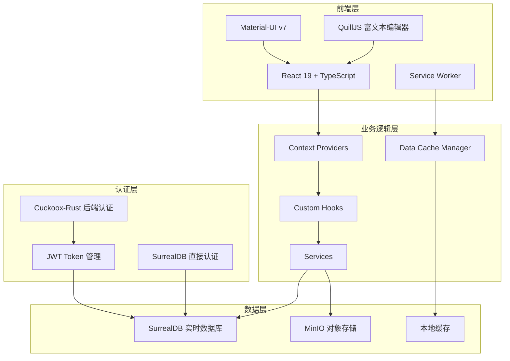
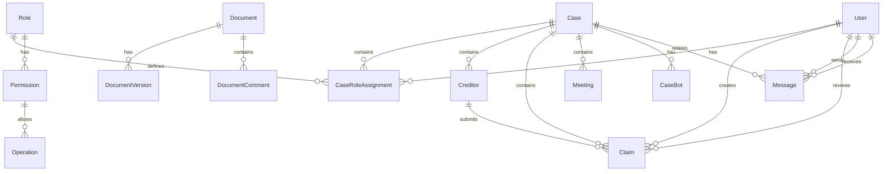

# 设计文档

## 概述

破产案件全生命周期管理平台是一个基于现代Web技术栈构建的企业级案件管理系统。系统采用React 19 + TypeScript前端，SurrealDB实时数据库，MinIO对象存储，以及Service Worker架构，提供高性能、实时协作的破产案件管理解决方案。

系统核心设计理念是通过严格的权限控制、实时数据同步和智能化流程管理，确保破产案件处理的合规性、高效性和透明度。

## 架构

### 整体架构



### Service Worker架构

系统采用Service Worker架构实现后台数据同步和缓存管理：

- **持久化缓存**：用户个人信息、权限、菜单配置
- **临时缓存**：页面数据，基于页面生命周期管理
- **增量同步**：基于时间戳的数据变更同步
- **双向同步**：本地和远程数据库的冲突解决

### 数据库设计

基于现有的SurrealDB schema，系统包含以下核心数据表：

- **case**: 案件基本信息和状态管理
- **creditor**: 债权人信息管理
- **claim**: 债权申报和审核数据
- **user**: 用户账户和认证信息
- **role**: 角色和权限定义
- **message**: 消息中心和通知系统
- **document**: 文档版本控制和协作
- **meeting**: 会议管理和纪要

## 组件和接口

### 核心组件架构

#### 1. 认证和权限组件

```typescript
// AuthContext - 认证状态管理
interface AuthContextValue {
  user: User | null;
  selectedCase: Case | null;
  userRoles: Role[];
  permissions: Permission[];
  login: (credentials: LoginCredentials) => Promise<void>;
  loginRootAdmin: (credentials: LoginCredentials) => Promise<void>;
  logout: () => Promise<void>;
  selectCase: (caseId: string) => Promise<void>;
  refreshToken: () => Promise<void>;
}

interface LoginCredentials {
  username: string;
  password: string;
}

// ProtectedRoute - 路由保护
interface ProtectedRouteProps {
  children: React.ReactNode;
  requiredPermissions?: string[];
  requiredCaseStatus?: string[];
}
```

#### 2. 案件管理组件

```typescript
// CaseManagement - 案件管理主组件
interface CaseManagementProps {
  mode: 'list' | 'detail' | 'create';
}

// CaseStatusFlow - 案件状态流转组件
interface CaseStatusFlowProps {
  currentCase: Case;
  onStatusChange: (newStatus: string, metadata?: any) => Promise<void>;
}

// CaseTimeline - 案件时间轴组件
interface CaseTimelineProps {
  caseId: string;
  events: CaseEvent[];
}
```

#### 3. 债权管理组件

```typescript
// CreditorManagement - 债权人管理
interface CreditorManagementProps {
  caseId: string;
  mode: 'list' | 'create' | 'import';
}

// ClaimSubmission - 债权申报组件
interface ClaimSubmissionProps {
  creditorId: string;
  caseId: string;
  mode: 'create' | 'edit' | 'view';
}

// ClaimReview - 债权审核组件
interface ClaimReviewProps {
  claimId: string;
  mode: 'review' | 'batch';
}
```

#### 4. 富文本编辑组件

```typescript
// RichTextEditor - 基于QuillJS的协作编辑器
interface RichTextEditorProps {
  documentId: string;
  readOnly?: boolean;
  onSave?: (content: string) => Promise<void>;
  enableComments?: boolean;
  enableVersionHistory?: boolean;
}

// DocumentComments - 文档批注组件
interface DocumentCommentsProps {
  documentId: string;
  selection?: TextSelection;
  onCommentAdd: (comment: string) => Promise<void>;
}
```

#### 5. 数据可视化组件

```typescript
// DashboardCharts - 数据大屏图表组件
interface DashboardChartsProps {
  caseId: string;
  chartType: 'overview' | 'trends' | 'distribution';
  realTimeUpdate?: boolean;
}

// StatCard - 统计卡片组件
interface StatCardProps {
  title: string;
  value: number | string;
  trend?: 'up' | 'down' | 'stable';
  format?: 'number' | 'currency' | 'percentage';
}
```

### 服务接口设计

#### 1. 数据服务接口

```typescript
// DataService - 统一数据访问接口
interface DataService {
  // 案件相关
  getCases(filters?: CaseFilters): Promise<Case[]>;
  createCase(caseData: CreateCaseRequest): Promise<Case>;
  updateCaseStatus(caseId: string, status: string, metadata?: any): Promise<void>;
  
  // 债权人相关
  getCreditors(caseId: string, filters?: CreditorFilters): Promise<Creditor[]>;
  createCreditor(creditorData: CreateCreditorRequest): Promise<Creditor>;
  importCreditors(caseId: string, file: File): Promise<ImportResult>;
  
  // 债权相关
  getClaims(caseId: string, filters?: ClaimFilters): Promise<Claim[]>;
  submitClaim(claimData: SubmitClaimRequest): Promise<Claim>;
  reviewClaim(claimId: string, reviewData: ClaimReviewRequest): Promise<void>;
  
  // 实时查询
  subscribeLiveQuery<T>(query: string, callback: (data: T[]) => void): Promise<string>;
  unsubscribeLiveQuery(subscriptionId: string): Promise<void>;
}
```

#### 2. 认证服务接口

```typescript
// AuthService - 认证和授权服务
interface AuthService {
  // JWT认证
  loginWithJWT(credentials: JwtLoginRequest): Promise<JwtLoginResponse>;
  loginRootAdminWithJWT(credentials: JwtLoginRequest): Promise<JwtLoginResponse>;
  refreshToken(request: JwtRefreshRequest): Promise<JwtRefreshResponse>;
  register(userData: RegisterRequest): Promise<RegisterResponse>;
  logout(): Promise<void>;
  
  // Token管理
  setAuthTokens(accessToken: string, refreshToken?: string, expiresIn?: number): Promise<void>;
  clearAuthTokens(): Promise<void>;
  getStoredAccessToken(): Promise<string | null>;
  
  // 租户管理
  setTenantCode(tenantCode: string): Promise<void>;
  getTenantCode(): Promise<string | null>;
  
  // 权限检查
  hasPermission(permission: string): boolean;
  hasOperationPermission(table: string, operation: string): boolean;
  canAccessCase(caseId: string): boolean;
  getAuthStatusFromSurreal(): Promise<boolean>;
  
  // 案件选择
  getUserCases(): Promise<Case[]>;
  selectCase(caseId: string): Promise<void>;
  getCurrentCase(): Case | null;
  
  // 用户管理
  getCurrentUser(): Promise<AppUser | null>;
  setCurrentUser(user: AppUser): Promise<void>;
  checkAuthenticationState(): Promise<boolean>;
}

interface JwtLoginRequest {
  username: string;
  password: string;
}

interface JwtLoginResponse {
  access_token: string;
  token_type: string;
  expires_in: number;
  refresh_token?: string;
  user: {
    id: string;
    username: string;
    name: string;
    email?: string;
    roles: string[];
  };
}

interface JwtRefreshRequest {
  refresh_token: string;
}

interface JwtRefreshResponse {
  access_token: string;
  token_type: string;
  expires_in: number;
  refresh_token?: string;
}

interface RegisterRequest {
  username: string;
  password: string;
  name: string;
  email?: string;
}

interface RegisterResponse {
  success: boolean;
  message: string;
  user?: {
    id: string;
    username: string;
    name: string;
    email?: string;
  };
}
```

#### 3. 消息服务接口

```typescript
// MessageService - 消息和通知服务
interface MessageService {
  // 消息管理
  getMessages(filters?: MessageFilters): Promise<Message[]>;
  sendMessage(messageData: SendMessageRequest): Promise<Message>;
  markAsRead(messageIds: string[]): Promise<void>;
  
  // 系统通知
  sendSystemNotification(notification: SystemNotification): Promise<void>;
  subscribeCaseReminders(caseId: string): Promise<void>;
  
  // 实时通信
  subscribeToConversation(conversationId: string): Promise<void>;
  unsubscribeFromConversation(conversationId: string): Promise<void>;
}
```

#### 4. 文档服务接口

```typescript
// DocumentService - 文档管理和协作服务
interface DocumentService {
  // 文档操作
  createDocument(documentData: CreateDocumentRequest): Promise<Document>;
  getDocument(documentId: string): Promise<Document>;
  updateDocument(documentId: string, content: string): Promise<void>;
  
  // 版本控制
  getDocumentVersions(documentId: string): Promise<DocumentVersion[]>;
  createVersion(documentId: string, content: string, summary?: string): Promise<DocumentVersion>;
  
  // 协作功能
  lockDocument(documentId: string): Promise<void>;
  unlockDocument(documentId: string): Promise<void>;
  addComment(documentId: string, comment: DocumentComment): Promise<void>;
  
  // 文件上传
  uploadFile(file: File, documentId?: string): Promise<FileUploadResult>;
}
```

## 数据模型

### 核心实体关系



### 关键数据结构

#### 案件数据模型

```typescript
interface Case {
  id: string;
  case_number: string;
  name: string;
  case_manager_name: string;
  case_lead_user_id?: string;
  case_procedure: string; // 默认"破产"
  procedure_phase: CasePhase;
  
  // 关键时间节点
  acceptance_date: Date;
  announcement_date?: Date;
  claim_submission_start_date?: Date;
  claim_submission_end_date?: Date;
  first_creditor_meeting_date?: Date;
  reorganization_ruling_date?: Date;
  reorganization_plan_submission_date?: Date;
  delayed_reorganization_plan_submission_date?: Date;
  second_creditor_meeting_date?: Date;
  closing_date?: Date;
  
  // 文档关联
  filing_material_doc_id?: string;
  reorganization_ruling_announcement_doc_id?: string;
  reorganization_plan_doc_id?: string;
  
  // 系统字段
  created_at: Date;
  created_by_user: string;
  updated_at: Date;
  selected_theme_name?: string;
}

type CasePhase = '立案' | '公告' | '债权申报' | '债权人第一次会议' | 
                 '裁定重整' | '提交重整计划' | '延迟提交重整计划' | 
                 '债权人第二次会议' | '破产清算' | '结案';
```

#### 债权数据模型

```typescript
interface Claim {
  id: string;
  claim_number: string;
  case_id: string;
  creditor_id: string;
  
  // 主张债权信息
  asserted_claim_details: {
    nature: string;
    principal: number;
    interest: number;
    other_amount?: number;
    total_asserted_amount: number;
    currency: string;
    brief_description?: string;
    attachment_doc_id: string;
  };
  
  // 审核认定债权信息
  approved_claim_details?: {
    nature: string;
    principal: number;
    interest: number;
    other_amount?: number;
    total_approved_amount: number;
    currency: string;
    approved_attachment_doc_id?: string;
  };
  
  // 审核信息
  status: ClaimStatus;
  review_status_id?: string;
  reviewer_id?: string;
  review_time?: Date;
  review_comments?: string;
  comments_doc_id?: string;
  
  // 系统字段
  created_by: string;
  created_at: Date;
  submission_time: Date;
  updated_at: Date;
}

type ClaimStatus = '草稿' | '待审核' | '审核通过' | '部分通过' | '驳回' | '要求补充材料';
```

#### 权限数据模型

```typescript
interface Role {
  id: string;
  name: string;
  description?: string;
  is_case_specific: boolean; // 是否为案件特定角色
  created_at: Date;
  updated_at: Date;
}

interface Permission {
  id: string;
  role_id: string;
  operation_id: string;
  granted: boolean;
  created_at: Date;
}

interface Operation {
  id: string;
  name: string;
  tables: string[];
  operation_type: 'create' | 'read' | 'update' | 'delete';
  menu_path?: string;
  description?: string;
}

interface CaseRoleAssignment {
  id: string;
  user_id: string;
  case_id: string;
  role_id: string;
  assigned_at: Date;
  assigned_by: string;
}
```

## 错误处理

### 错误分类和处理策略

#### 1. 认证和授权错误

```typescript
class AuthenticationError extends Error {
  constructor(message: string, public code: string) {
    super(message);
    this.name = 'AuthenticationError';
  }
}

class AuthorizationError extends Error {
  constructor(message: string, public requiredPermission: string) {
    super(message);
    this.name = 'AuthorizationError';
  }
}

// 处理策略
const handleAuthError = (error: AuthenticationError | AuthorizationError) => {
  if (error instanceof AuthenticationError) {
    // 清除本地认证状态，重定向到登录页
    authService.logout();
    router.push('/login');
  } else {
    // 显示权限不足提示，返回上一页或首页
    showErrorMessage('权限不足，无法执行此操作');
    router.back();
  }
};
```

#### 2. 数据验证错误

```typescript
interface ValidationError {
  field: string;
  message: string;
  code: string;
}

class DataValidationError extends Error {
  constructor(public errors: ValidationError[]) {
    super('数据验证失败');
    this.name = 'DataValidationError';
  }
}

// 处理策略
const handleValidationError = (error: DataValidationError) => {
  // 在表单中显示具体的字段错误
  error.errors.forEach(({ field, message }) => {
    setFieldError(field, message);
  });
};
```

#### 3. 网络和数据库错误

```typescript
class NetworkError extends Error {
  constructor(message: string, public statusCode?: number) {
    super(message);
    this.name = 'NetworkError';
  }
}

class DatabaseError extends Error {
  constructor(message: string, public query?: string) {
    super(message);
    this.name = 'DatabaseError';
  }
}

// 处理策略
const handleDataError = (error: NetworkError | DatabaseError) => {
  if (error instanceof NetworkError) {
    if (error.statusCode === 401) {
      // 认证过期，尝试刷新token
      return authService.refreshToken();
    } else if (error.statusCode >= 500) {
      // 服务器错误，显示通用错误消息
      showErrorMessage('服务器暂时不可用，请稍后重试');
    }
  } else {
    // 数据库错误，记录日志并显示友好提示
    console.error('Database error:', error.query, error.message);
    showErrorMessage('数据操作失败，请检查输入后重试');
  }
};
```

#### 4. 业务逻辑错误

```typescript
class BusinessRuleError extends Error {
  constructor(message: string, public ruleCode: string) {
    super(message);
    this.name = 'BusinessRuleError';
  }
}

// 案件状态流转错误
class InvalidCaseTransitionError extends BusinessRuleError {
  constructor(currentStatus: string, targetStatus: string) {
    super(`无法从${currentStatus}状态变更为${targetStatus}状态`, 'INVALID_CASE_TRANSITION');
  }
}

// 债权操作错误
class ClaimOperationError extends BusinessRuleError {
  constructor(operation: string, reason: string) {
    super(`债权${operation}失败：${reason}`, 'CLAIM_OPERATION_ERROR');
  }
}
```

### 全局错误处理

```typescript
// 全局错误边界组件
class GlobalErrorBoundary extends React.Component<Props, State> {
  static getDerivedStateFromError(error: Error): State {
    return { hasError: true, error };
  }

  componentDidCatch(error: Error, errorInfo: React.ErrorInfo) {
    // 记录错误到监控系统
    console.error('Global error caught:', error, errorInfo);
    
    // 根据错误类型进行不同处理
    if (error instanceof AuthenticationError) {
      handleAuthError(error);
    } else if (error instanceof DataValidationError) {
      handleValidationError(error);
    } else if (error instanceof BusinessRuleError) {
      showErrorMessage(error.message);
    } else {
      // 未知错误，显示通用错误页面
      showErrorMessage('系统发生未知错误，请刷新页面重试');
    }
  }
}
```

## 测试策略

### 测试架构

系统采用多层次测试策略，确保代码质量和系统稳定性：

#### 1. 单元测试 (Vitest + Testing Library)

```typescript
// 组件测试示例
describe('ClaimSubmission', () => {
  it('should calculate total amount correctly', () => {
    const { getByTestId } = render(
      <ClaimSubmission creditorId="test" caseId="test" mode="create" />
    );
    
    fireEvent.change(getByTestId('principal-input'), { target: { value: '100000' } });
    fireEvent.change(getByTestId('interest-input'), { target: { value: '5000' } });
    
    expect(getByTestId('total-amount')).toHaveTextContent('105,000.00');
  });
});

// 服务测试示例
describe('DataService', () => {
  it('should handle claim submission correctly', async () => {
    const mockClient = createMockSurrealClient();
    const dataService = new DataService(mockClient);
    
    const claimData = {
      creditorId: 'creditor:test',
      caseId: 'case:test',
      principal: 100000,
      interest: 5000
    };
    
    const result = await dataService.submitClaim(claimData);
    
    expect(result.id).toBeDefined();
    expect(result.status).toBe('待审核');
  });
});
```

#### 2. 集成测试

```typescript
// 数据库集成测试
describe('Case Management Integration', () => {
  beforeEach(async () => {
    await setupTestDatabase();
    await seedTestData();
  });
  
  it('should create case and update status correctly', async () => {
    const caseData = {
      case_number: 'TEST-001',
      name: '测试案件',
      case_manager_name: '张三',
      acceptance_date: new Date()
    };
    
    const createdCase = await dataService.createCase(caseData);
    expect(createdCase.procedure_phase).toBe('立案');
    
    await dataService.updateCaseStatus(createdCase.id, '公告');
    const updatedCase = await dataService.getCase(createdCase.id);
    expect(updatedCase.procedure_phase).toBe('公告');
  });
});
```

#### 3. 端到端测试 (Playwright)

```typescript
// E2E测试示例
test('complete claim submission flow', async ({ page }) => {
  // 登录
  await page.goto('/login');
  await page.click('[data-testid="github-login"]');
  
  // 选择案件
  await page.selectOption('[data-testid="case-selector"]', 'case:test');
  
  // 进入债权申报
  await page.click('[data-testid="claim-submission-menu"]');
  
  // 填写债权信息
  await page.fill('[data-testid="principal-input"]', '100000');
  await page.fill('[data-testid="interest-input"]', '5000');
  await page.selectOption('[data-testid="nature-select"]', '普通债权');
  
  // 提交申报
  await page.click('[data-testid="submit-claim"]');
  
  // 验证结果
  await expect(page.locator('[data-testid="success-message"]')).toBeVisible();
  await expect(page.locator('[data-testid="claim-status"]')).toHaveText('待审核');
});
```

### 测试数据管理

```typescript
// 测试数据工厂
class TestDataFactory {
  static createCase(overrides?: Partial<Case>): Case {
    return {
      id: `case:${Date.now()}`,
      case_number: 'TEST-001',
      name: '测试案件',
      case_manager_name: '张三',
      case_procedure: '破产',
      procedure_phase: '立案',
      acceptance_date: new Date(),
      created_at: new Date(),
      created_by_user: 'user:test',
      updated_at: new Date(),
      ...overrides
    };
  }
  
  static createClaim(overrides?: Partial<Claim>): Claim {
    return {
      id: `claim:${Date.now()}`,
      claim_number: 'CLAIM-001',
      case_id: 'case:test',
      creditor_id: 'creditor:test',
      asserted_claim_details: {
        nature: '普通债权',
        principal: 100000,
        interest: 5000,
        total_asserted_amount: 105000,
        currency: 'CNY',
        attachment_doc_id: 'document:test'
      },
      status: '草稿',
      created_by: 'user:test',
      created_at: new Date(),
      submission_time: new Date(),
      updated_at: new Date(),
      ...overrides
    };
  }
}
```

### 性能测试

```typescript
// 性能测试示例
describe('Performance Tests', () => {
  it('should load large claim list within acceptable time', async () => {
    const startTime = performance.now();
    
    // 创建1000条测试债权数据
    const claims = Array.from({ length: 1000 }, (_, i) => 
      TestDataFactory.createClaim({ claim_number: `CLAIM-${i}` })
    );
    
    await dataService.batchCreateClaims(claims);
    
    const loadStartTime = performance.now();
    const result = await dataService.getClaims('case:test');
    const loadEndTime = performance.now();
    
    expect(result.length).toBe(1000);
    expect(loadEndTime - loadStartTime).toBeLessThan(2000); // 2秒内完成
  });
});
```

这个设计文档涵盖了系统的核心架构、组件设计、数据模型、错误处理和测试策略。设计充分考虑了现有技术栈的特点，确保系统的可扩展性、可维护性和高性能。