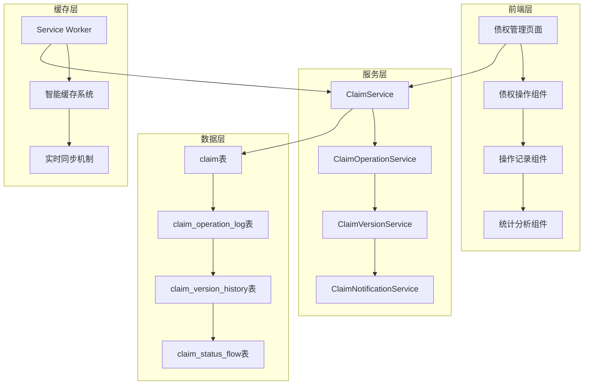

# 债权申报操作记录追踪系统设计文档

## 概述

本文档描述了债权申报操作记录追踪系统的技术设计，基于现有的SurrealDB数据库和Service Worker缓存架构，实现完整的债权生命周期管理和操作记录追踪功能。

## 架构设计

### 系统架构图



## 数据模型设计

### 核心数据表结构

#### 1. 债权操作日志表 (claim_operation_log)

```sql
-- 债权操作日志表
DEFINE TABLE claim_operation_log TYPE NORMAL SCHEMAFULL PERMISSIONS 
  FOR select WHERE $auth.id->has_role->role->can_execute_operation->operation_metadata[WHERE tables CONTAINS 'claim_operation_log' AND operation_type = 'read'] OR $auth.id->has_case_role->role->can_execute_operation->operation_metadata[WHERE tables CONTAINS 'claim_operation_log' AND operation_type = 'read'],
  FOR create WHERE $auth.id->has_role->role->can_execute_operation->operation_metadata[WHERE tables CONTAINS 'claim_operation_log' AND operation_type = 'create'] OR $auth.id->has_case_role->role->can_execute_operation->operation_metadata[WHERE tables CONTAINS 'claim_operation_log' AND operation_type = 'create'],
  FOR update NONE,
  FOR delete WHERE $auth.id->has_role->role.name CONTAINS 'admin';

DEFINE FIELD claim_id ON claim_operation_log TYPE record<claim> PERMISSIONS FULL;
DEFINE FIELD operation_type ON claim_operation_log TYPE string ASSERT $value INSIDE ['create', 'update', 'submit', 'withdraw', 'review', 'approve', 'reject', 'supplement_request', 'delete', 'view'] PERMISSIONS FULL;
DEFINE FIELD operation_description ON claim_operation_log TYPE string PERMISSIONS FULL;
DEFINE FIELD operator_id ON claim_operation_log TYPE record<user> DEFAULT $auth.id PERMISSIONS FULL;
DEFINE FIELD operator_name ON claim_operation_log TYPE string PERMISSIONS FULL;
DEFINE FIELD operator_role ON claim_operation_log TYPE string PERMISSIONS FULL;
DEFINE FIELD operation_time ON claim_operation_log TYPE datetime DEFAULT time::now() READONLY PERMISSIONS FULL;
DEFINE FIELD ip_address ON claim_operation_log TYPE option<string> PERMISSIONS FULL;
DEFINE FIELD user_agent ON claim_operation_log TYPE option<string> PERMISSIONS FULL;
DEFINE FIELD operation_details ON claim_operation_log TYPE option<object> PERMISSIONS FULL;
DEFINE FIELD before_data ON claim_operation_log TYPE option<object> PERMISSIONS FULL;
DEFINE FIELD after_data ON claim_operation_log TYPE option<object> PERMISSIONS FULL;
DEFINE FIELD changed_fields ON claim_operation_log TYPE option<array<string>> PERMISSIONS FULL;
DEFINE FIELD operation_result ON claim_operation_log TYPE string DEFAULT 'success' ASSERT $value INSIDE ['success', 'failed', 'partial'] PERMISSIONS FULL;
DEFINE FIELD error_message ON claim_operation_log TYPE option<string> PERMISSIONS FULL;
DEFINE FIELD related_documents ON claim_operation_log TYPE option<array<record<document>>> PERMISSIONS FULL;
DEFINE FIELD business_context ON claim_operation_log TYPE option<object> PERMISSIONS FULL;

-- 索引优化
DEFINE INDEX claim_operation_claim_time_idx ON claim_operation_log FIELDS claim_id, operation_time DESC;
DEFINE INDEX claim_operation_operator_idx ON claim_operation_log FIELDS operator_id, operation_time DESC;
DEFINE INDEX claim_operation_type_idx ON claim_operation_log FIELDS operation_type, operation_time DESC;
DEFINE INDEX claim_operation_result_idx ON claim_operation_log FIELDS operation_result, operation_time DESC;
```

#### 2. 债权版本历史表 (claim_version_history)

```sql
-- 债权版本历史表
DEFINE TABLE claim_version_history TYPE NORMAL SCHEMAFULL PERMISSIONS 
  FOR select WHERE $auth.id->has_role->role->can_execute_operation->operation_metadata[WHERE tables CONTAINS 'claim_version_history' AND operation_type = 'read'] OR $auth.id->has_case_role->role->can_execute_operation->operation_metadata[WHERE tables CONTAINS 'claim_version_history' AND operation_type = 'read'],
  FOR create WHERE $auth.id->has_role->role->can_execute_operation->operation_metadata[WHERE tables CONTAINS 'claim_version_history' AND operation_type = 'create'] OR $auth.id->has_case_role->role->can_execute_operation->operation_metadata[WHERE tables CONTAINS 'claim_version_history' AND operation_type = 'create'],
  FOR update NONE,
  FOR delete WHERE $auth.id->has_role->role.name CONTAINS 'admin';

DEFINE FIELD claim_id ON claim_version_history TYPE record<claim> PERMISSIONS FULL;
DEFINE FIELD version_number ON claim_version_history TYPE int PERMISSIONS FULL;
DEFINE FIELD version_type ON claim_version_history TYPE string ASSERT $value INSIDE ['initial', 'draft_update', 'submission', 'review_update', 'approval', 'rejection'] PERMISSIONS FULL;
DEFINE FIELD snapshot_data ON claim_version_history TYPE object PERMISSIONS FULL;
DEFINE FIELD change_summary ON claim_version_history TYPE option<string> PERMISSIONS FULL;
DEFINE FIELD changed_by ON claim_version_history TYPE record<user> DEFAULT $auth.id PERMISSIONS FULL;
DEFINE FIELD change_reason ON claim_version_history TYPE option<string> PERMISSIONS FULL;
DEFINE FIELD created_at ON claim_version_history TYPE datetime DEFAULT time::now() READONLY PERMISSIONS FULL;
DEFINE FIELD related_operation_log_id ON claim_version_history TYPE option<record<claim_operation_log>> PERMISSIONS FULL;
DEFINE FIELD checksum ON claim_version_history TYPE option<string> PERMISSIONS FULL;

-- 索引优化
DEFINE INDEX claim_version_claim_version_idx ON claim_version_history FIELDS claim_id, version_number UNIQUE;
DEFINE INDEX claim_version_claim_time_idx ON claim_version_history FIELDS claim_id, created_at DESC;
DEFINE INDEX claim_version_type_idx ON claim_version_history FIELDS version_type, created_at DESC;
```

#### 3. 债权状态流转表 (claim_status_flow)

```sql
-- 债权状态流转表
DEFINE TABLE claim_status_flow TYPE NORMAL SCHEMAFULL PERMISSIONS 
  FOR select WHERE $auth.id->has_role->role->can_execute_operation->operation_metadata[WHERE tables CONTAINS 'claim_status_flow' AND operation_type = 'read'] OR $auth.id->has_case_role->role->can_execute_operation->operation_metadata[WHERE tables CONTAINS 'claim_status_flow' AND operation_type = 'read'],
  FOR create WHERE $auth.id->has_role->role->can_execute_operation->operation_metadata[WHERE tables CONTAINS 'claim_status_flow' AND operation_type = 'create'] OR $auth.id->has_case_role->role->can_execute_operation->operation_metadata[WHERE tables CONTAINS 'claim_status_flow' AND operation_type = 'create'],
  FOR update NONE,
  FOR delete WHERE $auth.id->has_role->role.name CONTAINS 'admin';

DEFINE FIELD claim_id ON claim_status_flow TYPE record<claim> PERMISSIONS FULL;
DEFINE FIELD from_status ON claim_status_flow TYPE option<record<claim_review_status_definition>> PERMISSIONS FULL;
DEFINE FIELD to_status ON claim_status_flow TYPE record<claim_review_status_definition> PERMISSIONS FULL;
DEFINE FIELD transition_type ON claim_status_flow TYPE string ASSERT $value INSIDE ['user_action', 'system_action', 'admin_action', 'auto_transition'] PERMISSIONS FULL;
DEFINE FIELD trigger_reason ON claim_status_flow TYPE string PERMISSIONS FULL;
DEFINE FIELD transition_time ON claim_status_flow TYPE datetime DEFAULT time::now() READONLY PERMISSIONS FULL;
DEFINE FIELD operator_id ON claim_status_flow TYPE record<user> DEFAULT $auth.id PERMISSIONS FULL;
DEFINE FIELD operator_role ON claim_status_flow TYPE string PERMISSIONS FULL;
DEFINE FIELD transition_notes ON claim_status_flow TYPE option<string> PERMISSIONS FULL;
DEFINE FIELD review_comments ON claim_status_flow TYPE option<string> PERMISSIONS FULL;
DEFINE FIELD duration_in_previous_status ON claim_status_flow TYPE option<duration> PERMISSIONS FULL;
DEFINE FIELD related_operation_log_id ON claim_status_flow TYPE option<record<claim_operation_log>> PERMISSIONS FULL;

-- 索引优化
DEFINE INDEX claim_status_flow_claim_time_idx ON claim_status_flow FIELDS claim_id, transition_time DESC;
DEFINE INDEX claim_status_flow_status_idx ON claim_status_flow FIELDS to_status, transition_time DESC;
DEFINE INDEX claim_status_flow_operator_idx ON claim_status_flow FIELDS operator_id, transition_time DESC;
```

#### 4. 债权访问日志表 (claim_access_log)

```sql
-- 债权访问日志表
DEFINE TABLE claim_access_log TYPE NORMAL SCHEMAFULL PERMISSIONS 
  FOR select WHERE $auth.id->has_role->role->can_execute_operation->operation_metadata[WHERE tables CONTAINS 'claim_access_log' AND operation_type = 'read'] OR $auth.id->has_case_role->role->can_execute_operation->operation_metadata[WHERE tables CONTAINS 'claim_access_log' AND operation_type = 'read'],
  FOR create WHERE $auth.id->has_role->role->can_execute_operation->operation_metadata[WHERE tables CONTAINS 'claim_access_log' AND operation_type = 'create'] OR $auth.id->has_case_role->role->can_execute_operation->operation_metadata[WHERE tables CONTAINS 'claim_access_log' AND operation_type = 'create'],
  FOR update NONE,
  FOR delete WHERE $auth.id->has_role->role.name CONTAINS 'admin';

DEFINE FIELD claim_id ON claim_access_log TYPE record<claim> PERMISSIONS FULL;
DEFINE FIELD access_type ON claim_access_log TYPE string ASSERT $value INSIDE ['view', 'download', 'export', 'print'] PERMISSIONS FULL;
DEFINE FIELD accessor_id ON claim_access_log TYPE record<user> DEFAULT $auth.id PERMISSIONS FULL;
DEFINE FIELD accessor_name ON claim_access_log TYPE string PERMISSIONS FULL;
DEFINE FIELD accessor_role ON claim_access_log TYPE string PERMISSIONS FULL;
DEFINE FIELD access_time ON claim_access_log TYPE datetime DEFAULT time::now() READONLY PERMISSIONS FULL;
DEFINE FIELD ip_address ON claim_access_log TYPE option<string> PERMISSIONS FULL;
DEFINE FIELD user_agent ON claim_access_log TYPE option<string> PERMISSIONS FULL;
DEFINE FIELD accessed_fields ON claim_access_log TYPE option<array<string>> PERMISSIONS FULL;
DEFINE FIELD access_duration ON claim_access_log TYPE option<duration> PERMISSIONS FULL;
DEFINE FIELD access_result ON claim_access_log TYPE string DEFAULT 'success' ASSERT $value INSIDE ['success', 'denied', 'error'] PERMISSIONS FULL;
DEFINE FIELD denial_reason ON claim_access_log TYPE option<string> PERMISSIONS FULL;

-- 索引优化
DEFINE INDEX claim_access_claim_time_idx ON claim_access_log FIELDS claim_id, access_time DESC;
DEFINE INDEX claim_access_accessor_idx ON claim_access_log FIELDS accessor_id, access_time DESC;
DEFINE INDEX claim_access_type_idx ON claim_access_log FIELDS access_type, access_time DESC;
```

### 现有表结构优化

#### 优化 claim 表

```sql
-- 为现有 claim 表添加版本控制字段
DEFINE FIELD current_version ON claim TYPE int DEFAULT 1 PERMISSIONS FULL;
DEFINE FIELD last_operation_time ON claim TYPE datetime VALUE time::now() PERMISSIONS FULL;
DEFINE FIELD operation_count ON claim TYPE int DEFAULT 0 PERMISSIONS FULL;

-- 添加索引优化查询性能
DEFINE INDEX claim_version_idx ON claim FIELDS id, current_version;
DEFINE INDEX claim_last_operation_idx ON claim FIELDS last_operation_time DESC;
```

## 组件设计

### 1. ClaimOperationService

```typescript
interface ClaimOperationService {
  // 记录操作日志
  logOperation(params: {
    claimId: string;
    operationType: OperationType;
    description: string;
    beforeData?: any;
    afterData?: any;
    operationDetails?: any;
    businessContext?: any;
  }): Promise<void>;

  // 获取操作历史
  getOperationHistory(claimId: string, options?: {
    limit?: number;
    offset?: number;
    operationType?: OperationType;
    dateRange?: { start: Date; end: Date };
  }): Promise<ClaimOperationLog[]>;

  // 获取操作统计
  getOperationStatistics(params: {
    caseId?: string;
    dateRange?: { start: Date; end: Date };
    groupBy?: 'operator' | 'operation_type' | 'date';
  }): Promise<OperationStatistics>;
}
```

### 2. ClaimVersionService

```typescript
interface ClaimVersionService {
  // 创建版本快照
  createVersionSnapshot(params: {
    claimId: string;
    versionType: VersionType;
    changeSummary?: string;
    changeReason?: string;
  }): Promise<ClaimVersionHistory>;

  // 获取版本历史
  getVersionHistory(claimId: string): Promise<ClaimVersionHistory[]>;

  // 版本对比
  compareVersions(params: {
    claimId: string;
    fromVersion: number;
    toVersion: number;
  }): Promise<VersionDiff>;

  // 恢复到指定版本
  revertToVersion(params: {
    claimId: string;
    targetVersion: number;
    reason: string;
  }): Promise<void>;
}
```

### 3. ClaimStatusFlowService

```typescript
interface ClaimStatusFlowService {
  // 记录状态流转
  recordStatusTransition(params: {
    claimId: string;
    fromStatus?: string;
    toStatus: string;
    transitionType: TransitionType;
    triggerReason: string;
    transitionNotes?: string;
    reviewComments?: string;
  }): Promise<void>;

  // 获取状态流转历史
  getStatusFlowHistory(claimId: string): Promise<ClaimStatusFlow[]>;

  // 获取状态统计
  getStatusStatistics(params: {
    caseId?: string;
    dateRange?: { start: Date; end: Date };
  }): Promise<StatusStatistics>;
}
```

### 4. ClaimAuditService

```typescript
interface ClaimAuditService {
  // 记录访问日志
  logAccess(params: {
    claimId: string;
    accessType: AccessType;
    accessedFields?: string[];
    accessDuration?: number;
  }): Promise<void>;

  // 获取审计日志
  getAuditLog(params: {
    claimId?: string;
    userId?: string;
    dateRange?: { start: Date; end: Date };
    accessType?: AccessType;
  }): Promise<ClaimAccessLog[]>;

  // 导出审计报告
  exportAuditReport(params: {
    format: 'excel' | 'pdf';
    filters: AuditFilters;
  }): Promise<string>; // 返回文件URL
}
```

## 前端组件设计

### 1. ClaimOperationHistory 组件

```typescript
interface ClaimOperationHistoryProps {
  claimId: string;
  showFilters?: boolean;
  maxHeight?: number;
  onOperationClick?: (operation: ClaimOperationLog) => void;
}

const ClaimOperationHistory: React.FC<ClaimOperationHistoryProps> = ({
  claimId,
  showFilters = true,
  maxHeight = 400,
  onOperationClick
}) => {
  // 组件实现
};
```

### 2. ClaimVersionComparison 组件

```typescript
interface ClaimVersionComparisonProps {
  claimId: string;
  fromVersion: number;
  toVersion: number;
  onClose: () => void;
}

const ClaimVersionComparison: React.FC<ClaimVersionComparisonProps> = ({
  claimId,
  fromVersion,
  toVersion,
  onClose
}) => {
  // 组件实现
};
```

### 3. ClaimStatusFlowChart 组件

```typescript
interface ClaimStatusFlowChartProps {
  claimId: string;
  interactive?: boolean;
  showTimeline?: boolean;
}

const ClaimStatusFlowChart: React.FC<ClaimStatusFlowChartProps> = ({
  claimId,
  interactive = false,
  showTimeline = true
}) => {
  // 组件实现
};
```

## 缓存策略设计

### 智能缓存配置

```typescript
const claimTrackingCacheConfig = {
  tables: ['claim_operation_log', 'claim_version_history', 'claim_status_flow'],
  strategy: 'HYBRID',
  ttl: 300000, // 5分钟
  preload: true,
  subscriptions: {
    'claim_operation_log': {
      condition: 'claim_id = $current_claim_id',
      autoRefresh: true,
      refreshInterval: 30000
    },
    'claim_version_history': {
      condition: 'claim_id = $current_claim_id',
      autoRefresh: false
    },
    'claim_status_flow': {
      condition: 'claim_id = $current_claim_id',
      autoRefresh: true,
      refreshInterval: 60000
    }
  }
};
```

### 实时同步机制

```typescript
// Service Worker 中的实时同步处理
class ClaimTrackingSync {
  async handleClaimOperationUpdate(data: any) {
    // 更新本地缓存
    await this.updateLocalCache('claim_operation_log', data);
    
    // 通知相关页面
    await this.notifyPages('claim_operation_updated', {
      claimId: data.claim_id,
      operationType: data.operation_type
    });
    
    // 触发相关统计更新
    await this.updateStatisticsCache(data.claim_id);
  }

  async handleStatusTransition(data: any) {
    // 更新状态流转缓存
    await this.updateLocalCache('claim_status_flow', data);
    
    // 发送通知
    await this.sendStatusChangeNotification(data);
    
    // 更新相关统计
    await this.updateStatusStatistics(data.claim_id);
  }
}
```

## 通知机制设计

### 通知触发规则

```typescript
const notificationRules = {
  'claim_submitted': {
    recipients: ['case_lead', 'claim_reviewers'],
    template: 'claim_submitted_notification',
    priority: 'NORMAL'
  },
  'claim_approved': {
    recipients: ['claim_creator'],
    template: 'claim_approved_notification',
    priority: 'HIGH'
  },
  'claim_rejected': {
    recipients: ['claim_creator'],
    template: 'claim_rejected_notification',
    priority: 'HIGH'
  },
  'claim_supplement_required': {
    recipients: ['claim_creator'],
    template: 'claim_supplement_notification',
    priority: 'HIGH'
  }
};
```

### 通知模板

```typescript
const notificationTemplates = {
  claim_submitted_notification: {
    title: '新债权申报提交 - {claim_number}',
    content: '债权人 {creditor_name} 提交了新的债权申报，请及时审核。\n\n债权编号：{claim_number}\n申报金额：{asserted_amount}\n提交时间：{submission_time}',
    actionLink: '/claims/{claim_id}/review'
  },
  claim_approved_notification: {
    title: '债权审核通过 - {claim_number}',
    content: '您的债权申报已审核通过。\n\n债权编号：{claim_number}\n确认金额：{approved_amount}\n审核时间：{review_time}',
    actionLink: '/my-claims/{claim_id}'
  }
  // 更多模板...
};
```

## 性能优化设计

### 数据分区策略

```sql
-- 按时间分区操作日志表
DEFINE TABLE claim_operation_log_2024 TYPE NORMAL SCHEMAFULL 
  PERMISSIONS FOR select, create WHERE operation_time >= '2024-01-01T00:00:00Z' AND operation_time < '2025-01-01T00:00:00Z';

-- 历史数据归档策略
DEFINE EVENT archive_old_operation_logs ON DATABASE WHEN time::now() > time::now() - 1y THEN {
  -- 归档一年前的操作日志
  CREATE claim_operation_log_archive SELECT * FROM claim_operation_log 
  WHERE operation_time < time::now() - 1y;
  
  DELETE FROM claim_operation_log 
  WHERE operation_time < time::now() - 1y;
};
```

### 查询优化

```typescript
// 分页查询优化
const getOperationHistoryOptimized = async (claimId: string, options: {
  page: number;
  pageSize: number;
  operationType?: string;
}) => {
  const offset = (options.page - 1) * options.pageSize;
  
  let whereClause = 'claim_id = $claimId';
  const params: any = { claimId, limit: options.pageSize, offset };
  
  if (options.operationType) {
    whereClause += ' AND operation_type = $operationType';
    params.operationType = options.operationType;
  }
  
  const query = `
    SELECT * FROM claim_operation_log 
    WHERE ${whereClause}
    ORDER BY operation_time DESC
    LIMIT $limit START $offset
  `;
  
  return await queryWithAuth(query, params);
};
```

## 错误处理和恢复

### 操作失败处理

```typescript
class ClaimOperationHandler {
  async executeWithLogging<T>(
    operation: () => Promise<T>,
    logParams: LogParams
  ): Promise<T> {
    const startTime = Date.now();
    let result: T;
    let error: Error | null = null;
    
    try {
      result = await operation();
      
      // 记录成功操作
      await this.logOperation({
        ...logParams,
        operationResult: 'success',
        operationDetails: {
          duration: Date.now() - startTime
        }
      });
      
      return result;
    } catch (err) {
      error = err as Error;
      
      // 记录失败操作
      await this.logOperation({
        ...logParams,
        operationResult: 'failed',
        errorMessage: error.message,
        operationDetails: {
          duration: Date.now() - startTime,
          stackTrace: error.stack
        }
      });
      
      throw error;
    }
  }
}
```

## 测试策略

### 单元测试

```typescript
describe('ClaimOperationService', () => {
  test('should log operation correctly', async () => {
    const service = new ClaimOperationService(mockClient);
    
    await service.logOperation({
      claimId: 'claim:test',
      operationType: 'submit',
      description: '提交债权申报',
      beforeData: { status: 'draft' },
      afterData: { status: 'submitted' }
    });
    
    expect(mockClient.query).toHaveBeenCalledWith(
      expect.stringContaining('CREATE claim_operation_log'),
      expect.objectContaining({
        claimId: 'claim:test',
        operationType: 'submit'
      })
    );
  });
});
```

### 集成测试

```typescript
describe('Claim Operation Tracking Integration', () => {
  test('should track complete claim lifecycle', async () => {
    // 创建债权
    const claim = await claimService.createClaim(mockClaimData);
    
    // 验证创建操作被记录
    const createLog = await operationService.getOperationHistory(claim.id);
    expect(createLog[0].operationType).toBe('create');
    
    // 提交债权
    await claimService.submitClaim(claim.id);
    
    // 验证提交操作被记录
    const submitLog = await operationService.getOperationHistory(claim.id);
    expect(submitLog[0].operationType).toBe('submit');
    
    // 验证状态流转被记录
    const statusFlow = await statusFlowService.getStatusFlowHistory(claim.id);
    expect(statusFlow).toHaveLength(2); // 创建 + 提交
  });
});
```

## 安全考虑

### 数据脱敏

```typescript
const sensitiveFields = ['creditor_legal_id', 'contact_phone', 'contact_email'];

const sanitizeLogData = (data: any): any => {
  const sanitized = { ...data };
  
  sensitiveFields.forEach(field => {
    if (sanitized[field]) {
      sanitized[field] = maskSensitiveData(sanitized[field]);
    }
  });
  
  return sanitized;
};
```

### 访问控制

```typescript
const checkOperationLogAccess = async (userId: string, claimId: string): Promise<boolean> => {
  // 检查用户是否有权限查看该债权的操作日志
  const hasPermission = await permissionService.checkClaimAccess(userId, claimId, 'read_operation_log');
  
  if (!hasPermission) {
    await auditService.logAccess({
      claimId,
      accessType: 'view',
      accessResult: 'denied',
      denialReason: 'insufficient_permissions'
    });
  }
  
  return hasPermission;
};
```

这个设计文档提供了完整的债权申报操作记录追踪系统的技术架构，包括数据模型、服务组件、前端界面、缓存策略、通知机制、性能优化和安全考虑等各个方面。