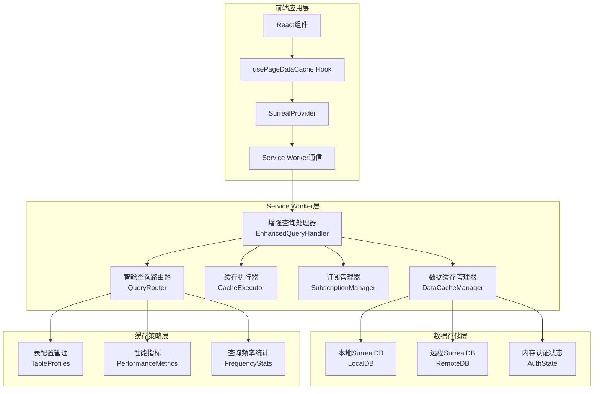

# 增强本地数据库缓存同步系统设计文档

## 概述

本设计文档基于现有的Service Worker架构，设计一个智能的本地数据库缓存和同步系统。该系统将在现有的`sw-surreal.ts`、`data-cache-manager.ts`和`subscription-manager.ts`基础上进行增强，实现统一的SurrealQL查询接口，智能的缓存路由，以及页面感知的自动订阅机制。

## 架构设计

### 整体架构图



### 核心组件设计

#### 1. 增强查询处理器 (EnhancedQueryHandler)

**职责：**
- 替换现有`sw-surreal.ts`中的简单查询处理逻辑
- 统一处理所有SurrealQL查询请求
- 协调各个子组件完成智能缓存和同步

**接口设计：**
```typescript
interface EnhancedQueryHandler {
  // 处理查询请求（替换现有的query/mutate处理）
  handleQuery(sql: string, params?: QueryParams, userId?: string, caseId?: string): Promise<QueryHandlerResult>
  
  // 处理写操作
  handleMutation(sql: string, params?: QueryParams, userId?: string, caseId?: string): Promise<QueryHandlerResult>
  
  // 预热缓存
  preloadCache(tables: string[], userId?: string, caseId?: string): Promise<void>
  
  // 获取性能统计
  getPerformanceStats(): PerformanceStats
}
```

#### 2. 智能查询路由器 (QueryRouter)

**职责：**
- 分析SurrealQL查询特征
- 根据表配置、查询频率、性能指标决定缓存策略
- 维护表缓存配置和性能统计

**核心算法：**
```typescript
// 查询分析算法
analyzeQuery(sql: string, params?: QueryParams): QueryAnalysis {
  // 1. 提取查询类型 (SELECT/INSERT/UPDATE/DELETE)
  // 2. 提取涉及的表名
  // 3. 分析查询复杂度 (JOIN/聚合/条件)
  // 4. 检测个人数据查询模式
  // 5. 评估查询频率和结果大小
}

// 缓存策略决策算法
decideCacheStrategy(analysis: QueryAnalysis, userId?: string): CacheRoutingDecision {
  // 1. 写操作 -> REMOTE_ONLY
  // 2. 个人数据查询 -> LOCAL_FIRST
  // 3. 单表简单查询 -> 根据表配置决定
  // 4. 复杂查询 -> 根据频率和性能指标决定
  // 5. 多表查询 -> 检查所有表的一致性要求
}
```

#### 3. 缓存执行器 (CacheExecutor)

**职责：**
- 根据QueryRouter的决策执行具体的缓存操作
- 实现多种缓存策略的执行逻辑
- 管理缓存状态检查和数据质量评估

**缓存策略实现：**
```typescript
// 本地优先策略
async executeLocalFirst(sql, params, analysis, decision, userId, caseId) {
  // 1. 检查本地缓存状态和数据质量
  // 2. 如果有新鲜数据，直接返回本地结果
  // 3. 如果数据陈旧，返回本地数据并安排后台同步
  // 4. 如果无本地数据，回退到远程查询
}

// 远程优先策略
async executeRemoteFirst(sql, params, analysis, decision, userId, caseId) {
  // 1. 优先从远程数据库查询
  // 2. 根据决策缓存查询结果
  // 3. 如果远程失败，尝试本地缓存
}

// 混合策略
async executeHybrid(sql, params, analysis, decision, userId, caseId) {
  // 1. 评估本地数据新鲜度
  // 2. 结合性能指标动态选择执行路径
  // 3. 根据数据质量和网络状况智能切换
}
```

#### 4. 增强订阅管理器 (SubscriptionManager)

**职责：**
- 管理Live Query订阅
- 实现页面感知的自动订阅
- 处理实时数据变更和增量同步

**订阅策略：**
```typescript
// 预定义订阅策略
const SUBSCRIPTION_STRATEGIES = {
  // 用户权限相关表 - 低频更新，高优先级
  user: {
    type: SubscriptionType.FULL_TABLE,
    updateFrequency: 10 * 60 * 1000, // 10分钟
    priority: 9,
    enableIncrementalSync: true
  },
  
  // 案件相关表 - 中等频率更新
  case: {
    type: SubscriptionType.CONDITIONAL,
    conditions: 'status != "archived"',
    updateFrequency: 5 * 60 * 1000, // 5分钟
    priority: 8
  },
  
  // 实时数据表 - 高频更新
  notification: {
    type: SubscriptionType.USER_SPECIFIC,
    updateFrequency: 30 * 1000, // 30秒
    priority: 10
  }
}
```

#### 5. 增强数据缓存管理器 (DataCacheManager)

**职责：**
- 管理本地数据库的数据存储
- 实现智能查询路由到本地或远程
- 维护内存中的认证状态信息

**核心改进：**
```typescript
// 智能查询方法
async query(sql: string, params?: QueryParams): Promise<UnknownData[]> {
  // 1. 检查是否包含认证查询
  if (this.containsAuth(sql)) {
    return await this.handleAuthQuery(sql, params);
  }
  
  // 2. 提取主要表名并检查缓存状态
  const tableName = this.extractTableName(sql);
  if (tableName && this.isTableCached(tableName)) {
    // 使用本地查询
    return await this.localDb.query(sql, params);
  }
  
  // 3. 使用远程查询并缓存结果
  const result = await this.remoteDb.query(sql, params);
  await this.cacheQueryResult(tableName, result);
  return result;
}

// 认证查询处理
async handleAuthQuery(sql: string, params?: QueryParams): Promise<UnknownData[]> {
  // 1. 从内存获取认证状态
  const authState = this.currentAuthState;
  
  // 2. 处理实际查询部分
  const actualSql = sql.replace(/return\s+\$auth\s*;?\s*/i, '').trim();
  let queryResult = [];
  
  if (actualSql) {
    // 执行实际查询，替换$auth变量
    const processedSql = this.processAuthVariables(actualSql, params, authState);
    queryResult = await this.executeProcessedQuery(processedSql);
  }
  
  // 3. 返回认证状态 + 查询结果
  return [authState, ...queryResult];
}
```

### 页面感知自动订阅系统

#### 页面数据需求检测

```typescript
// 页面配置管理
const PAGE_DATA_REQUIREMENTS = {
  '/cases': {
    requiredTables: ['case', 'case_status', 'case_types'],
    cacheStrategy: 'aggressive',
    preloadQueries: [
      {
        table: 'case',
        query: 'SELECT * FROM case WHERE status != "archived" ORDER BY created_at DESC LIMIT 100',
        priority: 'high'
      }
    ]
  },
  
  '/cases/:id': {
    requiredTables: ['case', 'claim', 'creditor', 'attachment'],
    cacheStrategy: 'aggressive',
    preloadQueries: [
      {
        table: 'claim',
        query: 'SELECT * FROM claim WHERE case_id = $case_id ORDER BY created_at DESC',
        priority: 'high'
      }
    ]
  }
}

// 自动订阅逻辑
async activatePageCache(pagePath: string, userId: string, caseId?: string) {
  // 1. 获取页面数据需求配置
  const config = this.getPageCacheConfig(pagePath);
  
  // 2. 为所需表创建订阅
  for (const table of config.requiredTables) {
    await this.subscriptionManager.subscribeToTable(table, userId, caseId);
  }
  
  // 3. 执行预加载查询
  await this.executePreloadQueries(config.preloadQueries, userId, caseId);
}
```

### 认证状态内存管理

#### 认证状态结构设计

```typescript
interface AuthState {
  // 用户基本信息
  id: string | RecordId;
  github_id?: string;
  username?: string;
  
  // 权限信息
  permissions: {
    operations: Array<{
      operation_id: string;
      case_id?: string;
      can_execute: boolean;
      conditions?: any;
    }>;
  };
  
  // 角色信息
  roles: {
    global: string[];
    case: Record<string, string[]>; // case_id -> role_names
  };
  
  // 菜单权限
  menus: Array<{
    id: string;
    path: string;
    labelKey: string;
    iconName?: string;
    parent_id?: string;
    order_index: number;
    is_active: boolean;
    required_permissions?: string[];
  }>;
  
  // 同步时间戳
  syncTimestamp: number;
}

// 认证状态管理
class AuthStateManager {
  private currentAuthState: AuthState | null = null;
  
  // 更新认证状态
  async updateAuthState(authData: AuthState): Promise<void> {
    this.currentAuthState = authData;
    console.log('AuthStateManager: Auth state updated');
  }
  
  // 获取认证状态
  getAuthState(): AuthState | null {
    return this.currentAuthState;
  }
  
  // 清除认证状态
  clearAuthState(): void {
    this.currentAuthState = null;
    console.log('AuthStateManager: Auth state cleared');
  }
  
  // 检查权限
  hasPermission(operationId: string, caseId?: string): boolean {
    if (!this.currentAuthState) return false;
    
    return this.currentAuthState.permissions.operations.some(op => 
      op.operation_id === operationId && 
      (!caseId || op.case_id === caseId) && 
      op.can_execute
    );
  }
}
```

### 缓存配置管理

#### 表缓存配置

```typescript
interface TableCacheConfig {
  table: string;
  cacheType: 'persistent' | 'temporary';
  syncStrategy: 'auto' | 'manual' | 'live';
  syncInterval: number; // 毫秒
  maxCacheSize: number; // 记录数
  ttl: number; // 生存时间（毫秒）
  priority: number; // 1-10，优先级
  consistencyLevel: 'strong' | 'eventual' | 'weak';
  enableLiveQuery: boolean;
  enableIncrementalSync: boolean;
}

// 默认表配置
const DEFAULT_TABLE_CONFIGS: Record<string, TableCacheConfig> = {
  // 自动同步表配置
  user: {
    table: 'user',
    cacheType: 'persistent',
    syncStrategy: 'auto',
    syncInterval: 10 * 60 * 1000, // 10分钟
    maxCacheSize: 10000,
    ttl: 24 * 60 * 60 * 1000, // 24小时
    priority: 9,
    consistencyLevel: 'eventual',
    enableLiveQuery: true,
    enableIncrementalSync: true
  },
  
  role: {
    table: 'role',
    cacheType: 'persistent',
    syncStrategy: 'auto',
    syncInterval: 30 * 60 * 1000, // 30分钟
    maxCacheSize: 1000,
    ttl: 24 * 60 * 60 * 1000,
    priority: 8,
    consistencyLevel: 'eventual',
    enableLiveQuery: true,
    enableIncrementalSync: true
  },
  
  case: {
    table: 'case',
    cacheType: 'temporary',
    syncStrategy: 'live',
    syncInterval: 5 * 60 * 1000, // 5分钟
    maxCacheSize: 5000,
    ttl: 4 * 60 * 60 * 1000, // 4小时
    priority: 8,
    consistencyLevel: 'strong',
    enableLiveQuery: true,
    enableIncrementalSync: true
  },
  
  notification: {
    table: 'notification',
    cacheType: 'temporary',
    syncStrategy: 'live',
    syncInterval: 30 * 1000, // 30秒
    maxCacheSize: 1000,
    ttl: 10 * 60 * 1000, // 10分钟
    priority: 10,
    consistencyLevel: 'strong',
    enableLiveQuery: true,
    enableIncrementalSync: true
  }
};
```

### 性能优化策略

#### 1. 查询优化

```typescript
// 查询性能优化
class QueryOptimizer {
  // SQL查询重写优化
  optimizeQuery(sql: string, cacheContext: CacheContext): string {
    // 1. 添加适当的LIMIT子句
    if (!sql.toLowerCase().includes('limit') && this.isLargeResultQuery(sql)) {
      sql += ' LIMIT 1000';
    }
    
    // 2. 优化WHERE条件顺序
    sql = this.optimizeWhereClause(sql);
    
    // 3. 添加索引提示
    sql = this.addIndexHints(sql, cacheContext);
    
    return sql;
  }
  
  // 批量查询优化
  batchQueries(queries: QueryRequest[]): BatchQueryPlan {
    // 1. 识别可以合并的查询
    const mergeable = this.identifyMergeableQueries(queries);
    
    // 2. 创建批量执行计划
    return this.createBatchPlan(mergeable);
  }
}
```

#### 2. 缓存优化

```typescript
// 缓存空间管理
class CacheSpaceManager {
  private maxCacheSize = 100 * 1024 * 1024; // 100MB
  private currentCacheSize = 0;
  
  // LRU缓存清理
  async cleanupCache(): Promise<void> {
    if (this.currentCacheSize < this.maxCacheSize * 0.8) {
      return; // 未达到清理阈值
    }
    
    // 1. 获取所有缓存项的使用统计
    const cacheItems = await this.getCacheUsageStats();
    
    // 2. 按LRU算法排序
    cacheItems.sort((a, b) => a.lastAccessed - b.lastAccessed);
    
    // 3. 清理低优先级的缓存项
    for (const item of cacheItems) {
      if (item.priority < 7 && item.cacheType === 'temporary') {
        await this.removeCacheItem(item);
        this.currentCacheSize -= item.size;
        
        if (this.currentCacheSize < this.maxCacheSize * 0.6) {
          break; // 清理到60%即可
        }
      }
    }
  }
  
  // 智能预加载
  async intelligentPreload(userId: string, caseId?: string): Promise<void> {
    // 1. 分析用户访问模式
    const accessPattern = await this.analyzeUserAccessPattern(userId);
    
    // 2. 预测可能访问的数据
    const predictedTables = this.predictDataAccess(accessPattern, caseId);
    
    // 3. 后台预加载高概率数据
    for (const table of predictedTables) {
      if (this.shouldPreload(table)) {
        this.schedulePreload(table, userId, caseId);
      }
    }
  }
}
```

### 错误处理和恢复

#### 1. 连接失败处理

```typescript
// 连接恢复策略
class ConnectionRecoveryManager {
  private reconnectAttempts = 0;
  private maxReconnectAttempts = 5;
  private reconnectDelay = 1000; // 初始延迟1秒
  
  async handleConnectionFailure(error: Error): Promise<void> {
    console.warn('Connection failed:', error);
    
    // 1. 切换到离线模式
    await this.switchToOfflineMode();
    
    // 2. 尝试重连
    await this.attemptReconnection();
  }
  
  private async switchToOfflineMode(): Promise<void> {
    // 1. 标记为离线状态
    this.isOffline = true;
    
    // 2. 通知前端应用
    await this.broadcastOfflineStatus();
    
    // 3. 启用离线查询模式
    this.enableOfflineQueryMode();
  }
  
  private async attemptReconnection(): Promise<void> {
    if (this.reconnectAttempts >= this.maxReconnectAttempts) {
      console.error('Max reconnection attempts reached');
      return;
    }
    
    this.reconnectAttempts++;
    const delay = this.reconnectDelay * Math.pow(2, this.reconnectAttempts - 1);
    
    setTimeout(async () => {
      try {
        await this.establishConnection();
        await this.switchToOnlineMode();
        this.reconnectAttempts = 0;
      } catch (error) {
        console.warn(`Reconnection attempt ${this.reconnectAttempts} failed:`, error);
        await this.attemptReconnection();
      }
    }, delay);
  }
}
```

#### 2. 数据一致性保证

```typescript
// 数据一致性管理
class DataConsistencyManager {
  // 冲突检测和解决
  async resolveDataConflict(
    localData: any,
    remoteData: any,
    conflictResolution: 'local_wins' | 'remote_wins' | 'merge' | 'manual'
  ): Promise<any> {
    
    switch (conflictResolution) {
      case 'local_wins':
        return localData;
        
      case 'remote_wins':
        return remoteData;
        
      case 'merge':
        return this.mergeData(localData, remoteData);
        
      case 'manual':
        // 提交给用户手动解决
        return await this.requestManualResolution(localData, remoteData);
        
      default:
        return remoteData; // 默认远程优先
    }
  }
  
  // 数据完整性检查
  async validateDataIntegrity(table: string, data: any[]): Promise<boolean> {
    // 1. 检查必需字段
    const requiredFields = this.getRequiredFields(table);
    for (const record of data) {
      for (const field of requiredFields) {
        if (!(field in record)) {
          console.error(`Missing required field ${field} in table ${table}`);
          return false;
        }
      }
    }
    
    // 2. 检查数据类型
    const fieldTypes = this.getFieldTypes(table);
    for (const record of data) {
      for (const [field, expectedType] of Object.entries(fieldTypes)) {
        if (field in record && !this.validateFieldType(record[field], expectedType)) {
          console.error(`Invalid type for field ${field} in table ${table}`);
          return false;
        }
      }
    }
    
    return true;
  }
}
```

### 监控和调试

#### 1. 性能监控

```typescript
// 性能监控系统
class PerformanceMonitor {
  private metrics = new Map<string, PerformanceMetric>();
  
  // 记录查询性能
  recordQueryPerformance(
    queryHash: string,
    source: 'local' | 'remote',
    executionTime: number,
    resultSize: number
  ): void {
    const metric = this.metrics.get(queryHash) || {
      queryHash,
      localStats: { count: 0, totalTime: 0, avgTime: 0 },
      remoteStats: { count: 0, totalTime: 0, avgTime: 0 },
      cacheHitRate: 0,
      lastUpdated: Date.now()
    };
    
    if (source === 'local') {
      metric.localStats.count++;
      metric.localStats.totalTime += executionTime;
      metric.localStats.avgTime = metric.localStats.totalTime / metric.localStats.count;
    } else {
      metric.remoteStats.count++;
      metric.remoteStats.totalTime += executionTime;
      metric.remoteStats.avgTime = metric.remoteStats.totalTime / metric.remoteStats.count;
    }
    
    // 计算缓存命中率
    const totalQueries = metric.localStats.count + metric.remoteStats.count;
    metric.cacheHitRate = metric.localStats.count / totalQueries;
    
    metric.lastUpdated = Date.now();
    this.metrics.set(queryHash, metric);
  }
  
  // 生成性能报告
  generatePerformanceReport(): PerformanceReport {
    const report = {
      totalQueries: 0,
      cacheHitRate: 0,
      avgLocalTime: 0,
      avgRemoteTime: 0,
      topSlowQueries: [],
      topFrequentQueries: [],
      generatedAt: Date.now()
    };
    
    // 统计总体指标
    for (const metric of this.metrics.values()) {
      report.totalQueries += metric.localStats.count + metric.remoteStats.count;
    }
    
    // 计算平均缓存命中率
    const hitRates = Array.from(this.metrics.values()).map(m => m.cacheHitRate);
    report.cacheHitRate = hitRates.reduce((sum, rate) => sum + rate, 0) / hitRates.length;
    
    return report;
  }
}
```

#### 2. 调试工具

```typescript
// 调试工具集
class CacheDebugger {
  // 缓存状态检查
  async inspectCacheState(table?: string): Promise<CacheInspectionResult> {
    const result = {
      tables: [],
      totalCacheSize: 0,
      totalRecords: 0,
      oldestCache: null,
      newestCache: null
    };
    
    const tables = table ? [table] : await this.getAllCachedTables();
    
    for (const tableName of tables) {
      const tableInfo = await this.inspectTableCache(tableName);
      result.tables.push(tableInfo);
      result.totalCacheSize += tableInfo.sizeBytes;
      result.totalRecords += tableInfo.recordCount;
    }
    
    return result;
  }
  
  // 查询执行跟踪
  async traceQueryExecution(sql: string, params?: QueryParams): Promise<QueryTrace> {
    const trace = {
      sql,
      params,
      steps: [],
      totalTime: 0,
      startTime: Date.now()
    };
    
    // 记录每个执行步骤
    trace.steps.push({
      step: 'query_analysis',
      startTime: Date.now(),
      details: 'Analyzing query characteristics'
    });
    
    const analysis = this.queryRouter.analyzeQuery(sql, params);
    trace.steps[0].endTime = Date.now();
    trace.steps[0].result = analysis;
    
    // 继续记录其他步骤...
    
    return trace;
  }
}
```

## 数据流设计

### 查询处理流程


### 认证查询处理流程


### 页面感知订阅流程


## 实现计划

### 阶段1：核心架构重构
1. 创建EnhancedQueryHandler替换现有查询处理逻辑
2. 实现QueryRouter的查询分析和策略决策功能
3. 增强DataCacheManager的智能查询路由能力
4. 实现内存认证状态管理

### 阶段2：缓存执行优化
1. 实现CacheExecutor的多种缓存策略
2. 添加缓存状态检查和数据质量评估
3. 实现后台同步和预加载机制
4. 优化查询性能和批量处理

### 阶段3：订阅系统增强
1. 扩展SubscriptionManager的订阅策略
2. 实现页面感知的自动订阅机制
3. 添加增量同步和冲突解决
4. 优化Live Query管理和健康检查

### 阶段4：监控和调试
1. 实现性能监控和统计收集
2. 添加调试工具和状态检查
3. 实现错误处理和恢复机制
4. 优化缓存空间管理和清理策略

### 阶段5：集成测试和优化
1. 端到端集成测试
2. 性能基准测试和优化
3. 用户体验测试和改进
4. 文档完善和部署准备

## 兼容性考虑

### 向后兼容
- 保持现有Service Worker API接口不变
- 现有的usePageDataCache等Hook继续工作
- 渐进式迁移，支持新旧系统并存

### 升级路径
1. 首先部署增强的Service Worker
2. 逐步迁移页面使用新的缓存机制
3. 监控性能指标和用户反馈
4. 完全切换到新系统后移除旧代码

## 风险评估

### 技术风险
- **复杂性增加**：新架构增加了系统复杂性，需要充分测试
- **性能影响**：智能路由可能带来额外开销，需要性能优化
- **内存使用**：缓存和统计数据可能增加内存使用

### 缓解措施
- 分阶段实施，每个阶段充分测试
- 实现性能监控，及时发现和解决问题
- 设置合理的缓存限制和清理策略
- 提供降级机制，出现问题时可以回退到简单模式