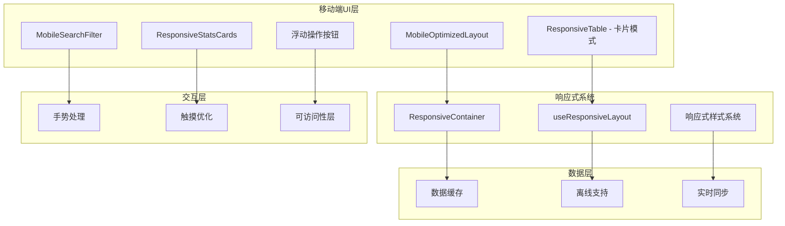

# 移动端UI优化设计文档

## 概述

基于对CuckooX破产案件管理系统移动端用户界面的深入分析，本设计文档提供了一套完整的移动端优化方案。设计充分利用现有的响应式组件架构，重点解决列表展示、交互操作和信息架构在移动端的用户体验问题。

## 架构设计

### 整体架构图



## 组件设计

### 1. 移动端案件卡片组件

#### CaseMobileCard
```typescript
interface CaseMobileCardProps {
  case: CaseItem;
  onView: (caseId: string) => void;
  onEdit: (caseId: string) => void;
  onStatusChange: (caseId: string) => void;
  expanded?: boolean;
  onToggleExpand?: () => void;
  showActions?: boolean;
  compact?: boolean;
}

const CaseMobileCard: React.FC<CaseMobileCardProps> = ({
  case: caseItem,
  onView,
  onEdit,
  onStatusChange,
  expanded = false,
  onToggleExpand,
  showActions = true,
  compact = false
}) => {
  // 卡片实现
};
```

#### 卡片布局设计
```
┌─────────────────────────────────────┐
│ 🏢 BK-2025-541961          📊 立案  │
│ 破产清算                            │
│                                     │
│ 👤 系统管理员    📅 2025-07-06      │
│                                     │
│ ┌─────────────────────────────────┐ │
│ │ 📄 查看详情  📋 查看材料  ✏️ 状态 │ │
│ └─────────────────────────────────┘ │
│                                     │
│ ⋯ 展开更多信息                      │
└─────────────────────────────────────┘
```

### 2. 移动端统计卡片优化

#### MobileStatsGrid
```typescript
interface MobileStatsGridProps {
  stats: StatCardData[];
  layout?: '2x2' | '1x4' | 'auto';
  compact?: boolean;
  onCardClick?: (stat: StatCardData) => void;
}

const MobileStatsGrid: React.FC<MobileStatsGridProps> = ({
  stats,
  layout = '2x2',
  compact = false,
  onCardClick
}) => {
  const { isMobile } = useResponsiveLayout();
  
  const getGridColumns = () => {
    if (!isMobile) return { xs: 1, sm: 2, md: 4 };
    
    switch (layout) {
      case '2x2':
        return { xs: 2, sm: 2 };
      case '1x4':
        return { xs: 1, sm: 4 };
      default:
        return { xs: 2, sm: 2 };
    }
  };
  
  return (
    <ResponsiveStatsCards
      stats={stats}
      columns={getGridColumns()}
      variant={compact ? 'compact' : 'default'}
      onCardClick={onCardClick}
    />
  );
};
```

### 3. 移动端搜索筛选组件

#### EnhancedMobileSearchFilter
```typescript
interface EnhancedMobileSearchFilterProps extends MobileSearchFilterProps {
  suggestions?: string[];
  recentSearches?: string[];
  onSuggestionClick?: (suggestion: string) => void;
  showVoiceSearch?: boolean;
  showBarcode?: boolean;
}

const EnhancedMobileSearchFilter: React.FC<EnhancedMobileSearchFilterProps> = ({
  suggestions = [],
  recentSearches = [],
  onSuggestionClick,
  showVoiceSearch = false,
  showBarcode = false,
  ...props
}) => {
  const [showSuggestions, setShowSuggestions] = useState(false);
  
  return (
    <Box>
      <MobileSearchFilter {...props} />
      
      {/* 搜索建议 */}
      <Collapse in={showSuggestions && suggestions.length > 0}>
        <Paper sx={{ mt: 1, maxHeight: 200, overflow: 'auto' }}>
          {suggestions.map((suggestion, index) => (
            <MenuItem
              key={index}
              onClick={() => onSuggestionClick?.(suggestion)}
            >
              <SvgIcon sx={{ mr: 1 }}>
                <path d={mdiMagnify} />
              </SvgIcon>
              {suggestion}
            </MenuItem>
          ))}
        </Paper>
      </Collapse>
    </Box>
  );
};
```

### 4. 手势处理系统

#### GestureHandler
```typescript
interface GestureConfig {
  swipeLeft?: () => void;
  swipeRight?: () => void;
  longPress?: () => void;
  doubleTap?: () => void;
  pinch?: (scale: number) => void;
}

const useGestureHandler = (config: GestureConfig) => {
  const [touchStart, setTouchStart] = useState<Touch | null>(null);
  const [touchEnd, setTouchEnd] = useState<Touch | null>(null);
  const longPressTimer = useRef<NodeJS.Timeout>();
  
  const handleTouchStart = (e: TouchEvent) => {
    setTouchStart(e.touches[0]);
    
    // 长按检测
    if (config.longPress) {
      longPressTimer.current = setTimeout(() => {
        config.longPress?.();
      }, 500);
    }
  };
  
  const handleTouchEnd = (e: TouchEvent) => {
    if (longPressTimer.current) {
      clearTimeout(longPressTimer.current);
    }
    
    setTouchEnd(e.changedTouches[0]);
    
    if (!touchStart || !touchEnd) return;
    
    const distance = Math.sqrt(
      Math.pow(touchEnd.clientX - touchStart.clientX, 2) +
      Math.pow(touchEnd.clientY - touchStart.clientY, 2)
    );
    
    const isSwipe = distance > 50;
    
    if (isSwipe) {
      const deltaX = touchEnd.clientX - touchStart.clientX;
      if (deltaX > 0 && config.swipeRight) {
        config.swipeRight();
      } else if (deltaX < 0 && config.swipeLeft) {
        config.swipeLeft();
      }
    }
  };
  
  return {
    onTouchStart: handleTouchStart,
    onTouchEnd: handleTouchEnd,
  };
};
```

## 数据模型

### 移动端优化的案件数据结构
```typescript
interface MobileCaseItem extends CaseItem {
  // 移动端特有字段
  priority: 'high' | 'medium' | 'low';
  lastActivity: string;
  unreadCount: number;
  isFavorite: boolean;
  
  // 显示优化
  displayTitle: string;
  displaySubtitle: string;
  statusColor: string;
  statusIcon: string;
}

interface MobileViewConfig {
  showAvatar: boolean;
  showTimestamp: boolean;
  showStatus: boolean;
  showActions: boolean;
  compactMode: boolean;
  expandable: boolean;
}
```

### 筛选和搜索状态
```typescript
interface MobileFilterState {
  searchQuery: string;
  activeFilters: Record<string, any>;
  sortBy: 'date' | 'priority' | 'status' | 'name';
  sortOrder: 'asc' | 'desc';
  viewMode: 'list' | 'grid' | 'compact';
  
  // 移动端特有
  recentSearches: string[];
  savedFilters: SavedFilter[];
  quickFilters: QuickFilter[];
}

interface SavedFilter {
  id: string;
  name: string;
  filters: Record<string, any>;
  createdAt: Date;
}

interface QuickFilter {
  id: string;
  label: string;
  icon: string;
  filter: Record<string, any>;
}
```

## 样式设计系统

### 移动端专用设计令牌
```css
:root {
  /* 移动端间距系统 */
  --mobile-space-xs: 4px;
  --mobile-space-sm: 8px;
  --mobile-space-md: 16px;
  --mobile-space-lg: 24px;
  --mobile-space-xl: 32px;
  
  /* 移动端字体系统 */
  --mobile-font-size-xs: 12px;
  --mobile-font-size-sm: 14px;
  --mobile-font-size-md: 16px;
  --mobile-font-size-lg: 18px;
  --mobile-font-size-xl: 20px;
  --mobile-font-size-xxl: 24px;
  
  /* 移动端圆角系统 */
  --mobile-radius-sm: 8px;
  --mobile-radius-md: 12px;
  --mobile-radius-lg: 16px;
  --mobile-radius-xl: 20px;
  
  /* 移动端阴影系统 */
  --mobile-shadow-sm: 0 1px 3px rgba(0, 0, 0, 0.1);
  --mobile-shadow-md: 0 2px 8px rgba(0, 0, 0, 0.1);
  --mobile-shadow-lg: 0 4px 16px rgba(0, 0, 0, 0.1);
  
  /* 触摸目标尺寸 */
  --mobile-touch-target-min: 44px;
  --mobile-touch-target-comfortable: 48px;
  --mobile-touch-target-large: 56px;
}
```

### 移动端卡片样式
```css
.mobile-case-card {
  background: var(--color-surface);
  border-radius: var(--mobile-radius-md);
  box-shadow: var(--mobile-shadow-sm);
  margin-bottom: var(--mobile-space-md);
  padding: var(--mobile-space-md);
  transition: all 0.2s ease;
  
  &:hover, &:focus-within {
    box-shadow: var(--mobile-shadow-md);
    transform: translateY(-1px);
  }
  
  &.compact {
    padding: var(--mobile-space-sm);
    margin-bottom: var(--mobile-space-sm);
  }
}

.mobile-case-card-header {
  display: flex;
  justify-content: space-between;
  align-items: flex-start;
  margin-bottom: var(--mobile-space-sm);
}

.mobile-case-card-title {
  font-size: var(--mobile-font-size-lg);
  font-weight: 600;
  color: var(--color-text-primary);
  margin: 0;
}

.mobile-case-card-subtitle {
  font-size: var(--mobile-font-size-sm);
  color: var(--color-text-secondary);
  margin: var(--mobile-space-xs) 0 0 0;
}

.mobile-case-card-actions {
  display: flex;
  gap: var(--mobile-space-sm);
  margin-top: var(--mobile-space-md);
  padding-top: var(--mobile-space-md);
  border-top: 1px solid var(--color-border-light);
}

.mobile-case-card-action {
  flex: 1;
  min-height: var(--mobile-touch-target-min);
  border-radius: var(--mobile-radius-sm);
  font-size: var(--mobile-font-size-sm);
  font-weight: 500;
}
```

## 交互设计

### 手势交互映射
```typescript
const GESTURE_MAPPINGS = {
  // 卡片手势
  CARD_SWIPE_LEFT: 'showQuickActions',
  CARD_SWIPE_RIGHT: 'markAsFavorite',
  CARD_LONG_PRESS: 'showContextMenu',
  CARD_DOUBLE_TAP: 'openDetails',
  
  // 列表手势
  LIST_PULL_DOWN: 'refreshData',
  LIST_PULL_UP: 'loadMore',
  LIST_PINCH_OUT: 'enterGridView',
  LIST_PINCH_IN: 'enterCompactView',
  
  // 搜索手势
  SEARCH_SWIPE_DOWN: 'showRecentSearches',
  FILTER_SWIPE_UP: 'openFilterPanel',
};
```

### 动画和过渡
```css
/* 页面转场动画 */
.mobile-page-enter {
  transform: translateX(100%);
  opacity: 0;
}

.mobile-page-enter-active {
  transform: translateX(0);
  opacity: 1;
  transition: all 300ms ease-out;
}

.mobile-page-exit {
  transform: translateX(0);
  opacity: 1;
}

.mobile-page-exit-active {
  transform: translateX(-100%);
  opacity: 0;
  transition: all 300ms ease-in;
}

/* 卡片展开动画 */
.mobile-card-expand-enter {
  max-height: 0;
  opacity: 0;
}

.mobile-card-expand-enter-active {
  max-height: 200px;
  opacity: 1;
  transition: all 300ms ease-out;
}

/* FAB动画 */
.mobile-fab {
  transform: scale(1);
  transition: transform 200ms ease;
}

.mobile-fab:active {
  transform: scale(0.95);
}

.mobile-fab.hidden {
  transform: scale(0) translateY(100px);
}
```

## 性能优化

### 虚拟滚动实现
```typescript
interface VirtualScrollConfig {
  itemHeight: number;
  containerHeight: number;
  overscan: number;
  threshold: number;
}

const useVirtualScroll = (
  items: any[],
  config: VirtualScrollConfig
) => {
  const [scrollTop, setScrollTop] = useState(0);
  const [containerRef, setContainerRef] = useState<HTMLElement | null>(null);
  
  const visibleRange = useMemo(() => {
    if (!containerRef) return { start: 0, end: 0 };
    
    const start = Math.floor(scrollTop / config.itemHeight);
    const visibleCount = Math.ceil(config.containerHeight / config.itemHeight);
    const end = Math.min(start + visibleCount + config.overscan, items.length);
    
    return { start: Math.max(0, start - config.overscan), end };
  }, [scrollTop, items.length, config, containerRef]);
  
  const visibleItems = items.slice(visibleRange.start, visibleRange.end);
  
  return {
    visibleItems,
    visibleRange,
    containerRef: setContainerRef,
    onScroll: (e: React.UIEvent) => setScrollTop(e.currentTarget.scrollTop),
  };
};
```

### 图片懒加载
```typescript
const useLazyImage = (src: string, placeholder?: string) => {
  const [imageSrc, setImageSrc] = useState(placeholder);
  const [isLoaded, setIsLoaded] = useState(false);
  const imgRef = useRef<HTMLImageElement>(null);
  
  useEffect(() => {
    const observer = new IntersectionObserver(
      ([entry]) => {
        if (entry.isIntersecting) {
          const img = new Image();
          img.onload = () => {
            setImageSrc(src);
            setIsLoaded(true);
          };
          img.src = src;
          observer.disconnect();
        }
      },
      { threshold: 0.1 }
    );
    
    if (imgRef.current) {
      observer.observe(imgRef.current);
    }
    
    return () => observer.disconnect();
  }, [src]);
  
  return { imageSrc, isLoaded, imgRef };
};
```

## 错误处理

### 移动端错误状态
```typescript
enum MobileErrorType {
  NETWORK_ERROR = 'NETWORK_ERROR',
  TOUCH_TARGET_TOO_SMALL = 'TOUCH_TARGET_TOO_SMALL',
  GESTURE_CONFLICT = 'GESTURE_CONFLICT',
  VIEWPORT_TOO_SMALL = 'VIEWPORT_TOO_SMALL',
  ORIENTATION_CHANGE_ERROR = 'ORIENTATION_CHANGE_ERROR',
}

interface MobileErrorState {
  type: MobileErrorType;
  message: string;
  recoveryAction?: () => void;
  retryAction?: () => void;
}

const MobileErrorBoundary: React.FC<{
  children: React.ReactNode;
  fallback?: React.ComponentType<{ error: MobileErrorState }>;
}> = ({ children, fallback: Fallback }) => {
  const [error, setError] = useState<MobileErrorState | null>(null);
  
  const handleError = (error: MobileErrorState) => {
    setError(error);
    
    // 发送错误报告
    if (process.env.NODE_ENV === 'production') {
      // analytics.trackError('mobile_ui_error', error);
    }
  };
  
  if (error && Fallback) {
    return <Fallback error={error} />;
  }
  
  return <>{children}</>;
};
```

## 测试策略

### 移动端测试用例
```typescript
describe('Mobile UI Components', () => {
  describe('CaseMobileCard', () => {
    it('should render with minimum touch target size', () => {
      // 测试触摸目标尺寸
    });
    
    it('should handle swipe gestures correctly', () => {
      // 测试滑动手势
    });
    
    it('should expand/collapse additional information', () => {
      // 测试展开/收起功能
    });
  });
  
  describe('MobileSearchFilter', () => {
    it('should open filter drawer on mobile', () => {
      // 测试筛选抽屉
    });
    
    it('should show search suggestions', () => {
      // 测试搜索建议
    });
  });
  
  describe('Responsive Behavior', () => {
    it('should switch to card layout on mobile', () => {
      // 测试响应式布局切换
    });
    
    it('should handle orientation changes', () => {
      // 测试屏幕旋转
    });
  });
});
```

### 性能测试
```typescript
describe('Mobile Performance', () => {
  it('should render large lists efficiently', async () => {
    const items = Array.from({ length: 1000 }, (_, i) => ({
      id: i,
      title: `Case ${i}`,
    }));
    
    const startTime = performance.now();
    render(<CaseList items={items} />);
    const endTime = performance.now();
    
    expect(endTime - startTime).toBeLessThan(100); // 100ms内完成渲染
  });
  
  it('should handle rapid scroll events', () => {
    // 测试快速滚动性能
  });
});
```

## 部署考虑

### 移动端特定配置
```typescript
// vite.config.ts 移动端优化
export default defineConfig({
  build: {
    rollupOptions: {
      output: {
        manualChunks: {
          'mobile-ui': [
            './src/components/mobile/MobileOptimizedLayout',
            './src/components/mobile/MobileSearchFilter',
            './src/hooks/useResponsiveLayout',
          ],
        },
      },
    },
  },
  
  // PWA配置优化
  plugins: [
    VitePWA({
      workbox: {
        runtimeCaching: [
          {
            urlPattern: /^https:\/\/dev\.cuckoox\.cn\/api\//,
            handler: 'NetworkFirst',
            options: {
              cacheName: 'api-cache',
              networkTimeoutSeconds: 3,
              expiration: {
                maxEntries: 50,
                maxAgeSeconds: 300,
              },
            },
          },
        ],
      },
    }),
  ],
});
```

## 监控和分析

### 移动端用户体验指标
```typescript
interface MobileUXMetrics {
  // 性能指标
  firstContentfulPaint: number;
  largestContentfulPaint: number;
  firstInputDelay: number;
  cumulativeLayoutShift: number;
  
  // 移动端特有指标
  touchResponseTime: number;
  gestureSuccessRate: number;
  scrollPerformance: number;
  orientationChangeTime: number;
  
  // 用户行为指标
  cardExpansionRate: number;
  searchUsageRate: number;
  filterUsageRate: number;
  fabClickRate: number;
}

const trackMobileUX = (metrics: Partial<MobileUXMetrics>) => {
  if (process.env.NODE_ENV === 'production') {
    // 发送到分析服务
    // analytics.track('mobile_ux_metrics', metrics);
  }
};
```

这套设计方案将为CuckooX破产案件管理系统提供一流的移动端用户体验，确保用户在任何设备上都能高效地管理和查看案件信息。