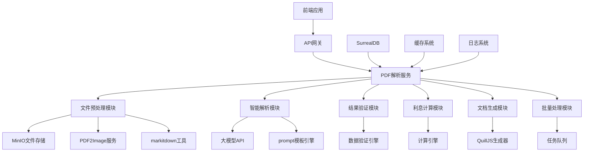

# PDF文档智能解析工具后端设计文档

## 概述

PDF文档智能解析工具后端是基于现有CuckooX-Google系统架构的服务端扩展，主要负责PDF文档的预处理、智能解析、数据存储和API服务。后端采用微服务架构，集成markitdown工具和大模型API，提供高性能、高可用的PDF智能解析服务。

## 技术架构

### 技术栈选择

- **数据库**: SurrealDB (现有系统)
- **文件存储**: MinIO (现有系统)
- **PDF处理**: markitdown + PDF2Image
- **大模型集成**: OpenAI API / Claude API / 国产大模型API
- **队列管理**: 基于SurrealDB的任务队列
- **API框架**: 与现有系统保持一致
- **缓存**: 基于现有缓存系统

### 整体架构



## 数据库设计

### 表结构设计

```sql
-- PDF文档解析记录表
DEFINE TABLE pdf_parse_record SCHEMAFULL;
DEFINE FIELD id ON pdf_parse_record TYPE record<pdf_parse_record>;
DEFINE FIELD case_id ON pdf_parse_record TYPE record<case>;
DEFINE FIELD batch_id ON pdf_parse_record TYPE string;
DEFINE FIELD original_file_url ON pdf_parse_record TYPE string;
DEFINE FIELD file_name ON pdf_parse_record TYPE string;
DEFINE FIELD file_size ON pdf_parse_record TYPE number;
DEFINE FIELD file_hash ON pdf_parse_record TYPE string;
DEFINE FIELD page_count ON pdf_parse_record TYPE number;
DEFINE FIELD status ON pdf_parse_record TYPE string ASSERT $value IN ['uploading', 'processing', 'completed', 'failed'];
DEFINE FIELD error_message ON pdf_parse_record TYPE string;
DEFINE FIELD processing_start_time ON pdf_parse_record TYPE datetime;
DEFINE FIELD processing_end_time ON pdf_parse_record TYPE datetime;
DEFINE FIELD created_at ON pdf_parse_record TYPE datetime DEFAULT time::now();
DEFINE FIELD created_by ON pdf_parse_record TYPE record<user>;
DEFINE FIELD updated_at ON pdf_parse_record TYPE datetime DEFAULT time::now();

-- 解析结果表
DEFINE TABLE parse_result SCHEMAFULL;
DEFINE FIELD id ON parse_result TYPE record<parse_result>;
DEFINE FIELD pdf_record_id ON parse_result TYPE record<pdf_parse_record>;
DEFINE FIELD contract_amount ON parse_result TYPE object;
DEFINE FIELD contract_date ON parse_result TYPE object;
DEFINE FIELD interest_rate ON parse_result TYPE object;
DEFINE FIELD additional_fields ON parse_result TYPE object;
DEFINE FIELD overall_confidence ON parse_result TYPE number;
DEFINE FIELD raw_text ON parse_result TYPE string;
DEFINE FIELD llm_response ON parse_result TYPE object;
DEFINE FIELD validation_status ON parse_result TYPE string ASSERT $value IN ['pending', 'validated', 'rejected'];
DEFINE FIELD is_verified ON parse_result TYPE bool DEFAULT false;
DEFINE FIELD verified_by ON parse_result TYPE record<user>;
DEFINE FIELD verified_at ON parse_result TYPE datetime;
DEFINE FIELD created_at ON parse_result TYPE datetime DEFAULT time::now();

-- PDF页面图片表
DEFINE TABLE pdf_page_image SCHEMAFULL;
DEFINE FIELD id ON pdf_page_image TYPE record<pdf_page_image>;
DEFINE FIELD pdf_record_id ON pdf_page_image TYPE record<pdf_parse_record>;
DEFINE FIELD page_number ON pdf_page_image TYPE number;
DEFINE FIELD image_url ON pdf_page_image TYPE string;
DEFINE FIELD image_hash ON pdf_page_image TYPE string;
DEFINE FIELD width ON pdf_page_image TYPE number;
DEFINE FIELD height ON pdf_page_image TYPE number;
DEFINE FIELD dpi ON pdf_page_image TYPE number DEFAULT 300;
DEFINE FIELD created_at ON pdf_page_image TYPE datetime DEFAULT time::now();

-- 字段修正历史表
DEFINE TABLE field_correction_history SCHEMAFULL;
DEFINE FIELD id ON field_correction_history TYPE record<field_correction_history>;
DEFINE FIELD parse_result_id ON field_correction_history TYPE record<parse_result>;
DEFINE FIELD field_name ON field_correction_history TYPE string;
DEFINE FIELD original_value ON field_correction_history TYPE string;
DEFINE FIELD corrected_value ON field_correction_history TYPE string;
DEFINE FIELD correction_reason ON field_correction_history TYPE string;
DEFINE FIELD confidence_before ON field_correction_history TYPE number;
DEFINE FIELD confidence_after ON field_correction_history TYPE number;
DEFINE FIELD corrected_by ON field_correction_history TYPE record<user>;
DEFINE FIELD corrected_at ON field_correction_history TYPE datetime DEFAULT time::now();

-- 解析文档表（QuillJS格式）
DEFINE TABLE parsed_document SCHEMAFULL;
DEFINE FIELD id ON parsed_document TYPE record<parsed_document>;
DEFINE FIELD parse_result_id ON parsed_document TYPE record<parse_result>;
DEFINE FIELD title ON parsed_document TYPE string;
DEFINE FIELD content ON parsed_document TYPE object; -- QuillJS Delta格式
DEFINE FIELD template_type ON parsed_document TYPE string;
DEFINE FIELD metadata ON parsed_document TYPE object;
DEFINE FIELD version ON parsed_document TYPE number DEFAULT 1;
DEFINE FIELD is_active ON parsed_document TYPE bool DEFAULT true;
DEFINE FIELD created_at ON parsed_document TYPE datetime DEFAULT time::now();
DEFINE FIELD updated_at ON parsed_document TYPE datetime DEFAULT time::now();
DEFINE FIELD created_by ON parsed_document TYPE record<user>;

-- 利息计算记录表
DEFINE TABLE interest_calculation SCHEMAFULL;
DEFINE FIELD id ON interest_calculation TYPE record<interest_calculation>;
DEFINE FIELD parse_result_id ON interest_calculation TYPE record<parse_result>;
DEFINE FIELD principal_amount ON interest_calculation TYPE number;
DEFINE FIELD interest_rate ON interest_calculation TYPE number;
DEFINE FIELD rate_type ON interest_calculation TYPE string ASSERT $value IN ['annual', 'monthly', 'daily'];
DEFINE FIELD calculation_start_date ON interest_calculation TYPE date;
DEFINE FIELD calculation_end_date ON interest_calculation TYPE date;
DEFINE FIELD calculation_method ON interest_calculation TYPE string ASSERT $value IN ['simple', 'compound'];
DEFINE FIELD compound_frequency ON interest_calculation TYPE number;
DEFINE FIELD calculated_interest ON interest_calculation TYPE number;
DEFINE FIELD total_amount ON interest_calculation TYPE number;
DEFINE FIELD calculation_breakdown ON interest_calculation TYPE array;
DEFINE FIELD parameters ON interest_calculation TYPE object;
DEFINE FIELD created_at ON interest_calculation TYPE datetime DEFAULT time::now();
DEFINE FIELD created_by ON interest_calculation TYPE record<user>;

-- 批量处理任务表
DEFINE TABLE batch_process_task SCHEMAFULL;
DEFINE FIELD id ON batch_process_task TYPE record<batch_process_task>;
DEFINE FIELD batch_id ON batch_process_task TYPE string;
DEFINE FIELD total_files ON batch_process_task TYPE number;
DEFINE FIELD completed_files ON batch_process_task TYPE number DEFAULT 0;
DEFINE FIELD failed_files ON batch_process_task TYPE number DEFAULT 0;
DEFINE FIELD status ON batch_process_task TYPE string ASSERT $value IN ['pending', 'processing', 'completed', 'failed'];
DEFINE FIELD start_time ON batch_process_task TYPE datetime;
DEFINE FIELD end_time ON batch_process_task TYPE datetime;
DEFINE FIELD created_by ON batch_process_task TYPE record<user>;
DEFINE FIELD created_at ON batch_process_task TYPE datetime DEFAULT time::now();

-- 系统配置表
DEFINE TABLE pdf_parser_config SCHEMAFULL;
DEFINE FIELD id ON pdf_parser_config TYPE record<pdf_parser_config>;
DEFINE FIELD config_key ON pdf_parser_config TYPE string;
DEFINE FIELD config_value ON pdf_parser_config TYPE string;
DEFINE FIELD config_type ON pdf_parser_config TYPE string ASSERT $value IN ['string', 'number', 'boolean', 'json'];
DEFINE FIELD description ON pdf_parser_config TYPE string;
DEFINE FIELD is_active ON pdf_parser_config TYPE bool DEFAULT true;
DEFINE FIELD updated_at ON pdf_parser_config TYPE datetime DEFAULT time::now();
DEFINE FIELD updated_by ON pdf_parser_config TYPE record<user>;

-- 创建索引
DEFINE INDEX idx_pdf_record_status ON pdf_parse_record FIELDS status;
DEFINE INDEX idx_pdf_record_batch ON pdf_parse_record FIELDS batch_id;
DEFINE INDEX idx_pdf_record_case ON pdf_parse_record FIELDS case_id;
DEFINE INDEX idx_parse_result_pdf ON parse_result FIELDS pdf_record_id;
DEFINE INDEX idx_page_image_pdf ON pdf_page_image FIELDS pdf_record_id;
DEFINE INDEX idx_correction_history_result ON field_correction_history FIELDS parse_result_id;
DEFINE INDEX idx_parsed_document_result ON parsed_document FIELDS parse_result_id;
DEFINE INDEX idx_interest_calc_result ON interest_calculation FIELDS parse_result_id;
DEFINE INDEX idx_batch_task_batch_id ON batch_process_task FIELDS batch_id;
```

## 核心服务设计

### 1. PDF预处理服务 (PDFPreprocessorService)

```typescript
interface PDFPreprocessorService {
  // 文件上传和验证
  uploadFile(file: Buffer, metadata: FileMetadata): Promise<UploadResult>;
  
  // PDF转图片
  convertToImages(fileUrl: string): Promise<ImageConversionResult>;
  
  // 文本提取
  extractText(fileUrl: string): Promise<TextExtractionResult>;
  
  // 获取PDF元数据
  getMetadata(fileUrl: string): Promise<PDFMetadata>;
}

interface FileMetadata {
  fileName: string;
  fileSize: number;
  mimeType: string;
  caseId?: string;
  batchId?: string;
  uploadedBy: string;
}

interface UploadResult {
  fileId: string;
  fileUrl: string;
  fileHash: string;
  status: 'uploaded' | 'failed';
  error?: string;
}

interface ImageConversionResult {
  success: boolean;
  images: {
    pageNumber: number;
    imageUrl: string;
    width: number;
    height: number;
    dpi: number;
  }[];
  error?: string;
}

interface TextExtractionResult {
  success: boolean;
  text: string;
  pageTexts: string[];
  confidence: number;
  error?: string;
}
```

**实现要点:**
- 文件格式验证和病毒扫描
- 使用PDF2Image进行高质量图片转换
- 集成markitdown进行文本提取
- 异步处理和进度跟踪
- 错误处理和重试机制

### 2. 智能解析服务 (IntelligentParserService)

```typescript
interface IntelligentParserService {
  // 解析PDF内容
  parseContent(text: string, images: ImageInfo[]): Promise<ParseResult>;
  
  // 验证解析结果
  validateResult(result: ParseResult): Promise<ValidationResult>;
  
  // 计算置信度
  calculateConfidence(result: ParseResult): Promise<number>;
}

interface ParseResult {
  contractAmount: ParsedField;
  contractDate: ParsedField;
  interestRate: ParsedField;
  additionalFields: Record<string, ParsedField>;
  rawLLMResponse: any;
  processingTime: number;
}

interface ParsedField {
  value: any;
  originalText: string;
  confidence: number;
  pageNumber: number;
  position?: BoundingBox;
  validationStatus: 'valid' | 'warning' | 'error';
  validationMessage?: string;
}

interface ValidationResult {
  isValid: boolean;
  warnings: ValidationWarning[];
  errors: ValidationError[];
  overallConfidence: number;
}
```

**Prompt模板设计:**

```typescript
const DEBT_ANALYSIS_PROMPT = `
你是一个专业的法律文档分析助手，专门分析债权相关的合同和文档。

请分析以下PDF文档内容，提取关键的债权信息：

文档内容：
{document_text}

请按照以下JSON格式返回结果：
{
  "contract_amount": {
    "value": 数值（统一转换为数字），
    "original_text": "原始文本",
    "confidence": 置信度(0-1),
    "page_number": 页码,
    "currency": "货币单位"
  },
  "contract_date": {
    "value": "YYYY-MM-DD格式",
    "original_text": "原始文本",
    "confidence": 置信度(0-1),
    "page_number": 页码
  },
  "interest_rate": {
    "value": 年利率数值,
    "original_text": "原始文本", 
    "confidence": 置信度(0-1),
    "page_number": 页码,
    "rate_type": "annual|monthly|daily"
  },
  "additional_fields": {
    "debtor_name": {...},
    "creditor_name": {...},
    "contract_type": {...}
  }
}

注意事项：
1. 金额识别支持中文大写、阿拉伯数字、带单位格式
2. 日期识别支持多种中文日期格式
3. 利率识别需要区分年利率、月利率、日利率
4. 如果某个字段无法识别，设置confidence为0
5. 置信度基于文本清晰度和上下文相关性
`;
```

### 3. 利息计算服务 (InterestCalculationService)

```typescript
interface InterestCalculationService {
  // 简单利息计算
  calculateSimpleInterest(params: SimpleInterestParams): Promise<InterestResult>;
  
  // 复利计算
  calculateCompoundInterest(params: CompoundInterestParams): Promise<InterestResult>;
  
  // 分段利率计算
  calculateSegmentedInterest(segments: InterestSegment[]): Promise<InterestResult>;
  
  // 保存计算结果
  saveCalculation(result: InterestResult, parseResultId: string): Promise<string>;
}

interface SimpleInterestParams {
  principal: number;
  rate: number; // 年利率
  startDate: Date;
  endDate: Date;
}

interface CompoundInterestParams extends SimpleInterestParams {
  compoundFrequency: number; // 复利频率（年）
}

interface InterestSegment {
  principal: number;
  rate: number;
  startDate: Date;
  endDate: Date;
  type: 'simple' | 'compound';
  compoundFrequency?: number;
}

interface InterestResult {
  principal: number;
  totalInterest: number;
  totalAmount: number;
  calculationMethod: string;
  breakdown: InterestBreakdownItem[];
  parameters: any;
  calculationDate: Date;
}

interface InterestBreakdownItem {
  period: string;
  principal: number;
  rate: number;
  days: number;
  interest: number;
  cumulativeInterest: number;
}
```

**计算算法实现:**

```typescript
class InterestCalculator {
  // 简单利息计算
  calculateSimple(principal: number, rate: number, days: number): number {
    return principal * (rate / 100) * (days / 365);
  }
  
  // 复利计算
  calculateCompound(
    principal: number, 
    rate: number, 
    days: number, 
    frequency: number
  ): number {
    const periods = (days / 365) * frequency;
    const ratePerPeriod = rate / 100 / frequency;
    return principal * Math.pow(1 + ratePerPeriod, periods) - principal;
  }
  
  // 分段计算
  calculateSegmented(segments: InterestSegment[]): InterestResult {
    let totalInterest = 0;
    const breakdown: InterestBreakdownItem[] = [];
    
    for (const segment of segments) {
      const days = this.calculateDays(segment.startDate, segment.endDate);
      let segmentInterest: number;
      
      if (segment.type === 'simple') {
        segmentInterest = this.calculateSimple(segment.principal, segment.rate, days);
      } else {
        segmentInterest = this.calculateCompound(
          segment.principal, 
          segment.rate, 
          days, 
          segment.compoundFrequency || 1
        );
      }
      
      totalInterest += segmentInterest;
      breakdown.push({
        period: `${segment.startDate.toISOString().split('T')[0]} - ${segment.endDate.toISOString().split('T')[0]}`,
        principal: segment.principal,
        rate: segment.rate,
        days,
        interest: segmentInterest,
        cumulativeInterest: totalInterest
      });
    }
    
    return {
      principal: segments[0]?.principal || 0,
      totalInterest,
      totalAmount: (segments[0]?.principal || 0) + totalInterest,
      calculationMethod: 'segmented',
      breakdown,
      parameters: { segments },
      calculationDate: new Date()
    };
  }
}
```

### 4. QuillJS文档生成服务 (DocumentGeneratorService)

```typescript
interface DocumentGeneratorService {
  // 生成文档
  generateDocument(
    parseResult: ParseResult, 
    template: DocumentTemplate
  ): Promise<GeneratedDocument>;
  
  // 保存文档
  saveDocument(document: GeneratedDocument): Promise<string>;
  
  // 获取模板
  getTemplate(templateType: string): Promise<DocumentTemplate>;
}

interface DocumentTemplate {
  id: string;
  name: string;
  type: 'debt_claim' | 'contract_analysis' | 'interest_calculation' | 'custom';
  structure: QuillDelta;
  fieldMappings: FieldMapping[];
  metadata: TemplateMetadata;
}

interface FieldMapping {
  fieldName: string;
  placeholder: string;
  format?: 'currency' | 'date' | 'percentage' | 'text';
  required: boolean;
}

interface GeneratedDocument {
  id: string;
  title: string;
  content: QuillDelta;
  template: DocumentTemplate;
  sourceData: ParseResult;
  metadata: DocumentMetadata;
  createdAt: Date;
}
```

**文档模板示例:**

```typescript
const DEBT_CLAIM_TEMPLATE: DocumentTemplate = {
  id: 'debt_claim_template',
  name: '债权申报书',
  type: 'debt_claim',
  structure: {
    ops: [
      { insert: '债权申报书\n', attributes: { header: 1, align: 'center' } },
      { insert: '\n申报人：' },
      { insert: '{{creditor_name}}', attributes: { background: '#ffeb3b' } },
      { insert: '\n债务人：' },
      { insert: '{{debtor_name}}', attributes: { background: '#ffeb3b' } },
      { insert: '\n\n一、债权基本信息\n', attributes: { header: 2 } },
      { insert: '合同金额：' },
      { insert: '{{contract_amount}}', attributes: { background: '#ffeb3b' } },
      { insert: ' 元\n合同日期：' },
      { insert: '{{contract_date}}', attributes: { background: '#ffeb3b' } },
      { insert: '\n利率：' },
      { insert: '{{interest_rate}}', attributes: { background: '#ffeb3b' } },
      { insert: '%（年利率）\n\n二、利息计算\n', attributes: { header: 2 } },
      { insert: '本金：' },
      { insert: '{{principal_amount}}', attributes: { background: '#ffeb3b' } },
      { insert: ' 元\n利息：' },
      { insert: '{{calculated_interest}}', attributes: { background: '#ffeb3b' } },
      { insert: ' 元\n债权总额：' },
      { insert: '{{total_claim_amount}}', attributes: { background: '#ffeb3b' } },
      { insert: ' 元\n\n三、证据材料\n', attributes: { header: 2 } },
      { insert: '原始合同文档：\n' },
      { insert: '{{pdf_reference}}', attributes: { background: '#e1f5fe' } }
    ]
  },
  fieldMappings: [
    { fieldName: 'creditor_name', placeholder: '{{creditor_name}}', format: 'text', required: true },
    { fieldName: 'debtor_name', placeholder: '{{debtor_name}}', format: 'text', required: true },
    { fieldName: 'contract_amount', placeholder: '{{contract_amount}}', format: 'currency', required: true },
    { fieldName: 'contract_date', placeholder: '{{contract_date}}', format: 'date', required: true },
    { fieldName: 'interest_rate', placeholder: '{{interest_rate}}', format: 'percentage', required: true },
    { fieldName: 'principal_amount', placeholder: '{{principal_amount}}', format: 'currency', required: true },
    { fieldName: 'calculated_interest', placeholder: '{{calculated_interest}}', format: 'currency', required: true },
    { fieldName: 'total_claim_amount', placeholder: '{{total_claim_amount}}', format: 'currency', required: true }
  ],
  metadata: {
    version: '1.0',
    author: 'system',
    description: '标准债权申报书模板'
  }
};
```

### 5. 批量处理服务 (BatchProcessorService)

```typescript
interface BatchProcessorService {
  // 创建批量任务
  createBatchTask(files: FileInfo[], batchId: string): Promise<BatchTask>;
  
  // 处理批量任务
  processBatch(batchId: string): Promise<void>;
  
  // 获取批量状态
  getBatchStatus(batchId: string): Promise<BatchStatus>;
  
  // 取消批量任务
  cancelBatch(batchId: string): Promise<void>;
}

interface BatchTask {
  batchId: string;
  totalFiles: number;
  status: 'pending' | 'processing' | 'completed' | 'failed';
  createdAt: Date;
  createdBy: string;
}

interface BatchStatus {
  batchId: string;
  totalFiles: number;
  completedFiles: number;
  failedFiles: number;
  processingFiles: number;
  status: string;
  startTime?: Date;
  endTime?: Date;
  files: BatchFileStatus[];
}

interface BatchFileStatus {
  fileId: string;
  fileName: string;
  status: 'pending' | 'processing' | 'completed' | 'failed';
  progress: number;
  startTime?: Date;
  endTime?: Date;
  error?: string;
  result?: ParseResult;
}
```

**批量处理队列实现:**

```typescript
class BatchProcessorQueue {
  private readonly maxConcurrency = 3; // 最大并发数
  private readonly processingTasks = new Map<string, Promise<void>>();
  
  async processBatch(batchId: string): Promise<void> {
    const batchTask = await this.getBatchTask(batchId);
    const files = await this.getBatchFiles(batchId);
    
    // 更新批量任务状态
    await this.updateBatchStatus(batchId, 'processing');
    
    // 创建处理队列
    const queue = files.map(file => () => this.processFile(file));
    
    // 并发处理
    await this.processWithConcurrency(queue, this.maxConcurrency);
    
    // 更新最终状态
    const finalStatus = await this.calculateFinalStatus(batchId);
    await this.updateBatchStatus(batchId, finalStatus);
  }
  
  private async processWithConcurrency<T>(
    tasks: (() => Promise<T>)[], 
    concurrency: number
  ): Promise<T[]> {
    const results: T[] = [];
    const executing: Promise<void>[] = [];
    
    for (const task of tasks) {
      const promise = task().then(result => {
        results.push(result);
      });
      
      executing.push(promise);
      
      if (executing.length >= concurrency) {
        await Promise.race(executing);
        executing.splice(executing.findIndex(p => p === promise), 1);
      }
    }
    
    await Promise.all(executing);
    return results;
  }
}
```

## API接口设计

### 1. 文件上传接口

```typescript
// POST /api/pdf/upload
interface UploadRequest {
  files: File[];
  caseId?: string;
  batchId?: string;
}

interface UploadResponse {
  success: boolean;
  data: {
    uploadedFiles: UploadedFileInfo[];
    batchId: string;
  };
  errors?: string[];
}

interface UploadedFileInfo {
  fileId: string;
  fileName: string;
  fileUrl: string;
  status: 'uploaded' | 'failed';
  error?: string;
}
```

### 2. 解析状态查询接口

```typescript
// GET /api/pdf/parse-status/:parseId
interface ParseStatusResponse {
  parseId: string;
  status: 'processing' | 'completed' | 'failed';
  progress: number;
  result?: ParseResult;
  error?: string;
  startTime: Date;
  endTime?: Date;
}

// GET /api/pdf/batch-status/:batchId
interface BatchStatusResponse {
  batchId: string;
  status: BatchStatus;
}
```

### 3. 字段修正接口

```typescript
// PATCH /api/pdf/parse-result/:parseId/field
interface FieldUpdateRequest {
  fieldName: string;
  newValue: any;
  reason: string;
}

interface FieldUpdateResponse {
  success: boolean;
  updatedField: ParsedField;
  correctionId: string;
}
```

### 4. 利息计算接口

```typescript
// POST /api/pdf/calculate-interest
interface InterestCalculationRequest {
  parseResultId?: string;
  principal: number;
  rate: number;
  rateType: 'annual' | 'monthly' | 'daily';
  startDate: string;
  endDate: string;
  calculationMethod: 'simple' | 'compound';
  compoundFrequency?: number;
  segments?: InterestSegment[];
}

interface InterestCalculationResponse {
  success: boolean;
  result: InterestResult;
  calculationId: string;
}
```

### 5. 文档生成接口

```typescript
// POST /api/pdf/generate-document
interface DocumentGenerationRequest {
  parseResultId: string;
  templateType: string;
  title: string;
  includeImages: boolean;
  customFields?: Record<string, any>;
}

interface DocumentGenerationResponse {
  success: boolean;
  document: GeneratedDocument;
  documentId: string;
}
```

## 错误处理策略

### 1. 错误分类

```typescript
enum ErrorType {
  VALIDATION_ERROR = 'VALIDATION_ERROR',
  FILE_PROCESSING_ERROR = 'FILE_PROCESSING_ERROR',
  LLM_API_ERROR = 'LLM_API_ERROR',
  DATABASE_ERROR = 'DATABASE_ERROR',
  EXTERNAL_SERVICE_ERROR = 'EXTERNAL_SERVICE_ERROR',
  PERMISSION_ERROR = 'PERMISSION_ERROR',
  SYSTEM_ERROR = 'SYSTEM_ERROR'
}

interface APIError {
  type: ErrorType;
  code: string;
  message: string;
  details?: any;
  timestamp: Date;
  requestId: string;
}
```

### 2. 重试机制

```typescript
class RetryHandler {
  async executeWithRetry<T>(
    operation: () => Promise<T>,
    maxRetries: number = 3,
    backoffMs: number = 1000
  ): Promise<T> {
    let lastError: Error;
    
    for (let attempt = 1; attempt <= maxRetries; attempt++) {
      try {
        return await operation();
      } catch (error) {
        lastError = error as Error;
        
        if (attempt === maxRetries) {
          throw lastError;
        }
        
        // 指数退避
        const delay = backoffMs * Math.pow(2, attempt - 1);
        await this.sleep(delay);
      }
    }
    
    throw lastError!;
  }
  
  private sleep(ms: number): Promise<void> {
    return new Promise(resolve => setTimeout(resolve, ms));
  }
}
```

### 3. 降级策略

```typescript
class FallbackHandler {
  async parseWithFallback(text: string): Promise<ParseResult> {
    try {
      // 尝试主要的大模型API
      return await this.primaryLLMService.parse(text);
    } catch (error) {
      console.warn('Primary LLM failed, trying fallback:', error);
      
      try {
        // 尝试备用大模型API
        return await this.fallbackLLMService.parse(text);
      } catch (fallbackError) {
        console.warn('Fallback LLM failed, using rule-based parsing:', fallbackError);
        
        // 使用基于规则的解析
        return await this.ruleBasedParser.parse(text);
      }
    }
  }
}
```

## 性能优化

### 1. 缓存策略

```typescript
class CacheManager {
  private readonly redis: RedisClient;
  
  // 解析结果缓存
  async cacheParseResult(fileHash: string, result: ParseResult): Promise<void> {
    const key = `parse_result:${fileHash}`;
    await this.redis.setex(key, 3600, JSON.stringify(result)); // 1小时缓存
  }
  
  async getCachedParseResult(fileHash: string): Promise<ParseResult | null> {
    const key = `parse_result:${fileHash}`;
    const cached = await this.redis.get(key);
    return cached ? JSON.parse(cached) : null;
  }
  
  // LLM响应缓存
  async cacheLLMResponse(textHash: string, response: any): Promise<void> {
    const key = `llm_response:${textHash}`;
    await this.redis.setex(key, 7200, JSON.stringify(response)); // 2小时缓存
  }
}
```

### 2. 资源管理

```typescript
class ResourceManager {
  private readonly maxConcurrentProcessing = 5;
  private readonly processingQueue = new Queue<ProcessingTask>();
  private currentProcessing = 0;
  
  async processFile(file: FileInfo): Promise<void> {
    if (this.currentProcessing >= this.maxConcurrentProcessing) {
      await this.processingQueue.enqueue({ file, resolve: null, reject: null });
      return;
    }
    
    this.currentProcessing++;
    
    try {
      await this.doProcessFile(file);
    } finally {
      this.currentProcessing--;
      this.processNextInQueue();
    }
  }
  
  private async processNextInQueue(): Promise<void> {
    if (this.processingQueue.isEmpty()) return;
    
    const task = await this.processingQueue.dequeue();
    this.processFile(task.file);
  }
}
```

## 安全考虑

### 1. 文件安全

```typescript
class FileSecurityValidator {
  async validateFile(file: Buffer, metadata: FileMetadata): Promise<ValidationResult> {
    // 文件类型验证
    if (!this.isValidPDFFile(file)) {
      throw new Error('Invalid PDF file format');
    }
    
    // 文件大小验证
    if (metadata.fileSize > 50 * 1024 * 1024) { // 50MB
      throw new Error('File size exceeds limit');
    }
    
    // 病毒扫描
    const scanResult = await this.virusScanner.scan(file);
    if (!scanResult.clean) {
      throw new Error('File contains malicious content');
    }
    
    // PDF结构验证
    const structureValid = await this.validatePDFStructure(file);
    if (!structureValid) {
      throw new Error('PDF structure is corrupted');
    }
    
    return { valid: true };
  }
  
  private isValidPDFFile(file: Buffer): boolean {
    // 检查PDF文件头
    const pdfHeader = file.slice(0, 4).toString();
    return pdfHeader === '%PDF';
  }
}
```

### 2. 数据脱敏

```typescript
class DataSanitizer {
  sanitizeForLogging(data: any): any {
    const sensitiveFields = ['contract_amount', 'creditor_name', 'debtor_name'];
    const sanitized = { ...data };
    
    for (const field of sensitiveFields) {
      if (sanitized[field]) {
        sanitized[field] = this.maskSensitiveData(sanitized[field]);
      }
    }
    
    return sanitized;
  }
  
  private maskSensitiveData(value: string): string {
    if (value.length <= 4) return '***';
    return value.substring(0, 2) + '***' + value.substring(value.length - 2);
  }
}
```

## 监控与日志

### 1. 性能监控

```typescript
class PerformanceMonitor {
  async trackAPICall<T>(
    operation: string,
    handler: () => Promise<T>
  ): Promise<T> {
    const startTime = Date.now();
    const requestId = this.generateRequestId();
    
    try {
      const result = await handler();
      
      const duration = Date.now() - startTime;
      this.recordMetric('api_call_success', {
        operation,
        duration,
        requestId
      });
      
      return result;
    } catch (error) {
      const duration = Date.now() - startTime;
      this.recordMetric('api_call_error', {
        operation,
        duration,
        error: error.message,
        requestId
      });
      
      throw error;
    }
  }
  
  private recordMetric(metric: string, data: any): void {
    // 发送到监控系统
    console.log(`[METRIC] ${metric}:`, data);
  }
}
```

### 2. 结构化日志

```typescript
class Logger {
  info(message: string, context?: any): void {
    this.log('INFO', message, context);
  }
  
  error(message: string, error?: Error, context?: any): void {
    this.log('ERROR', message, { ...context, error: error?.stack });
  }
  
  private log(level: string, message: string, context?: any): void {
    const logEntry = {
      timestamp: new Date().toISOString(),
      level,
      message,
      service: 'pdf-parser-backend',
      ...context
    };
    
    console.log(JSON.stringify(logEntry));
  }
}
```

## 部署配置

### 1. 环境变量配置

```bash
# 数据库配置
SURREALDB_URL=ws://localhost:8000/rpc
SURREALDB_NS=ck_go
SURREALDB_DB=test

# MinIO配置
MINIO_ENDPOINT=localhost:9000
MINIO_ACCESS_KEY=minioadmin
MINIO_SECRET_KEY=minioadmin
MINIO_BUCKET=pdf-documents

# 大模型API配置
OPENAI_API_KEY=sk-...
OPENAI_API_BASE=https://api.openai.com/v1
CLAUDE_API_KEY=sk-ant-...
CLAUDE_API_BASE=https://api.anthropic.com

# 服务配置
MAX_FILE_SIZE=52428800  # 50MB
MAX_CONCURRENT_PROCESSING=5
CACHE_TTL=3600
LOG_LEVEL=info

# 安全配置
JWT_SECRET=your-jwt-secret
ENCRYPTION_KEY=your-encryption-key
VIRUS_SCANNER_ENABLED=true
```

### 2. Docker配置

```dockerfile
FROM node:18-alpine

WORKDIR /app

# 安装系统依赖
RUN apk add --no-cache \
    python3 \
    py3-pip \
    poppler-utils \
    imagemagick

# 安装Python依赖
RUN pip3 install markitdown pdf2image

# 复制应用代码
COPY package*.json ./
RUN npm ci --only=production

COPY . .

# 构建应用
RUN npm run build

EXPOSE 3000

CMD ["npm", "start"]
```