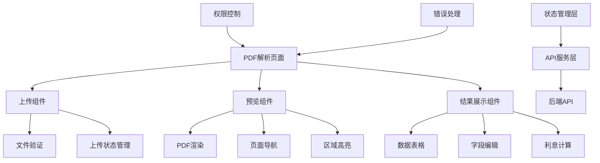

# PDF文档智能解析工具前端设计文档

## 概述

PDF文档智能解析工具前端是基于React 19 + TypeScript的现代化Web应用，集成在CuckooX-Google破产案件管理系统中。前端负责提供直观的用户界面，处理PDF文档的上传、预览、解析结果展示和编辑等功能，通过RESTful API与后端服务通信。

## 技术架构

### 技术栈

- **框架**: React 19 + TypeScript
- **UI库**: Material-UI v7 (MUI)
- **状态管理**: TanStack Query + React Context
- **PDF处理**: react-pdf + pdf-lib
- **图形标注**: Fabric.js
- **富文本编辑**: QuillJS v2 (集成现有RichTextEditor)
- **文件上传**: react-dropzone
- **表单处理**: react-hook-form + zod
- **样式**: MUI + Tailwind CSS

### 整体架构



## 组件设计

### 1. 主页面组件 (PDFParserPage)

```typescript
interface PDFParserPageProps {
  caseId?: string;
  mode: 'admin' | 'creditor' | 'auditor';
}

const PDFParserPage: React.FC<PDFParserPageProps> = ({ caseId, mode }) => {
  // 页面状态管理
  // 权限检查
  // 布局渲染
};
```

**布局结构:**
- 顶部：面包屑导航 + 操作按钮
- 左侧：文件上传区域 + 解析结果表格
- 右侧：PDF预览面板
- 底部：利息计算器（可折叠）

### 2. 文件上传组件 (PDFUploadComponent)

```typescript
interface PDFUploadComponentProps {
  onFilesUploaded: (files: UploadedFile[]) => void;
  maxFiles?: number;
  maxSize?: number;
  disabled?: boolean;
}

interface UploadedFile {
  id: string;
  name: string;
  size: number;
  file: File;
  status: 'pending' | 'uploading' | 'completed' | 'error';
  progress: number;
  error?: string;
}

const PDFUploadComponent: React.FC<PDFUploadComponentProps> = (props) => {
  const { getRootProps, getInputProps, isDragActive } = useDropzone({
    accept: { 'application/pdf': ['.pdf'] },
    maxSize: props.maxSize || 50 * 1024 * 1024, // 50MB
    maxFiles: props.maxFiles || 10,
    onDrop: handleFileDrop
  });
  
  // 文件验证逻辑
  // 上传状态管理
  // 进度显示
};
```

**功能特性:**
- 拖拽上传支持
- 文件格式和大小验证
- 批量上传管理
- 实时进度显示
- 错误处理和重试

### 3. PDF预览组件 (PDFPreviewComponent)

```typescript
interface PDFPreviewComponentProps {
  fileUrl: string;
  highlightRegions?: HighlightRegion[];
  onPageChange?: (pageNumber: number) => void;
  onRegionClick?: (region: HighlightRegion) => void;
}

interface HighlightRegion {
  id: string;
  pageNumber: number;
  x: number;
  y: number;
  width: number;
  height: number;
  color: string;
  fieldName: string;
  confidence: number;
}

const PDFPreviewComponent: React.FC<PDFPreviewComponentProps> = (props) => {
  const [numPages, setNumPages] = useState<number>(0);
  const [pageNumber, setPageNumber] = useState<number>(1);
  const [scale, setScale] = useState<number>(1.0);
  
  // PDF渲染逻辑
  // 页面导航
  // 缩放控制
  // 区域高亮
};
```

**功能特性:**
- PDF页面渲染
- 缩放和导航控制
- 区域高亮显示
- 点击交互支持
- 响应式适配

### 4. 解析结果展示组件 (ParseResultComponent)

```typescript
interface ParseResultComponentProps {
  parseResult: ParseResult;
  onFieldEdit: (fieldName: string, newValue: any) => void;
  onFieldClick: (fieldName: string) => void;
  readonly?: boolean;
}

interface ParseResult {
  id: string;
  status: 'processing' | 'completed' | 'failed';
  fields: ParsedField[];
  confidence: number;
  createdAt: Date;
}

interface ParsedField {
  name: string;
  displayName: string;
  value: any;
  originalValue?: any;
  confidence: number;
  sourceText: string;
  pageNumber: number;
  position?: BoundingBox;
  isModified: boolean;
  modifiedBy?: string;
  modifiedAt?: Date;
  modificationReason?: string;
}

const ParseResultComponent: React.FC<ParseResultComponentProps> = (props) => {
  // 数据表格渲染
  // 字段编辑处理
  // 置信度显示
  // 修正历史管理
};
```

**表格列定义:**
- 字段名称
- 识别值
- 置信度（进度条显示）
- 来源页码
- 修正状态
- 操作按钮

### 5. 字段编辑对话框 (FieldEditDialog)

```typescript
interface FieldEditDialogProps {
  open: boolean;
  field: ParsedField;
  onSave: (updatedField: ParsedField, reason: string) => void;
  onClose: () => void;
}

const FieldEditDialog: React.FC<FieldEditDialogProps> = (props) => {
  const { control, handleSubmit, formState } = useForm<FieldEditForm>({
    resolver: zodResolver(fieldEditSchema)
  });
  
  // 表单验证
  // 数据类型处理
  // 修正原因输入
};
```

**表单字段:**
- 字段值输入（根据类型动态渲染）
- 修正原因（必填）
- 原始值显示（只读）
- 置信度显示

### 6. 利息计算器组件 (InterestCalculatorComponent)

```typescript
interface InterestCalculatorProps {
  contractAmount?: number;
  interestRate?: number;
  contractDate?: Date;
  onCalculationComplete: (result: InterestCalculationResult) => void;
}

interface InterestCalculationResult {
  principal: number;
  interest: number;
  totalAmount: number;
  calculationDate: Date;
  parameters: CalculationParameters;
  breakdown: InterestBreakdown[];
}

const InterestCalculatorComponent: React.FC<InterestCalculatorProps> = (props) => {
  // 计算参数设置
  // 实时计算预览
  // 结果详细展示
  // 计算历史记录
};
```

**计算参数:**
- 本金金额
- 利率类型和数值
- 计算起止日期
- 复利频率
- 计算方式选择

### 7. QuillJS文档生成组件 (DocumentGeneratorComponent)

```typescript
interface DocumentGeneratorProps {
  parseResult: ParseResult;
  onDocumentGenerated: (document: GeneratedDocument) => void;
}

interface GeneratedDocument {
  id: string;
  title: string;
  content: Delta; // QuillJS Delta格式
  template: DocumentTemplate;
  metadata: DocumentMetadata;
}

const DocumentGeneratorComponent: React.FC<DocumentGeneratorProps> = (props) => {
  // 模板选择
  // 文档预览
  // 字段映射
  // 生成和保存
};
```

**文档模板:**
- 债权申报书
- 合同分析报告
- 利息计算说明
- 自定义模板

### 8. 批量处理监控组件 (BatchProcessMonitor)

```typescript
interface BatchProcessMonitorProps {
  batchId: string;
  onBatchComplete: (results: BatchProcessResult[]) => void;
}

interface BatchProcessResult {
  fileId: string;
  fileName: string;
  status: 'processing' | 'completed' | 'failed';
  progress: number;
  result?: ParseResult;
  error?: string;
  startTime: Date;
  endTime?: Date;
}

const BatchProcessMonitor: React.FC<BatchProcessMonitorProps> = (props) => {
  // 批量状态轮询
  // 进度可视化
  // 错误处理
  // 结果汇总
};
```

## 状态管理设计

### 1. React Query配置

```typescript
// API查询配置
const queryClient = new QueryClient({
  defaultOptions: {
    queries: {
      staleTime: 5 * 60 * 1000, // 5分钟
      cacheTime: 10 * 60 * 1000, // 10分钟
      retry: 3,
      refetchOnWindowFocus: false
    }
  }
});

// 主要查询hooks
export const usePDFParseResult = (parseId: string) => {
  return useQuery({
    queryKey: ['pdfParseResult', parseId],
    queryFn: () => pdfParseService.getParseResult(parseId),
    enabled: !!parseId
  });
};

export const useBatchProcessStatus = (batchId: string) => {
  return useQuery({
    queryKey: ['batchProcessStatus', batchId],
    queryFn: () => pdfParseService.getBatchStatus(batchId),
    refetchInterval: 2000, // 2秒轮询
    enabled: !!batchId
  });
};
```

### 2. Context状态管理

```typescript
interface PDFParserContextValue {
  currentFile: UploadedFile | null;
  parseResult: ParseResult | null;
  selectedField: string | null;
  calculationResult: InterestCalculationResult | null;
  uiState: {
    isUploading: boolean;
    isParsing: boolean;
    isCalculating: boolean;
    showCalculator: boolean;
    previewScale: number;
    currentPage: number;
  };
  actions: {
    setCurrentFile: (file: UploadedFile | null) => void;
    setSelectedField: (fieldName: string | null) => void;
    updateFieldValue: (fieldName: string, value: any, reason: string) => void;
    toggleCalculator: () => void;
    setPreviewScale: (scale: number) => void;
  };
}

const PDFParserContext = createContext<PDFParserContextValue | null>(null);
```

## API服务设计

### 1. PDF解析服务

```typescript
class PDFParseService {
  // 文件上传
  async uploadFile(file: File, caseId?: string): Promise<UploadResponse> {
    const formData = new FormData();
    formData.append('file', file);
    if (caseId) formData.append('caseId', caseId);
    
    return this.apiClient.post('/api/pdf/upload', formData, {
      headers: { 'Content-Type': 'multipart/form-data' },
      onUploadProgress: (progressEvent) => {
        // 上传进度回调
      }
    });
  }
  
  // 获取解析结果
  async getParseResult(parseId: string): Promise<ParseResult> {
    return this.apiClient.get(`/api/pdf/parse-result/${parseId}`);
  }
  
  // 更新字段值
  async updateField(parseId: string, fieldName: string, value: any, reason: string): Promise<void> {
    return this.apiClient.patch(`/api/pdf/parse-result/${parseId}/field`, {
      fieldName,
      value,
      reason
    });
  }
  
  // 计算利息
  async calculateInterest(params: InterestCalculationParams): Promise<InterestCalculationResult> {
    return this.apiClient.post('/api/pdf/calculate-interest', params);
  }
  
  // 生成文档
  async generateDocument(parseId: string, template: string): Promise<GeneratedDocument> {
    return this.apiClient.post(`/api/pdf/generate-document/${parseId}`, { template });
  }
}
```

### 2. 错误处理

```typescript
// API错误拦截器
apiClient.interceptors.response.use(
  (response) => response,
  (error) => {
    if (error.response?.status === 401) {
      // 未授权，跳转登录
      window.location.href = '/login';
    } else if (error.response?.status === 403) {
      // 权限不足
      showErrorMessage('权限不足，请联系管理员');
    } else if (error.response?.status >= 500) {
      // 服务器错误
      showErrorMessage('服务器错误，请稍后重试');
    }
    return Promise.reject(error);
  }
);

// 全局错误边界
class PDFParserErrorBoundary extends React.Component<Props, State> {
  static getDerivedStateFromError(error: Error): State {
    return { hasError: true, error };
  }
  
  componentDidCatch(error: Error, errorInfo: React.ErrorInfo) {
    console.error('PDF Parser Error:', error, errorInfo);
    // 发送错误报告
  }
  
  render() {
    if (this.state.hasError) {
      return <ErrorFallback error={this.state.error} />;
    }
    return this.props.children;
  }
}
```

## 响应式设计

### 1. 断点配置

```typescript
const breakpoints = {
  xs: 0,
  sm: 600,
  md: 900,
  lg: 1200,
  xl: 1536
};

// 响应式布局Hook
const useResponsiveLayout = () => {
  const theme = useTheme();
  const isMobile = useMediaQuery(theme.breakpoints.down('md'));
  const isTablet = useMediaQuery(theme.breakpoints.between('md', 'lg'));
  
  return {
    isMobile,
    isTablet,
    isDesktop: !isMobile && !isTablet,
    layoutMode: isMobile ? 'mobile' : isTablet ? 'tablet' : 'desktop'
  };
};
```

### 2. 布局适配

```typescript
const PDFParserLayout: React.FC = () => {
  const { layoutMode } = useResponsiveLayout();
  
  if (layoutMode === 'mobile') {
    return (
      <Stack spacing={2}>
        <PDFUploadComponent />
        <Tabs>
          <Tab label="解析结果" />
          <Tab label="PDF预览" />
          <Tab label="利息计算" />
        </Tabs>
        {/* 标签页内容 */}
      </Stack>
    );
  }
  
  return (
    <Grid container spacing={2}>
      <Grid size={6}>
        <PDFUploadComponent />
        <ParseResultComponent />
      </Grid>
      <Grid size={6}>
        <PDFPreviewComponent />
      </Grid>
    </Grid>
  );
};
```

## 性能优化

### 1. 组件懒加载

```typescript
// 懒加载大型组件
const PDFPreviewComponent = lazy(() => import('./PDFPreviewComponent'));
const InterestCalculatorComponent = lazy(() => import('./InterestCalculatorComponent'));

// 使用Suspense包装
<Suspense fallback={<CircularProgress />}>
  <PDFPreviewComponent />
</Suspense>
```

### 2. 虚拟化列表

```typescript
// 大量解析结果的虚拟化显示
import { FixedSizeList as List } from 'react-window';

const VirtualizedParseResultList: React.FC = ({ items }) => {
  const Row = ({ index, style }) => (
    <div style={style}>
      <ParseResultItem item={items[index]} />
    </div>
  );
  
  return (
    <List
      height={600}
      itemCount={items.length}
      itemSize={80}
      width="100%"
    >
      {Row}
    </List>
  );
};
```

### 3. 图片懒加载

```typescript
// PDF页面图片懒加载
const LazyPDFPage: React.FC<{ pageNumber: number }> = ({ pageNumber }) => {
  const [isVisible, setIsVisible] = useState(false);
  const ref = useRef<HTMLDivElement>(null);
  
  useEffect(() => {
    const observer = new IntersectionObserver(
      ([entry]) => setIsVisible(entry.isIntersecting),
      { threshold: 0.1 }
    );
    
    if (ref.current) observer.observe(ref.current);
    return () => observer.disconnect();
  }, []);
  
  return (
    <div ref={ref}>
      {isVisible ? <PDFPage pageNumber={pageNumber} /> : <Skeleton />}
    </div>
  );
};
```

## 测试策略

### 1. 单元测试

```typescript
// 组件测试示例
describe('PDFUploadComponent', () => {
  it('should accept PDF files only', () => {
    render(<PDFUploadComponent onFilesUploaded={jest.fn()} />);
    
    const input = screen.getByRole('button', { name: /upload/i });
    const pdfFile = new File(['pdf content'], 'test.pdf', { type: 'application/pdf' });
    const txtFile = new File(['text content'], 'test.txt', { type: 'text/plain' });
    
    // 测试PDF文件接受
    fireEvent.drop(input, { dataTransfer: { files: [pdfFile] } });
    expect(screen.queryByText(/格式错误/)).not.toBeInTheDocument();
    
    // 测试非PDF文件拒绝
    fireEvent.drop(input, { dataTransfer: { files: [txtFile] } });
    expect(screen.getByText(/格式错误/)).toBeInTheDocument();
  });
});
```

### 2. 集成测试

```typescript
// API集成测试
describe('PDF Parse Integration', () => {
  it('should complete full parse workflow', async () => {
    const mockFile = new File(['pdf'], 'test.pdf', { type: 'application/pdf' });
    
    // 模拟上传
    const uploadResponse = await pdfParseService.uploadFile(mockFile);
    expect(uploadResponse.success).toBe(true);
    
    // 模拟解析完成
    const parseResult = await pdfParseService.getParseResult(uploadResponse.parseId);
    expect(parseResult.status).toBe('completed');
    expect(parseResult.fields).toHaveLength(3);
  });
});
```

## 安全考虑

### 1. 文件安全

```typescript
// 文件类型验证
const validateFileType = (file: File): boolean => {
  const allowedTypes = ['application/pdf'];
  const allowedExtensions = ['.pdf'];
  
  return allowedTypes.includes(file.type) && 
         allowedExtensions.some(ext => file.name.toLowerCase().endsWith(ext));
};

// 文件大小限制
const MAX_FILE_SIZE = 50 * 1024 * 1024; // 50MB
const validateFileSize = (file: File): boolean => {
  return file.size <= MAX_FILE_SIZE;
};
```

### 2. XSS防护

```typescript
// 用户输入清理
import DOMPurify from 'dompurify';

const sanitizeInput = (input: string): string => {
  return DOMPurify.sanitize(input);
};

// 安全的HTML渲染
const SafeHTML: React.FC<{ content: string }> = ({ content }) => {
  const sanitizedContent = useMemo(() => 
    DOMPurify.sanitize(content), [content]
  );
  
  return <div dangerouslySetInnerHTML={{ __html: sanitizedContent }} />;
};
```