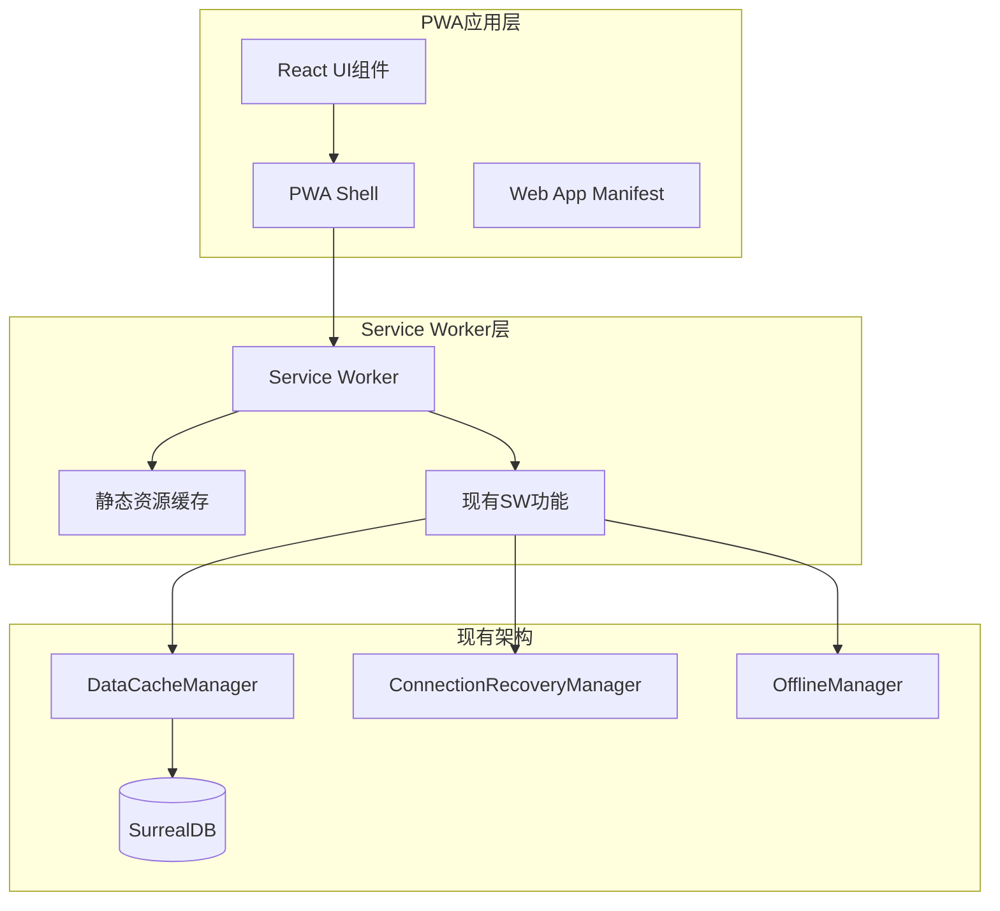

# PWA优化设计文档

## 概述

基于现有的CuckooX-Google破产案件管理系统架构，将其转换为完整的PWA应用。设计充分利用现有的Service Worker智能缓存系统、SurrealDB连接管理和数据同步机制，重点优化静态资源缓存、离线体验和PWA特性集成。

## 架构设计

### 整体架构图



### 核心组件关系

1. **PWA Shell**: 应用外壳，提供基础UI框架和导航
2. **静态资源缓存**: 新增的静态资源管理模块
3. **现有SW功能**: 利用现有的数据缓存和连接管理
4. **网络状态管理**: 新增的网络感知模块

## 组件设计

### 1. PWA基础设施组件

#### PWAManifestGenerator
```typescript
interface PWAManifestConfig {
  name: string;
  short_name: string;
  description: string;
  theme_color: string;
  background_color: string;
  display: 'standalone' | 'fullscreen' | 'minimal-ui';
  orientation: 'portrait' | 'landscape' | 'any';
  icons: PWAIcon[];
  start_url: string;
  scope: string;
}

class PWAManifestGenerator {
  generateManifest(config: PWAManifestConfig): WebAppManifest;
  validateManifest(manifest: WebAppManifest): boolean;
  updateManifest(updates: Partial<PWAManifestConfig>): void;
}
```

#### PWAInstallManager
```typescript
interface InstallPromptState {
  canInstall: boolean;
  isInstalled: boolean;
  installPrompt: BeforeInstallPromptEvent | null;
}

class PWAInstallManager {
  private installPrompt: BeforeInstallPromptEvent | null = null;
  
  async checkInstallability(): Promise<InstallPromptState>;
  async showInstallPrompt(): Promise<boolean>;
  async handleInstallEvent(): Promise<void>;
  onInstallStateChange(callback: (state: InstallPromptState) => void): void;
}
```

### 2. 静态资源缓存系统

#### StaticResourceCacheManager
```typescript
interface CacheStrategy {
  name: string;
  version: string;
  resources: string[];
  maxAge: number;
  updateStrategy: 'immediate' | 'background' | 'manual';
}

class StaticResourceCacheManager {
  private cacheStrategies: Map<string, CacheStrategy> = new Map();
  
  async initializeCache(): Promise<void>;
  async cacheStaticResources(strategy: CacheStrategy): Promise<void>;
  async updateCache(strategyName: string): Promise<void>;
  async clearOldCaches(): Promise<void>;
  async handleFetch(request: Request): Promise<Response>;
}
```

#### 缓存策略配置
```typescript
const CACHE_STRATEGIES: CacheStrategy[] = [
  {
    name: 'app-shell',
    version: 'v1.0.0',
    resources: [
      '/',
      '/index.html',
      '/static/css/main.css',
      '/static/js/main.js',
      '/manifest.json'
    ],
    maxAge: 86400000, // 24小时
    updateStrategy: 'background'
  },
  {
    name: 'assets',
    version: 'v1.0.0',
    resources: [
      '/static/media/logo.svg',
      '/static/fonts/*',
      '/favicon.ico'
    ],
    maxAge: 604800000, // 7天
    updateStrategy: 'manual'
  }
];
```

### 3. 网络状态管理

#### NetworkStateManager
```typescript
interface NetworkState {
  isOnline: boolean;
  connectionType: 'wifi' | '4g' | '3g' | '2g' | 'unknown';
  effectiveType: 'slow-2g' | '2g' | '3g' | '4g';
  downlink: number;
  rtt: number;
}

class NetworkStateManager {
  private currentState: NetworkState;
  private listeners: Set<(state: NetworkState) => void> = new Set();
  
  async initialize(): Promise<void>;
  getCurrentState(): NetworkState;
  onStateChange(callback: (state: NetworkState) => void): void;
  removeStateListener(callback: (state: NetworkState) => void): void;
  
  // 与现有OfflineManager集成
  private notifyOfflineManager(isOnline: boolean): void;
}
```

### 4. PWA UI增强组件

#### PWAStatusIndicator
```typescript
interface PWAStatus {
  networkState: NetworkState;
  installState: InstallPromptState;
  cacheState: {
    isUpdating: boolean;
    hasUpdate: boolean;
    lastUpdated: Date;
  };
}

class PWAStatusIndicator extends React.Component<{}, PWAStatus> {
  renderNetworkIndicator(): React.ReactNode;
  renderInstallPrompt(): React.ReactNode;
  renderUpdatePrompt(): React.ReactNode;
  
  componentDidMount(): void;
  componentWillUnmount(): void;
}
```

#### OfflineActionHandler
```typescript
interface OfflineActionConfig {
  disabledActions: string[];
  offlineMessage: string;
  retryMessage: string;
}

class OfflineActionHandler {
  private config: OfflineActionConfig;
  private networkManager: NetworkStateManager;
  
  shouldDisableAction(actionType: string): boolean;
  wrapActionWithOfflineCheck<T>(
    action: () => Promise<T>,
    actionType: string
  ): () => Promise<T>;
  showOfflineMessage(actionType: string): void;
}
```

### 5. 推送通知系统

#### PWAPushManager
```typescript
interface PushNotificationConfig {
  vapidPublicKey: string;
  serviceWorkerPath: string;
  notificationOptions: NotificationOptions;
}

interface NotificationPayload {
  title: string;
  body: string;
  icon?: string;
  badge?: string;
  data?: any;
  actions?: NotificationAction[];
}

class PWAPushManager {
  private config: PushNotificationConfig;
  private registration: ServiceWorkerRegistration | null = null;
  
  async initialize(): Promise<void>;
  async requestPermission(): Promise<NotificationPermission>;
  async subscribe(): Promise<PushSubscription | null>;
  async unsubscribe(): Promise<boolean>;
  
  // 与现有Service Worker集成
  async sendNotificationToSW(payload: NotificationPayload): Promise<void>;
}
```

## 数据模型

### PWA配置数据
```typescript
interface PWAConfig {
  manifest: PWAManifestConfig;
  cacheStrategies: CacheStrategy[];
  pushConfig: PushNotificationConfig;
  offlineConfig: OfflineActionConfig;
}

interface PWAState {
  isInstalled: boolean;
  canInstall: boolean;
  hasUpdate: boolean;
  isOffline: boolean;
  lastSync: Date;
  cacheSize: number;
}
```

### 缓存元数据
```typescript
interface CacheMetadata {
  name: string;
  version: string;
  createdAt: Date;
  lastAccessed: Date;
  size: number;
  resources: CachedResource[];
}

interface CachedResource {
  url: string;
  cachedAt: Date;
  size: number;
  mimeType: string;
  etag?: string;
}
```

## 错误处理

### PWA错误类型
```typescript
enum PWAErrorType {
  MANIFEST_LOAD_FAILED = 'MANIFEST_LOAD_FAILED',
  CACHE_OPERATION_FAILED = 'CACHE_OPERATION_FAILED',
  INSTALL_FAILED = 'INSTALL_FAILED',
  NOTIFICATION_PERMISSION_DENIED = 'NOTIFICATION_PERMISSION_DENIED',
  SERVICE_WORKER_UPDATE_FAILED = 'SERVICE_WORKER_UPDATE_FAILED'
}

class PWAError extends Error {
  constructor(
    public type: PWAErrorType,
    message: string,
    public originalError?: Error
  ) {
    super(message);
  }
}
```

### 错误恢复策略
```typescript
interface ErrorRecoveryStrategy {
  errorType: PWAErrorType;
  maxRetries: number;
  retryDelay: number;
  fallbackAction: () => Promise<void>;
}

class PWAErrorHandler {
  private strategies: Map<PWAErrorType, ErrorRecoveryStrategy> = new Map();
  
  async handleError(error: PWAError): Promise<void>;
  registerStrategy(strategy: ErrorRecoveryStrategy): void;
  private async executeRecovery(strategy: ErrorRecoveryStrategy): Promise<void>;
}
```

## 测试策略

### 单元测试
- PWA组件功能测试
- 缓存策略测试
- 网络状态管理测试
- 推送通知功能测试

### 集成测试
- Service Worker与PWA功能集成
- 离线/在线状态切换测试
- 安装和更新流程测试


## 性能优化

### 缓存优化
1. **分层缓存策略**: 应用外壳、静态资源、动态数据分别缓存
2. **预加载策略**: 关键资源预加载，非关键资源懒加载
3. **缓存更新策略**: 后台更新，避免阻塞用户操作

### 启动性能
1. **App Shell模式**: 快速显示应用框架
2. **关键资源内联**: 首屏CSS内联减少请求
3. **渐进式加载**: 按需加载非关键功能

### 内存管理
1. **缓存大小限制**: 设置合理的缓存大小上限
2. **LRU清理策略**: 自动清理最少使用的缓存
3. **内存监控**: 监控内存使用，及时清理

## 安全考虑

### HTTPS要求
- PWA必须在HTTPS环境下运行
- Service Worker只能在安全上下文中注册
- 推送通知需要安全连接

### 数据安全
- 缓存数据加密存储
- 敏感信息不进入缓存
- 定期清理过期缓存


## 部署考虑

### 构建优化
```typescript
// vite.config.ts PWA配置
import { VitePWA } from 'vite-plugin-pwa';

export default defineConfig({
  plugins: [
    VitePWA({
      registerType: 'autoUpdate',
      workbox: {
        globPatterns: ['**/*.{js,css,html,ico,png,svg,woff2}'],
        runtimeCaching: [
          {
            urlPattern: /^https:\/\/api\./,
            handler: 'NetworkFirst',
            options: {
              cacheName: 'api-cache',
              expiration: {
                maxEntries: 100,
                maxAgeSeconds: 300
              }
            }
          }
        ]
      },
      manifest: {
        name: 'CuckooX 破产案件管理系统',
        short_name: 'CuckooX',
        description: '企业破产案件管理系统',
        theme_color: '#1976d2',
        background_color: '#ffffff',
        display: 'standalone',
        orientation: 'portrait',
        scope: '/',
        start_url: '/',
        icons: [
          {
            src: '/assets/logo/favicon.svg',
            sizes: '32x32',
            type: 'image/svg+xml',
            purpose: 'any'
          },
          {
            src: '/assets/logo/cuckoo-icon.svg',
            sizes: '48x48 72x72 96x96 144x144 192x192 512x512',
            type: 'image/svg+xml',
            purpose: 'any'
          },
          {
            src: '/assets/logo/cuckoo-icon.svg',
            sizes: '48x48 72x72 96x96 144x144 192x192 512x512',
            type: 'image/svg+xml',
            purpose: 'maskable'
          }
        ]
      }
    })
  ]
});
```

### 服务器配置
- 正确的MIME类型设置
- 缓存头配置
- HTTPS重定向
- Service Worker作用域配置

## 监控和分析

### PWA指标监控
- 安装转化率
- 离线使用率
- 缓存命中率
- 推送通知点击率

### 性能监控
- 首次内容绘制(FCP)
- 最大内容绘制(LCP)
- 首次输入延迟(FID)
- 累积布局偏移(CLS)

### 用户体验监控
- 离线功能使用情况
- 网络状态分布
- 设备类型分析
- 错误率统计