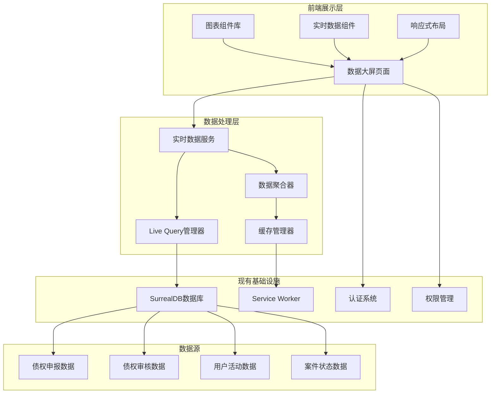

# 设计文档

## 概述

实时数据大屏系统是破产案件全生命周期管理平台的核心可视化组件，基于现有的技术栈构建，包括React 19 + TypeScript、SurrealDB实时数据库、Material-UI v7组件库以及Service Worker架构。系统通过SurrealDB Live Query技术实现毫秒级的数据实时同步，结合高性能的图表可视化库，为案件管理人提供直观、美观、响应迅速的数据监控体验。

系统设计遵循现有项目的架构模式，充分利用已有的认证系统、权限管理、数据缓存等基础设施，确保与现有功能模块的无缝集成。

## 架构

### 整体架构设计



### 实时数据流架构

系统采用基于SurrealDB Live Query的实时数据流处理架构，确保数据变更能够在3秒内反映到用户界面。

### 数据聚合架构

系统采用多层数据聚合策略，确保实时性和性能的平衡：

1. **原始数据层**：直接从SurrealDB获取的原始业务数据
2. **聚合计算层**：实时计算统计指标和趋势数据
3. **缓存优化层**：缓存计算结果，减少重复计算
4. **展示适配层**：将数据转换为图表组件所需格式

## 组件和接口

### 核心组件设计

#### 1. 数据大屏主页面组件

```typescript
// src/pages/dashboard/claims.tsx
interface ClaimsDashboardProps {
  caseId: string;
  refreshInterval?: number; // 默认5秒
  theme?: 'light' | 'dark';
}

interface DashboardState {
  isLoading: boolean;
  isConnected: boolean;
  lastUpdateTime: Date;
  error: string | null;
  data: DashboardData;
}

interface DashboardData {
  // 核心统计指标
  totalStats: {
    appliedAmount: number;
    approvedAmount: number;
    pendingAmount: number;
    appliedCount: number;
    approvedCount: number;
    pendingCount: number;
    creditorCount: number;
  };
  
  // 趋势数据
  trends: {
    dailyApplications: TrendPoint[];
    dailyApprovals: TrendPoint[];
    weeklyStats: TrendPoint[];
  };
  
  // 分布数据
  distributions: {
    claimNatureDistribution: DistributionItem[];
    reviewStatusDistribution: DistributionItem[];
    creditorTypeDistribution: DistributionItem[];
  };
  
  // 用户活动
  userActivity: {
    onlineUsers: OnlineUserStats;
    recentActivities: ActivityItem[];
  };
}
```

#### 2. 实时数据服务组件

```typescript
// src/services/dashboardService.ts
class DashboardService {
  private liveQueryManager: LiveQueryManager;
  private dataAggregator: DataAggregator;
  private cacheManager: CacheManager;
  private subscriptions: Map<string, string> = new Map();
  
  constructor(surrealClient: Surreal, caseId: string) {
    this.liveQueryManager = new LiveQueryManager(surrealClient);
    this.dataAggregator = new DataAggregator();
    this.cacheManager = new CacheManager();
  }
  
  // 初始化实时数据订阅
  async initializeSubscriptions(callback: (data: DashboardData) => void): Promise<void>;
  
  // 获取初始数据
  async getInitialData(): Promise<DashboardData>;
  
  // 清理所有订阅
  async cleanup(): Promise<void>;
  
  // 手动刷新数据
  async refreshData(): Promise<DashboardData>;
  
  // 导出数据
  async exportData(format: 'excel' | 'pdf'): Promise<Blob>;
}
```

#### 3. 图表组件库

```typescript
// src/components/dashboard/charts/StatCard.tsx
interface StatCardProps {
  title: string;
  value: number | string;
  unit?: string;
  trend?: {
    direction: 'up' | 'down' | 'stable';
    percentage: number;
    period: string;
  };
  format?: 'number' | 'currency' | 'percentage';
  color?: 'primary' | 'secondary' | 'success' | 'warning' | 'error';
  loading?: boolean;
  onClick?: () => void;
}

// src/components/dashboard/charts/TrendChart.tsx
interface TrendChartProps {
  data: TrendPoint[];
  title: string;
  type: 'line' | 'bar' | 'area';
  height?: number;
  showGrid?: boolean;
  showTooltip?: boolean;
  color?: string;
  loading?: boolean;
}
```

### 数据接口设计

#### 1. SurrealDB查询接口

系统将使用以下SurrealDB函数来获取聚合数据：

- `fn::get_claim_stats($case_id)` - 获取债权统计数据
- `fn::get_claim_trends($case_id, $period)` - 获取趋势数据
- `fn::get_claim_distributions($case_id)` - 获取分布数据
- `fn::get_user_activities($case_id, $limit)` - 获取用户活动
- `fn::get_online_users($case_id)` - 获取在线用户统计

#### 2. Live Query订阅接口

```typescript
interface LiveQueryConfig {
  // 债权数据变更订阅
  claimChanges: {
    query: `LIVE SELECT * FROM claim WHERE case_id = $case_id`;
    params: { case_id: string };
    callback: (action: 'CREATE' | 'UPDATE' | 'DELETE', result: Claim) => void;
  };
  
  // 用户活动订阅
  userActivity: {
    query: `LIVE SELECT * FROM user WHERE id IN (SELECT ->user FROM $case_id->has_member)`;
    params: { case_id: string };
    callback: (action: 'CREATE' | 'UPDATE' | 'DELETE', result: User) => void;
  };
}
```

## 数据模型

### 核心数据结构

```typescript
interface DashboardData {
  // 基础信息
  caseId: string;
  caseName: string;
  lastUpdateTime: Date;
  
  // 核心统计
  stats: {
    claims: {
      applied: { count: number; amount: number };
      approved: { count: number; amount: number };
      pending: { count: number; amount: number };
      rejected: { count: number; amount: number };
    };
    creditors: {
      total: number;
      active: number;
    };
    users: {
      online: number;
      total: number;
      byRole: Record<string, number>;
    };
  };
  
  // 趋势数据
  trends: {
    daily: {
      applications: TrendSeries;
      approvals: TrendSeries;
      amounts: TrendSeries;
    };
    weekly: {
      applications: TrendSeries;
      approvals: TrendSeries;
      amounts: TrendSeries;
    };
  };
  
  // 分布数据
  distributions: {
    claimNature: DistributionSeries;
    reviewStatus: DistributionSeries;
    creditorType: DistributionSeries;
    amountRange: DistributionSeries;
  };
  
  // 活动数据
  activities: {
    recent: ActivityItem[];
    summary: {
      todayActivities: number;
      weekActivities: number;
      monthActivities: number;
    };
  };
}
```

### 数据库扩展设计

为支持实时数据大屏，需要对现有数据库结构进行以下扩展：

#### 1. 用户活动追踪表

```sql
-- 用户活动日志表
DEFINE TABLE user_activity SCHEMAFULL;
DEFINE FIELD user_id ON user_activity TYPE record<user>;
DEFINE FIELD case_id ON user_activity TYPE record<case>;
DEFINE FIELD activity_type ON user_activity TYPE string;
DEFINE FIELD description ON user_activity TYPE string;
DEFINE FIELD metadata ON user_activity TYPE object;
DEFINE FIELD created_at ON user_activity TYPE datetime DEFAULT time::now();

-- 索引
DEFINE INDEX user_activity_case_time ON user_activity COLUMNS case_id, created_at;
DEFINE INDEX user_activity_type ON user_activity COLUMNS activity_type;
```

#### 2. 实时统计缓存表

```sql
-- 统计数据缓存表
DEFINE TABLE dashboard_stats SCHEMAFULL;
DEFINE FIELD case_id ON dashboard_stats TYPE record<case>;
DEFINE FIELD stat_type ON dashboard_stats TYPE string;
DEFINE FIELD stat_data ON dashboard_stats TYPE object;
DEFINE FIELD calculated_at ON dashboard_stats TYPE datetime DEFAULT time::now();
DEFINE FIELD expires_at ON dashboard_stats TYPE datetime;

-- 唯一索引
DEFINE INDEX dashboard_stats_unique ON dashboard_stats COLUMNS case_id, stat_type UNIQUE;
```

## 错误处理

### 错误分类和处理策略

#### 1. 连接和网络错误

```typescript
class DashboardConnectionError extends Error {
  constructor(message: string, public retryable: boolean = true) {
    super(message);
    this.name = 'DashboardConnectionError';
  }
}

class LiveQueryError extends Error {
  constructor(message: string, public queryId?: string) {
    super(message);
    this.name = 'LiveQueryError';
  }
}

// 错误处理策略
const handleConnectionError = (error: DashboardConnectionError) => {
  if (error.retryable) {
    // 显示重连提示，自动重试
    showRetryableError('连接中断，正在尝试重新连接...', () => {
      dashboardService.reconnect();
    });
  } else {
    // 显示永久错误，需要刷新页面
    showPermanentError('连接失败，请刷新页面重试');
  }
};
```

#### 2. 数据处理错误

```typescript
class DataAggregationError extends Error {
  constructor(message: string, public dataType: string) {
    super(message);
    this.name = 'DataAggregationError';
  }
}

class ChartRenderError extends Error {
  constructor(message: string, public chartType: string) {
    super(message);
    this.name = 'ChartRenderError';
  }
}
```

#### 3. 性能和资源错误

```typescript
class PerformanceError extends Error {
  constructor(message: string, public metric: string, public threshold: number) {
    super(message);
    this.name = 'PerformanceError';
  }
}

// 性能监控和处理
const performanceMonitor = {
  checkRenderTime: (componentName: string, renderTime: number) => {
    if (renderTime > 1000) { // 超过1秒
      throw new PerformanceError(
        `${componentName}渲染时间过长: ${renderTime}ms`,
        'render_time',
        1000
      );
    }
  },
  
  checkMemoryUsage: () => {
    if (performance.memory && performance.memory.usedJSHeapSize > 100 * 1024 * 1024) {
      throw new MemoryError(
        '内存使用过高，建议刷新页面',
        performance.memory.usedJSHeapSize
      );
    }
  }
};
```

## 测试策略

### 测试架构设计

系统采用多层次测试策略，确保功能正确性和性能表现：

#### 1. 单元测试 (Vitest + Testing Library)

- **数据聚合器测试**：验证统计计算的准确性
- **Live Query管理器测试**：验证订阅和取消订阅的正确性
- **图表组件测试**：验证数据渲染和交互功能

#### 2. 集成测试

- **大屏服务集成测试**：验证实时数据流的完整性
- **数据库集成测试**：验证Live Query和数据聚合的正确性

#### 3. 端到端测试 (Playwright)

- **大屏页面E2E测试**：验证完整的用户交互流程
- **实时更新测试**：验证数据变更的实时反映
- **网络异常测试**：验证断网重连的处理

#### 4. 性能测试

- **加载性能测试**：验证页面加载时间在3秒内
- **大数据集测试**：验证1000+债权记录的处理性能
- **内存使用测试**：验证长时间运行的内存稳定性

这个设计文档提供了实时数据大屏系统的完整技术方案，充分考虑了现有项目的技术栈和架构模式，确保新功能能够无缝集成到现有系统中。