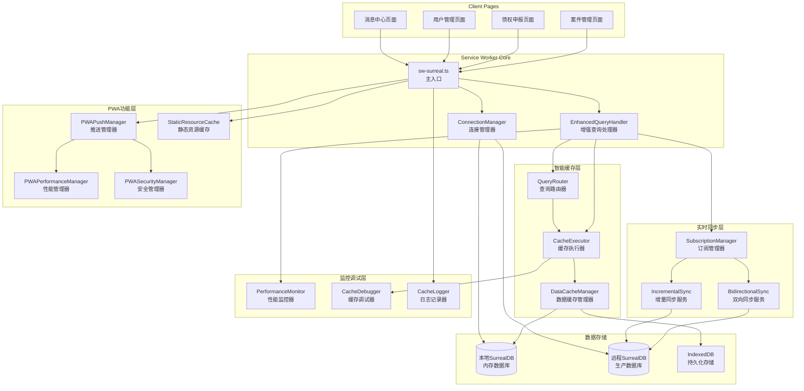
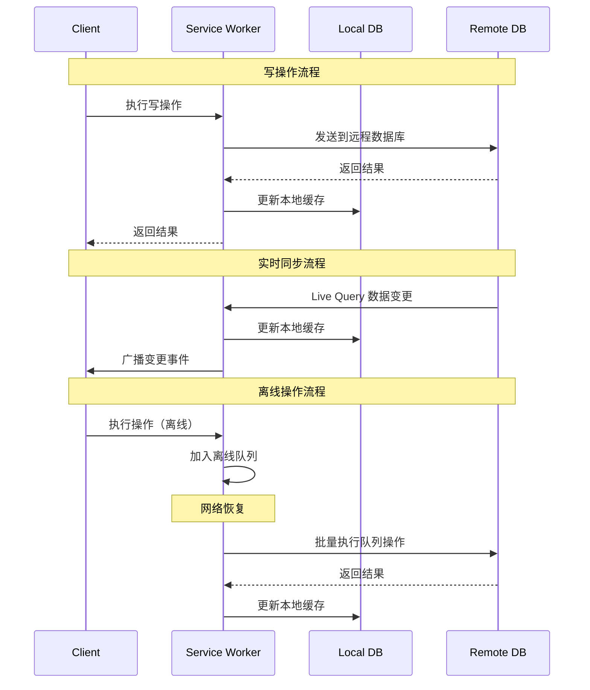

# Service Worker 架构重构设计文档

## 概述

本设计文档基于需求分析，提出了一个现代化的Service Worker架构，旨在构建高性能、可靠的离线优先应用。该架构采用模块化设计，支持智能缓存、实时数据同步、PWA功能集成等核心特性，为CuckooX-Google破产案件管理系统提供强大的数据访问和缓存能力。

## 架构设计

### 整体架构图



### 核心组件设计

#### 1. 统一数据库连接管理 (ConnectionManager)

**设计理念**: 提供统一、可靠的SurrealDB连接管理，支持多租户数据库隔离和自动重连机制。

**核心特性**:
- **多租户支持**: 基于用户登录信息自动切换到对应的database
- **连接池管理**: 维护本地和远程数据库连接实例
- **自动重连**: 检测连接断开并自动重连，恢复认证状态
- **连接共享**: 多个客户端页面共享同一个连接实例

**技术实现**:
```typescript
class SurrealDBConnectionManager {
  private localDb: Surreal;
  private remoteDb?: Surreal;
  private currentTenant?: string;
  private authState?: AuthState;
  private reconnectTimer?: NodeJS.Timeout;

  async connect(config: ConnectionConfig): Promise<void>
  async switchTenant(tenantCode: string): Promise<void>
  async authenticate(credentials: AuthCredentials): Promise<void>
  async handleDisconnection(): Promise<void>
  async reconnect(): Promise<void>
}
```

#### 2. 优化的智能查询路由系统 (QueryRouter + CacheExecutor)

**设计理念**: 基于表缓存状态智能路由查询，缓存表与原始表结构完全一致。

**简化的缓存策略**:
- **CACHED**: 表已缓存，直接从本地查询
- **REMOTE**: 表未缓存或缓存已过期，从远程查询
- **WRITE_THROUGH**: 写操作，先写远程再更新本地缓存

**查询路由逻辑**:
```typescript
class OptimizedQueryRouter {
  // 查询路由决策
  async routeQuery(sql: string, params?: Record<string, unknown>): Promise<QueryRoute> {
    const analysis = this.analyzeQuery(sql, params);
    
    // 写操作直接路由到远程
    if (analysis.isWriteOperation) {
      return {
        strategy: 'WRITE_THROUGH',
        source: 'remote',
        reasoning: '写操作必须通过远程数据库'
      };
    }
    
    // 检查涉及的表是否已缓存
    const cachedTables = await this.getCachedTables(analysis.tables);
    const allTablesCached = analysis.tables.every(table => cachedTables.has(table));
    
    if (allTablesCached) {
      // 检查缓存是否有效
      const cacheValid = await this.validateCacheStatus(analysis.tables);
      
      if (cacheValid) {
        return {
          strategy: 'CACHED',
          source: 'local',
          reasoning: '所有涉及的表都已缓存且有效'
        };
      }
    }
    
    // 部分表缓存或缓存无效，使用远程查询
    return {
      strategy: 'REMOTE',
      source: 'remote', 
      reasoning: '表未缓存或缓存无效，使用远程查询'
    };
  }
  
  // 获取已缓存的表
  private async getCachedTables(tables: string[]): Promise<Set<string>> {
    const cachedTables = new Set<string>();
    
    for (const table of tables) {
      const metadata = await this.localDb.query(
        'SELECT * FROM cache_metadata WHERE table_name = $table AND is_active = true',
        { table }
      );
      
      if (metadata.length > 0) {
        cachedTables.add(table);
      }
    }
    
    return cachedTables;
  }
  
  // 验证缓存状态
  private async validateCacheStatus(tables: string[]): Promise<boolean> {
    for (const table of tables) {
      const metadata = await this.localDb.query(
        'SELECT * FROM cache_metadata WHERE table_name = $table',
        { table }
      );
      
      if (metadata.length === 0) return false;
      
      const cache = metadata[0];
      
      // 检查临时缓存是否过期
      if (cache.cache_type === 'temporary' && cache.expires_at) {
        if (new Date(cache.expires_at) < new Date()) {
          return false;
        }
      }
      
      // 检查Live Query是否活跃
      if (!cache.live_query_uuid || !cache.is_active) {
        return false;
      }
    }
    
    return true;
  }
}

interface QueryRoute {
  strategy: 'CACHED' | 'REMOTE' | 'WRITE_THROUGH';
  source: 'local' | 'remote';
  reasoning: string;
}
```

**执行器优化**:
```typescript
class OptimizedCacheExecutor {
  async executeQuery(sql: string, params?: Record<string, unknown>): Promise<QueryResult> {
    const route = await this.queryRouter.routeQuery(sql, params);
    
    switch (route.strategy) {
      case 'CACHED':
        // 直接在本地数据库执行查询
        return await this.executeLocalQuery(sql, params);
        
      case 'REMOTE':
        // 在远程数据库执行查询
        const result = await this.executeRemoteQuery(sql, params);
        
        // 检查是否需要启用表缓存
        const analysis = this.analyzeQuery(sql, params);
        await this.considerEnablingCache(analysis.tables);
        
        return result;
        
      case 'WRITE_THROUGH':
        // 写操作：先写远程，Live Query会自动更新本地缓存
        return await this.executeRemoteQuery(sql, params);
        
      default:
        throw new Error(`Unsupported query strategy: ${route.strategy}`);
    }
  }
  
  // 本地查询执行
  private async executeLocalQuery(sql: string, params?: Record<string, unknown>): Promise<QueryResult> {
    const startTime = Date.now();
    const result = await this.localDb.query(sql, params);
    const executionTime = Date.now() - startTime;
    
    return {
      data: result,
      source: 'local',
      executionTime,
      cacheHit: true
    };
  }
  
  // 考虑启用表缓存
  private async considerEnablingCache(tables: string[]): Promise<void> {
    for (const table of tables) {
      const strategy = CACHE_STRATEGIES[table];
      if (strategy && !await this.isTableCached(table)) {
        // 异步启用缓存，不阻塞当前查询
        this.cacheManager.enableTableCache(table).catch(error => {
          console.warn(`Failed to enable cache for table ${table}:`, error);
        });
      }
    }
  }
}
```

#### 3. 优化的缓存和订阅管理 (CacheManager + SubscriptionManager)

**设计理念**: 缓存表与原始表结构完全一致，通过Live Query实时同步数据。

**缓存策略**:
```typescript
interface CacheStrategy {
  table: string;                       // 表名
  cacheType: 'persistent' | 'temporary'; // 缓存类型
  enableLiveSync: boolean;             // 是否启用Live Query同步
  priority: number;                    // 优先级 1-10
  ttl?: number;                        // 生存时间（仅临时缓存）
}

// 预定义缓存策略
const CACHE_STRATEGIES: Record<string, CacheStrategy> = {
  // 用户权限数据 - 持久化缓存，Live Query同步
  user: {
    table: 'user',
    cacheType: 'persistent',
    enableLiveSync: true,
    priority: 9
  },
  
  role: {
    table: 'role', 
    cacheType: 'persistent',
    enableLiveSync: true,
    priority: 8
  },
  
  has_role: {
    table: 'has_role',
    cacheType: 'persistent', 
    enableLiveSync: true,
    priority: 9
  },
  
  // 业务数据 - 临时缓存，Live Query同步
  case: {
    table: 'case',
    cacheType: 'temporary',
    enableLiveSync: true,
    priority: 8,
    ttl: 4 * 60 * 60 * 1000 // 4小时
  },
  
  claim: {
    table: 'claim',
    cacheType: 'temporary',
    enableLiveSync: true, 
    priority: 7,
    ttl: 2 * 60 * 60 * 1000 // 2小时
  }
};
```

**Live Query同步机制**:
```typescript
class OptimizedCacheManager {
  private liveQuerySubscriptions = new Map<string, string>(); // table -> uuid
  
  // 启用表缓存
  async enableTableCache(table: string): Promise<void> {
    const strategy = CACHE_STRATEGIES[table];
    if (!strategy) return;
    
    // 1. 初始数据同步
    await this.initialSync(table);
    
    // 2. 启用Live Query同步
    if (strategy.enableLiveSync) {
      await this.setupLiveQuerySync(table);
    }
    
    // 3. 记录缓存元数据
    await this.updateCacheMetadata(table, strategy);
  }
  
  // 初始数据同步
  private async initialSync(table: string): Promise<void> {
    if (!this.remoteDb) return;
    
    // 从远程数据库获取全表数据
    const data = await this.remoteDb.select(table);
    
    // 清空本地表
    await this.localDb.query(`DELETE FROM ${table}`);
    
    // 批量插入数据到本地表（保持原始结构）
    for (const record of data) {
      await this.localDb.create(record.id, record);
    }
    
    console.log(`Initial sync completed for table: ${table}, records: ${data.length}`);
  }
  
  // 设置Live Query同步
  private async setupLiveQuerySync(table: string): Promise<void> {
    if (!this.remoteDb) return;
    
    // 创建Live Query订阅
    const queryUuid = await this.remoteDb.live(table, async (action, result) => {
      await this.handleLiveQueryUpdate(table, action, result);
    });
    
    // 记录订阅ID
    this.liveQuerySubscriptions.set(table, queryUuid);
    
    console.log(`Live Query setup for table: ${table}, UUID: ${queryUuid}`);
  }
  
  // 处理Live Query更新
  private async handleLiveQueryUpdate(
    table: string, 
    action: 'CREATE' | 'UPDATE' | 'DELETE', 
    result: any
  ): Promise<void> {
    try {
      switch (action) {
        case 'CREATE':
          // 直接插入到本地表
          await this.localDb.create(result.id, result);
          break;
          
        case 'UPDATE':
          // 直接更新本地表记录
          await this.localDb.update(result.id, result);
          break;
          
        case 'DELETE':
          // 直接删除本地表记录
          await this.localDb.delete(result.id);
          break;
      }
      
      // 更新缓存元数据
      await this.updateCacheStats(table, action);
      
      // 广播变更给客户端
      await this.broadcastCacheUpdate(table, action, result);
      
    } catch (error) {
      console.error(`Failed to handle live query update for ${table}:`, error);
    }
  }
}
```

**页面感知机制**:
- 页面进入时自动启用相关表的缓存
- 多个页面使用相同表时共享缓存和Live Query
- 页面离开时检查是否还有其他页面使用，决定是否保留缓存
- 支持缓存优先级和资源管理

#### 4. 双向数据同步机制 (BidirectionalSync + IncrementalSync)

**设计理念**: 确保本地和远程数据的一致性，支持离线操作和冲突解决。

**同步策略**:
- **实时同步**: 通过Live Query接收远程数据变更
- **增量同步**: 基于时间戳获取变更数据，减少网络传输
- **离线队列**: 网络断开时暂存操作，恢复后批量执行
- **冲突解决**: 使用时间戳策略，最新修改优先

**数据流设计**:


#### 5. PWA功能集成

**设计理念**: 提供原生应用般的用户体验，包括离线访问、推送通知、后台同步等。

**核心功能模块**:

**PWAPushManager**: 推送通知管理
- 订阅管理和权限处理
- 通知显示和点击处理
- 与业务逻辑集成（案件提醒、债权审核通知等）

**PWAPerformanceManager**: 性能优化
- 资源预加载和缓存策略
- 网络适应性调整
- 内存使用优化

**PWASecurityManager**: 安全管理
- 会话管理和自动锁屏
- 令牌刷新和过期处理
- 多标签页状态同步

**StaticResourceCacheManager**: 静态资源缓存
- 应用壳缓存
- 版本管理和更新策略
- 离线资源提供

#### 6. 性能监控和优化 (PerformanceMonitor)

**设计理念**: 实时监控系统性能，提供数据驱动的优化建议。

**监控指标**:
```typescript
interface PerformanceMetrics {
  // 缓存性能
  cacheHitRate: number;
  avgResponseTime: number;
  
  // 查询性能
  localQueryCount: number;
  remoteQueryCount: number;
  avgLocalTime: number;
  avgRemoteTime: number;
  
  // 错误统计
  errorRate: number;
  slowQueryCount: number;
  
  // 资源使用
  memoryUsage: number;
  cacheSize: number;
}
```

**异常检测**:
- 慢查询检测（>5秒）
- 高错误率告警（>10%）
- 缓存命中率下降（<60%）
- 内存使用异常

#### 7. 安全和权限管理

**设计理念**: 确保数据访问的安全性，支持细粒度的权限控制。

**安全机制**:
- **令牌管理**: 安全存储和自动刷新认证令牌
- **会话控制**: 基于用户活动的会话管理
- **权限缓存**: 本地缓存用户权限信息，快速权限检查
- **多标签页同步**: 确保多个标签页的认证状态一致

**权限检查流程**:
```typescript
// 权限检查从本地缓存获取，毫秒级响应
async function checkPermission(operation: string, caseId?: string): Promise<boolean> {
  const authState = await getAuthState();
  if (!authState) return false;
  
  // 从缓存的权限数据中检查
  const permissions = authState.permissions.operations;
  return permissions.some(p => 
    p.operation_id === operation && 
    (!caseId || p.case_id === caseId) &&
    p.can_execute
  );
}
```

## 数据模型设计

### 优化的缓存数据结构

#### 直接表缓存策略

缓存表与原始表结构完全一致，通过Live Query实时同步：

```typescript
// 缓存策略：直接复制原始表结构
// 例如：需要缓存case表，则在本地数据库创建相同的case表

// 缓存元数据表（用于管理缓存状态）
interface CacheMetadata {
  id: RecordId;
  table_name: string;              // 缓存的表名
  cache_type: 'persistent' | 'temporary'; // 缓存类型
  live_query_uuid?: string;        // Live Query订阅ID
  last_sync_time: number;          // 最后同步时间
  record_count: number;            // 缓存记录数
  is_active: boolean;              // 是否活跃
  created_at: Date;
  updated_at: Date;
  expires_at?: Date;               // 过期时间（仅临时缓存）
}

// 用户认证状态
interface AuthState {
  id: string;
  tenant_code: string;
  permissions: {
    operations: OperationPermission[];
  };
  roles: {
    global: string[];
    case: Record<string, string[]>;
  };
  menus: MenuMetadata[];
  syncTimestamp: number;
}

// 订阅状态
interface SubscriptionState {
  id: string;
  table: string;
  subscription_type: SubscriptionType;
  user_id?: string;
  case_id?: string;
  live_query_uuid?: string;
  last_sync_time: number;
  is_active: boolean;
  created_at: Date;
}
```

### 优化的本地数据库Schema

```sql
-- 缓存元数据管理表
DEFINE TABLE cache_metadata SCHEMAFULL;
DEFINE FIELD table_name ON cache_metadata TYPE string;
DEFINE FIELD cache_type ON cache_metadata TYPE string;
DEFINE FIELD live_query_uuid ON cache_metadata TYPE option<string>;
DEFINE FIELD last_sync_time ON cache_metadata TYPE number;
DEFINE FIELD record_count ON cache_metadata TYPE number DEFAULT 0;
DEFINE FIELD is_active ON cache_metadata TYPE bool DEFAULT true;
DEFINE FIELD created_at ON cache_metadata TYPE datetime DEFAULT time::now();
DEFINE FIELD updated_at ON cache_metadata TYPE datetime VALUE time::now();
DEFINE FIELD expires_at ON cache_metadata TYPE option<datetime>;

-- 缓存表直接复制原始表结构
-- 例如：缓存case表
DEFINE TABLE case SCHEMAFULL;
-- 这里的字段定义与远程数据库的case表完全一致
DEFINE FIELD name ON case TYPE string;
DEFINE FIELD status ON case TYPE string;
DEFINE FIELD created_at ON case TYPE datetime DEFAULT time::now();
DEFINE FIELD updated_at ON case TYPE datetime VALUE time::now();
DEFINE FIELD created_by ON case TYPE record<user>;
-- ... 其他字段与远程表一致

-- 缓存claim表
DEFINE TABLE claim SCHEMAFULL;
-- 字段定义与远程数据库的claim表完全一致
DEFINE FIELD case_id ON claim TYPE record<case>;
DEFINE FIELD creditor_name ON claim TYPE string;
DEFINE FIELD amount ON claim TYPE number;
DEFINE FIELD status ON claim TYPE string;
DEFINE FIELD created_at ON claim TYPE datetime DEFAULT time::now();
-- ... 其他字段与远程表一致

-- 缓存用户权限相关表
DEFINE TABLE user SCHEMAFULL;
DEFINE TABLE role SCHEMAFULL;
DEFINE TABLE has_role TYPE RELATION IN user OUT role SCHEMAFULL;
DEFINE TABLE menu_metadata SCHEMAFULL;
DEFINE TABLE operation_metadata SCHEMAFULL;
-- ... 所有需要缓存的表都保持与远程数据库一致的结构

-- 性能监控表
DEFINE TABLE performance_metrics SCHEMAFULL;
DEFINE FIELD query_hash ON performance_metrics TYPE string;
DEFINE FIELD query_type ON performance_metrics TYPE string;
DEFINE FIELD execution_time ON performance_metrics TYPE number;
DEFINE FIELD cache_hit ON performance_metrics TYPE bool;
DEFINE FIELD source ON performance_metrics TYPE string;
DEFINE FIELD timestamp ON performance_metrics TYPE datetime DEFAULT time::now();
```

## 组件接口设计

### 主要接口定义

```typescript
// 查询处理器接口
interface IQueryHandler {
  handleQuery(sql: string, params?: QueryParams, userId?: string, caseId?: string): Promise<QueryHandlerResult>;
  handleMutation(sql: string, params?: QueryParams, userId?: string, caseId?: string): Promise<QueryHandlerResult>;
  preloadCache(tables: string[], userId?: string, caseId?: string): Promise<void>;
}

// 连接管理器接口
interface IConnectionManager {
  connect(config: ConnectionConfig): Promise<void>;
  disconnect(): Promise<void>;
  switchTenant(tenantCode: string): Promise<void>;
  authenticate(credentials: AuthCredentials): Promise<void>;
  isConnected(): boolean;
  getConnectionState(): ConnectionState;
}

// 缓存管理器接口
interface ICacheManager {
  query(sql: string, params?: QueryParams): Promise<UnknownData[]>;
  cacheData(table: string, data: UnknownData[], cacheType: CacheType, userId?: string, caseId?: string): Promise<void>;
  clearCache(table?: string, userId?: string, caseId?: string): Promise<void>;
  getCacheStatus(): CacheStatus;
}

// 订阅管理器接口
interface ISubscriptionManager {
  subscribeToTable(table: string, userId?: string, caseId?: string): Promise<string>;
  unsubscribe(subscriptionId: string): Promise<void>;
  getActiveSubscriptions(): Map<string, ActiveSubscription>;
  getSyncStatus(): Map<string, SyncStatus>;
}
```

### 客户端SurrealDB SDK集成

#### 自定义Service Worker引擎

通过实现SurrealDB SDK的自定义引擎接口，客户端可以完全使用标准的SurrealDB API，而底层通过Service Worker进行数据访问：

```typescript
// 自定义Service Worker引擎实现
import { Engine, EngineEvents, RpcRequest, RpcResponse } from 'surrealdb';

export class ServiceWorkerEngine extends Engine {
  private serviceWorker?: ServiceWorker;
  private requestId = 0;
  private pendingRequests = new Map<number, {
    resolve: (value: any) => void;
    reject: (error: any) => void;
  }>();

  constructor() {
    super();
    this.setupServiceWorkerConnection();
  }

  private async setupServiceWorkerConnection(): Promise<void> {
    // 等待Service Worker准备就绪
    const registration = await navigator.serviceWorker.ready;
    this.serviceWorker = registration.active;

    // 监听Service Worker消息
    navigator.serviceWorker.addEventListener('message', this.handleMessage.bind(this));
  }

  private handleMessage(event: MessageEvent): void {
    const { type, payload } = event.data;
    
    if (type === 'rpc_response') {
      const { requestId, result, error } = payload;
      const pending = this.pendingRequests.get(requestId);
      
      if (pending) {
        this.pendingRequests.delete(requestId);
        
        if (error) {
          pending.reject(new Error(error.description));
        } else {
          pending.resolve(result);
        }
      }
    }
  }

  // 实现Engine接口的rpc方法
  async rpc(request: RpcRequest): Promise<RpcResponse> {
    if (!this.serviceWorker) {
      throw new Error('Service Worker not available');
    }

    const requestId = ++this.requestId;

    return new Promise((resolve, reject) => {
      // 存储pending请求
      this.pendingRequests.set(requestId, { resolve, reject });

      // 发送RPC请求到Service Worker
      this.serviceWorker!.postMessage({
        type: 'rpc_request',
        payload: {
          requestId,
          method: request.method,
          params: request.params
        }
      });

      // 设置超时
      setTimeout(() => {
        if (this.pendingRequests.has(requestId)) {
          this.pendingRequests.delete(requestId);
          reject(new Error('Request timeout'));
        }
      }, 30000); // 30秒超时
    });
  }

  // 实现连接方法
  async connect(url: string): Promise<void> {
    // Service Worker引擎不需要直接连接
    // 连接由Service Worker管理
    this.emitter.emit('open');
  }

  // 实现断开连接方法
  async disconnect(): Promise<void> {
    this.pendingRequests.clear();
    this.emitter.emit('close');
  }

  // 获取连接状态
  get connected(): boolean {
    return !!this.serviceWorker;
  }
}

// 客户端使用标准SurrealDB SDK
import { Surreal } from 'surrealdb';

// 创建使用Service Worker引擎的SurrealDB实例
const db = new Surreal({
  engines: {
    sw: () => new ServiceWorkerEngine()
  }
});

// 连接到Service Worker引擎
await db.connect('sw://localhost');

// 现在可以使用完全标准的SurrealDB API
const users = await db.query('SELECT * FROM user WHERE active = true');
const result = await db.create('case', {
  name: '破产案件001',
  status: 'active',
  created_at: new Date()
});

// Live Query也完全兼容
await db.live('case', (action, result) => {
  console.log('Case data changed:', action, result);
});
```

#### Service Worker RPC处理

Service Worker需要处理来自自定义引擎的RPC请求：

```typescript
// Service Worker中的RPC处理
self.addEventListener('message', async (event) => {
  const { type, payload } = event.data;
  
  if (type === 'rpc_request') {
    const { requestId, method, params } = payload;
    
    try {
      let result;
      
      switch (method) {
        case 'query':
          result = await handleQuery(params[0], params[1]);
          break;
          
        case 'create':
          result = await handleCreate(params[0], params[1]);
          break;
          
        case 'select':
          result = await handleSelect(params[0]);
          break;
          
        case 'update':
          result = await handleUpdate(params[0], params[1]);
          break;
          
        case 'delete':
          result = await handleDelete(params[0]);
          break;
          
        case 'live':
          result = await handleLive(params[0], params[1]);
          break;
          
        case 'kill':
          result = await handleKill(params[0]);
          break;
          
        case 'use':
          result = await handleUse(params[0]);
          break;
          
        case 'signin':
          result = await handleSignin(params[0]);
          break;
          
        case 'signup':
          result = await handleSignup(params[0]);
          break;
          
        case 'authenticate':
          result = await handleAuthenticate(params[0]);
          break;
          
        case 'invalidate':
          result = await handleInvalidate();
          break;
          
        default:
          throw new Error(`Unsupported method: ${method}`);
      }
      
      // 发送成功响应
      event.ports[0]?.postMessage({
        type: 'rpc_response',
        payload: {
          requestId,
          result
        }
      });
      
    } catch (error) {
      // 发送错误响应
      event.ports[0]?.postMessage({
        type: 'rpc_response',
        payload: {
          requestId,
          error: {
            code: error.code || 'INTERNAL_ERROR',
            description: error.message,
            details: error.details || '',
            information: error.stack || ''
          }
        }
      });
    }
  }
});

// RPC方法实现示例
async function handleQuery(sql: string, params?: Record<string, unknown>) {
  // 使用EnhancedQueryHandler处理查询
  const result = await enhancedQueryHandler.handleQuery(sql, params);
  return result.data;
}

async function handleCreate(thing: string, data?: Record<string, unknown>) {
  // 转换为INSERT语句
  const sql = `CREATE ${thing} CONTENT $data`;
  const result = await enhancedQueryHandler.handleMutation(sql, { data });
  return result.data;
}

async function handleLive(table: string, callback?: Function) {
  // 创建Live Query订阅
  const subscriptionId = await subscriptionManager.subscribeToTable(table);
  
  // 返回Live Query UUID（兼容SurrealDB SDK）
  return subscriptionId;
}
```

### 消息通信协议（RPC格式）

#### RPC请求消息（客户端 → Service Worker）

```typescript
// 统一的RPC请求消息格式
interface RpcRequestMessage {
  type: 'rpc_request';
  payload: {
    requestId: number;              // 请求唯一标识
    method: string;                 // RPC方法名，对应SurrealDB SDK方法
    params: unknown[];              // 方法参数数组，与SurrealDB SDK参数一致
  };
}

// 支持的RPC方法（与SurrealDB SDK方法一一对应）:
// - query(sql, params?)           // 执行SurrealQL查询
// - create(thing, data?)          // 创建记录
// - select(thing)                 // 选择记录
// - update(thing, data?)          // 更新记录
// - merge(thing, data?)           // 合并记录
// - patch(thing, patches?)        // 补丁更新记录
// - delete(thing)                 // 删除记录
// - live(table, callback?)        // 创建Live Query
// - kill(uuid)                    // 终止Live Query
// - use(namespace, database?)     // 切换命名空间/数据库
// - signin(credentials)           // 登录认证
// - signup(credentials)           // 注册用户
// - authenticate(token)           // 令牌认证
// - invalidate()                  // 注销认证

// 使用示例：
// db.query('SELECT * FROM user') 
// → { method: 'query', params: ['SELECT * FROM user'] }

// db.create('case', { name: 'test' })
// → { method: 'create', params: ['case', { name: 'test' }] }

// db.live('case', callback)
// → { method: 'live', params: ['case', callback] }

// Service Worker管理消息（非RPC）
// 这些消息用于Service Worker的管理和监控，不通过SurrealDB SDK

// 1. 页面生命周期管理
interface PageLifecycleMessage {
  type: 'page_lifecycle';
  payload: {
    action: 'enter' | 'leave';      // 页面进入或离开
    pageId: string;                 // 页面唯一标识
    tables?: string[];              // 页面关注的表（进入时提供）
    userId?: string;                // 用户ID
    caseId?: string;                // 案件ID
  };
}
// 使用场景：页面进入时自动订阅相关数据，离开时取消订阅

// 2. 缓存预加载管理
interface CachePreloadMessage {
  type: 'cache_preload';
  payload: {
    tables: string[];               // 需要预加载的表
    priority?: 'high' | 'normal' | 'low'; // 预加载优先级
  };
}
// 使用场景：应用启动时预加载常用数据

// 3. 性能监控请求
interface PerformanceMonitorMessage {
  type: 'performance_monitor';
  payload: {
    action: 'get_stats' | 'get_report' | 'reset';
    timeRange?: {
      startTime: number;
      endTime: number;
    };
  };
}
// 使用场景：获取性能统计和报告

// 4. 系统健康检查
interface HealthCheckMessage {
  type: 'health_check';
  payload: {
    includeDetails?: boolean;
  };
}
// 使用场景：检查Service Worker健康状态

// 5. 配置更新
interface ConfigUpdateMessage {
  type: 'config_update';
  payload: {
    cacheStrategies?: Record<string, CacheStrategy>;
    performanceThresholds?: PerformanceThresholds;
    debugMode?: boolean;
  };
}
// 使用场景：运行时调整配置
```

#### RPC响应消息（Service Worker → 客户端）

```typescript
// 统一的RPC响应消息格式
interface RpcResponseMessage {
  type: 'rpc_response';
  payload: {
    requestId: number;              // 对应的请求ID
    result?: unknown;               // 方法执行结果，与SurrealDB SDK返回值完全一致
    error?: {                       // 错误信息，与SurrealDB SDK错误格式一致
      code: string;
      details: string;
      description: string;
      information: string;
    };
  };
}

// 不同RPC方法的返回值示例：
// query() → unknown[] (查询结果数组)
// create() → Record<string, unknown> (创建的记录)
// select() → unknown[] (选择的记录数组)
// update() → Record<string, unknown> (更新后的记录)
// delete() → Record<string, unknown> (删除的记录)
// live() → string (Live Query UUID)
// kill() → boolean (是否成功终止)
// use() → void (无返回值)
// signin() → string (认证令牌)
// authenticate() → void (无返回值)

// Live Query回调通知 - 与SurrealDB Live Query回调完全一致
interface LiveQueryCallbackMessage {
  type: 'live_query_callback';
  payload: {
    subscriptionId: string;         // Live Query订阅ID
    // SurrealDB Live Query标准回调参数
    action: 'CREATE' | 'UPDATE' | 'DELETE'; // 变更类型
    result: unknown;                // 变更的记录数据
  };
}
// 这个消息会触发客户端注册的Live Query回调函数
// 完全兼容SurrealDB SDK: await db.live(table, (action, result) => { ... })

// Service Worker管理响应消息

// 1. 性能统计响应
interface PerformanceStatsMessage {
  type: 'performance_stats';
  payload: {
    stats: {
      cacheHitRate: number;         // 缓存命中率
      avgResponseTime: number;      // 平均响应时间
      totalQueries: number;         // 总查询数
      errorRate: number;            // 错误率
      memoryUsage: number;          // 内存使用量
    };
    report?: PerformanceReport;     // 详细性能报告
    anomalies?: PerformanceAnomaly[]; // 性能异常
  };
}

// 2. 系统状态响应
interface SystemStatusMessage {
  type: 'system_status';
  payload: {
    status: 'healthy' | 'degraded' | 'error';
    connections: {
      local: 'connected' | 'disconnected';
      remote: 'connected' | 'disconnected' | 'unavailable';
    };
    cacheStatus: {
      size: number;                 // 缓存大小
      hitRate: number;              // 命中率
      tableCount: number;           // 缓存表数量
    };
    subscriptionStatus: {
      active: number;               // 活跃订阅数
      total: number;                // 总订阅数
    };
    lastHealthCheck: number;        // 最后健康检查时间
  };
}

// 3. 缓存状态通知
interface CacheStatusMessage {
  type: 'cache_status';
  payload: {
    table: string;                  // 表名
    action: 'cached' | 'cleared' | 'refreshed'; // 缓存操作
    recordCount: number;            // 记录数量
    cacheType: 'persistent' | 'temporary'; // 缓存类型
    timestamp: number;              // 更新时间
  };
}

// 4. 页面订阅状态
interface PageSubscriptionMessage {
  type: 'page_subscription';
  payload: {
    pageId: string;                 // 页面ID
    subscriptions: Array<{          // 订阅列表
      table: string;
      subscriptionId: string;
      status: 'active' | 'inactive' | 'error';
      lastSyncTime: number;
    }>;
  };
}

// 5. 配置更新确认
interface ConfigUpdateConfirmMessage {
  type: 'config_updated';
  payload: {
    success: boolean;               // 更新是否成功
    updatedConfig: Partial<ServiceWorkerConfig>; // 更新的配置项
    error?: string;                 // 错误信息
    restartRequired?: boolean;      // 是否需要重启
  };
}
```

#### 完整使用示例

```typescript
// 1. 客户端完全使用标准SurrealDB SDK
import { Surreal } from 'surrealdb';
import { ServiceWorkerEngine } from './ServiceWorkerEngine';

// 创建数据库实例，使用Service Worker引擎
const db = new Surreal({
  engines: {
    sw: () => new ServiceWorkerEngine()
  }
});

// 连接到Service Worker引擎
await db.connect('sw://localhost');

// 使用标准SurrealDB API进行数据操作
export class CaseService {
  // 查询案件列表
  async getCases(status?: string) {
    const sql = status 
      ? 'SELECT * FROM case WHERE status = $status ORDER BY created_at DESC'
      : 'SELECT * FROM case ORDER BY created_at DESC';
    
    return await db.query(sql, { status });
  }

  // 创建新案件
  async createCase(caseData: any) {
    return await db.create('case', caseData);
  }

  // 更新案件状态
  async updateCaseStatus(caseId: string, status: string) {
    return await db.update(caseId, { status, updated_at: new Date() });
  }

  // 删除案件
  async deleteCase(caseId: string) {
    return await db.delete(caseId);
  }

  // 订阅案件数据变更
  async subscribeToCaseChanges(callback: (action: string, result: any) => void) {
    return await db.live('case', callback);
  }

  // 取消订阅
  async unsubscribeFromCaseChanges(subscriptionId: string) {
    return await db.kill(subscriptionId);
  }
}

// 2. React组件中使用
import React, { useEffect, useState } from 'react';

export function CaseListPage() {
  const [cases, setCases] = useState([]);
  const [subscription, setSubscription] = useState<string>();

  useEffect(() => {
    // 页面进入时通知Service Worker
    navigator.serviceWorker.controller?.postMessage({
      type: 'page_lifecycle',
      payload: {
        action: 'enter',
        pageId: 'case-list',
        tables: ['case'],
        userId: getCurrentUserId(),
        caseId: getCurrentCaseId()
      }
    });

    // 加载初始数据
    loadCases();

    // 订阅数据变更
    subscribeToCaseChanges();

    return () => {
      // 页面离开时清理
      if (subscription) {
        db.kill(subscription);
      }
      
      navigator.serviceWorker.controller?.postMessage({
        type: 'page_lifecycle',
        payload: {
          action: 'leave',
          pageId: 'case-list'
        }
      });
    };
  }, []);

  const loadCases = async () => {
    try {
      const result = await db.query('SELECT * FROM case ORDER BY created_at DESC');
      setCases(result[0] || []);
    } catch (error) {
      console.error('Failed to load cases:', error);
    }
  };

  const subscribeToCaseChanges = async () => {
    try {
      const subId = await db.live('case', (action, result) => {
        console.log('Case data changed:', action, result);
        
        // 根据变更类型更新本地状态
        setCases(prevCases => {
          switch (action) {
            case 'CREATE':
              return [...prevCases, result];
            case 'UPDATE':
              return prevCases.map(c => c.id === result.id ? result : c);
            case 'DELETE':
              return prevCases.filter(c => c.id !== result.id);
            default:
              return prevCases;
          }
        });
      });
      
      setSubscription(subId);
    } catch (error) {
      console.error('Failed to subscribe to case changes:', error);
    }
  };

  const handleCreateCase = async (caseData: any) => {
    try {
      await db.create('case', caseData);
      // Live Query会自动更新UI，无需手动刷新
    } catch (error) {
      console.error('Failed to create case:', error);
    }
  };

  return (
    <div>
      <h1>案件列表</h1>
      {cases.map(case => (
        <div key={case.id}>
          <h3>{case.name}</h3>
          <p>状态: {case.status}</p>
        </div>
      ))}
      <button onClick={() => handleCreateCase({ name: '新案件', status: 'active' })}>
        创建案件
      </button>
    </div>
  );
}

// 3. Service Worker中的RPC处理完全透明
// 开发者无需关心Service Worker的实现细节
// 所有的缓存、同步、性能优化都在后台自动进行
```

## 错误处理策略

### 分层错误处理

```typescript
// 错误类型定义
enum ErrorType {
  CONNECTION_ERROR = 'CONNECTION_ERROR',
  QUERY_ERROR = 'QUERY_ERROR',
  CACHE_ERROR = 'CACHE_ERROR',
  PERMISSION_ERROR = 'PERMISSION_ERROR',
  TIMEOUT_ERROR = 'TIMEOUT_ERROR'
}

// 错误处理策略
interface ErrorHandlingStrategy {
  type: ErrorType;
  retryCount: number;
  retryDelay: number;
  fallbackAction: 'use_cache' | 'return_empty' | 'throw_error';
  logLevel: 'debug' | 'info' | 'warn' | 'error';
}

// 错误恢复机制
class ErrorRecoveryManager {
  async handleError(error: Error, context: ErrorContext): Promise<RecoveryAction> {
    // 根据错误类型和上下文决定恢复策略
    switch (error.type) {
      case ErrorType.CONNECTION_ERROR:
        return this.handleConnectionError(error, context);
      case ErrorType.QUERY_ERROR:
        return this.handleQueryError(error, context);
      case ErrorType.CACHE_ERROR:
        return this.handleCacheError(error, context);
      default:
        return { action: 'throw', error };
    }
  }
}
```

## 性能优化策略

### 缓存优化

1. **智能预加载**: 基于用户行为模式预加载可能需要的数据
2. **LRU清理**: 内存不足时优先清理最少使用的缓存
3. **压缩存储**: 对大型数据使用压缩算法减少内存占用
4. **分片缓存**: 大表数据分片存储，按需加载

### 查询优化

1. **查询合并**: 相似查询合并执行，减少数据库访问
2. **结果缓存**: 复杂查询结果缓存，避免重复计算
3. **索引优化**: 为常用查询条件建立索引
4. **批量操作**: 多个小操作合并为批量操作

### 网络优化

1. **请求去重**: 相同请求去重，避免重复网络调用
2. **连接复用**: 复用WebSocket连接，减少连接开销
3. **数据压缩**: 网络传输数据压缩
4. **增量更新**: 只传输变更的数据部分

## 测试策略

### 单元测试

```typescript
// 查询路由器测试
describe('QueryRouter', () => {
  test('should route personal data queries to LOCAL_FIRST', () => {
    const router = new QueryRouter();
    const analysis = router.analyzeQuery('return $auth; select * from user_personal_data');
    const decision = router.decideCacheStrategy(analysis, 'user123');
    
    expect(decision.strategy).toBe(CacheStrategy.LOCAL_FIRST);
    expect(decision.priority).toBeGreaterThan(7);
  });

  test('should route write operations to REMOTE_ONLY', () => {
    const router = new QueryRouter();
    const analysis = router.analyzeQuery('UPDATE case SET status = "closed" WHERE id = $caseId');
    const decision = router.decideCacheStrategy(analysis);
    
    expect(decision.strategy).toBe(CacheStrategy.REMOTE_ONLY);
    expect(decision.enableLiveQuery).toBe(false);
  });
});

// 缓存执行器测试
describe('CacheExecutor', () => {
  test('should execute LOCAL_FIRST strategy correctly', async () => {
    const executor = new CacheExecutor(mockRouter, mockCacheManager, mockLocalDb, mockRemoteDb);
    const result = await executor.executeQuery('SELECT * FROM user WHERE id = $userId', { userId: 'user123' });
    
    expect(result.source).toBe('local');
    expect(result.cacheHit).toBe(true);
    expect(result.executionTime).toBeLessThan(50); // 本地查询应该很快
  });
});
```

### 集成测试

```typescript
// Service Worker 集成测试
describe('Service Worker Integration', () => {
  test('should handle complete query lifecycle', async () => {
    // 模拟客户端查询请求
    const queryRequest = {
      type: 'query',
      payload: {
        sql: 'SELECT * FROM case WHERE status = "active"',
        userId: 'user123'
      }
    };

    // 发送消息到 Service Worker
    const response = await sendMessageToServiceWorker(queryRequest);

    expect(response.success).toBe(true);
    expect(response.data).toBeDefined();
    expect(response.source).toBeOneOf(['local', 'remote', 'hybrid']);
  });

  test('should handle offline scenario', async () => {
    // 模拟网络断开
    mockNetworkOffline();

    const queryRequest = {
      type: 'query',
      payload: {
        sql: 'SELECT * FROM user WHERE id = $userId',
        params: { userId: 'user123' }
      }
    };

    const response = await sendMessageToServiceWorker(queryRequest);

    expect(response.success).toBe(true);
    expect(response.source).toBe('local');
  });
});
```

### 性能测试

```typescript
// 性能基准测试
describe('Performance Benchmarks', () => {
  test('cache hit should respond within 5ms', async () => {
    const startTime = performance.now();
    await executeQuery('SELECT * FROM user WHERE id = "user123"');
    const endTime = performance.now();
    
    expect(endTime - startTime).toBeLessThan(5);
  });

  test('should maintain >80% cache hit rate under normal load', async () => {
    const queries = generateTestQueries(1000);
    const results = await Promise.all(queries.map(q => executeQuery(q.sql, q.params)));
    
    const cacheHits = results.filter(r => r.cacheHit).length;
    const hitRate = cacheHits / results.length;
    
    expect(hitRate).toBeGreaterThan(0.8);
  });
});
```

## 部署和运维

### 版本管理

```typescript
// Service Worker 版本控制
const SW_VERSION = "v2.0.0-enhanced-cache";
const SW_CACHE_NAME = `cuckoox-sw-${SW_VERSION}`;

// 版本升级处理
self.addEventListener('activate', (event) => {
  event.waitUntil(
    Promise.all([
      // 清理旧版本缓存
      cleanupOutdatedCaches(),
      // 迁移数据结构
      migrateDataStructure(),
      // 通知客户端更新
      notifyClientsOfUpdate()
    ])
  );
});
```

### 监控和告警

```typescript
// 性能监控配置
const MONITORING_CONFIG = {
  // 性能阈值
  thresholds: {
    cacheHitRate: 0.6,        // 缓存命中率 > 60%
    avgResponseTime: 100,     // 平均响应时间 < 100ms
    errorRate: 0.05,          // 错误率 < 5%
    memoryUsage: 100 * 1024 * 1024  // 内存使用 < 100MB
  },
  
  // 告警配置
  alerts: {
    enabled: true,
    channels: ['console', 'indexeddb'],
    severity: ['high', 'critical']
  }
};
```

### 配置管理

```typescript
// 环境配置
interface ServiceWorkerConfig {
  database: {
    local: {
      namespace: string;
      database: string;
    };
    remote: {
      url: string;
      namespace: string;
      database: string;
    };
  };
  
  cache: {
    maxSize: number;
    defaultTTL: number;
    strategies: Record<string, CacheStrategy>;
  };
  
  performance: {
    monitoring: boolean;
    metricsRetention: number;
    anomalyDetection: boolean;
  };
  
  security: {
    tokenRefreshInterval: number;
    sessionTimeout: number;
    autoLockTimeout: number;
  };
}
```

## 总结

本设计文档提出了一个全面的Service Worker架构，通过模块化设计实现了智能缓存、实时同步、PWA功能集成等核心特性。该架构具有以下优势：

1. **高性能**: 智能缓存策略和查询优化，实现毫秒级响应
2. **高可用**: 多层错误处理和自动恢复机制
3. **可扩展**: 模块化设计支持功能扩展和定制
4. **易维护**: 清晰的接口定义和完善的测试策略
5. **用户友好**: PWA功能提供原生应用般的体验

该架构为CuckooX-Google破产案件管理系统提供了强大的数据访问和缓存能力，能够显著提升用户体验和系统性能。