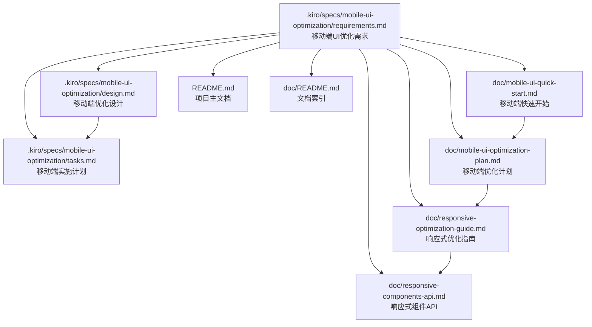

# 移动端UI优化需求文档更新总结

## 📋 更新概述

**更新时间**: 2025年1月27日  
**更新类型**: 新增需求文档和相关文档同步更新  
**影响范围**: 移动端UI优化相关的所有文档

## 🆕 新增文档

### 核心需求文档
- **`.kiro/specs/mobile-ui-optimization/requirements.md`** - 移动端UI优化需求文档
  - 基于对 `https://dev.cuckoox.cn/cases` 页面的深入分析
  - 定义了10个核心需求领域，每个领域包含详细的用户故事和验收标准
  - 涵盖移动端列表展示、触摸交互、搜索筛选、统计适配、导航优化等关键功能
  - 包含性能、可访问性和用户体验的全面要求

## 📝 更新的文档

### 1. README.md
**更新内容**:
- 将"响应式布局优化"部分重命名为"移动端UI优化"
- 添加了基于10个核心需求领域的详细说明
- 更新了当前实现状态，明确区分已完成、进行中和计划中的功能
- 在文档资源部分新增"移动端UI优化文档"分类
- 添加了新需求文档的链接和说明

### 2. doc/README.md (文档索引)
**更新内容**:
- 在"🌐 PWA 和用户体验"部分新增"移动端UI优化"子分类
- 添加了三个核心需求文档的链接和详细说明
- 保持了与现有响应式布局优化文档的关联

### 3. doc/mobile-ui-quick-start.md
**更新内容**:
- 在开头添加了需求概览，说明基于10个核心需求领域
- 更新了"获取帮助"部分，优先推荐新的需求和设计文档
- 保持了实用的快速开始步骤，但增加了需求背景说明

### 4. doc/mobile-ui-optimization-plan.md
**更新内容**:
- 在项目概述中引用了新的需求文档
- 新增"需求基础"部分，详细列出10个核心需求领域
- 在总结部分添加了相关文档链接，形成完整的文档体系

### 5. doc/responsive-optimization-guide.md
**更新内容**:
- 在概述中引用了新的需求文档作为设计基础
- 新增"需求驱动的设计"部分，说明10个核心需求领域
- 在总结部分添加了完整的相关文档链接

### 6. doc/responsive-components-api.md
**更新内容**:
- 在概述中说明组件设计基于详细的需求分析
- 新增"设计原则"部分，列出10个核心需求领域
- 在文档末尾添加了完整的相关文档链接

## 🎯 更新目标

### 1. 建立完整的文档体系
- 新的需求文档作为核心基础文档
- 现有技术文档与需求文档形成有机关联
- 确保开发团队能够从需求到实现的完整追溯

### 2. 提升文档可用性
- 在每个相关文档中都添加了需求文档的引用
- 建立了清晰的文档导航和交叉引用
- 确保开发者能够快速找到所需信息

### 3. 保持文档一致性
- 统一了10个核心需求领域的表述
- 确保所有文档都基于相同的需求基础
- 维护了文档间的逻辑一致性

## 📚 文档关系图

## 🔄 后续维护

### 1. 文档同步
- 当需求文档更新时，需要同步更新所有引用文档
- 保持10个核心需求领域表述的一致性
- 及时更新实现状态和进度信息

### 2. 质量保证
- 定期检查文档链接的有效性
- 确保代码示例与实际实现保持同步
- 收集用户反馈，持续改进文档质量

### 3. 版本管理
- 重要更新时创建文档快照
- 维护文档变更历史
- 确保文档版本与代码版本的对应关系

## ✅ 验证清单

- [x] 新需求文档创建完成，内容详细且结构清晰
- [x] README.md 更新完成，正确引用新文档
- [x] 文档索引更新完成，新增移动端UI优化分类
- [x] 所有相关技术文档都已更新，添加了需求文档引用
- [x] 文档间的交叉引用正确且完整
- [x] 10个核心需求领域在所有文档中表述一致
- [x] 文档链接路径正确，使用了相对路径
- [x] 保持了现有文档的实用性和可操作性

## 📞 联系方式

如有关于此次文档更新的问题或建议，请通过以下方式联系：
- **GitHub Issues**: 提交文档相关问题
- **开发团队**: 技术实现相关讨论
- **产品团队**: 需求理解和优先级讨论

---

*本次更新建立了完整的移动端UI优化文档体系，为开发团队提供了从需求分析到技术实现的全面指导。*