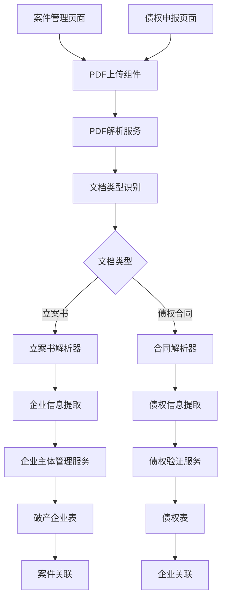
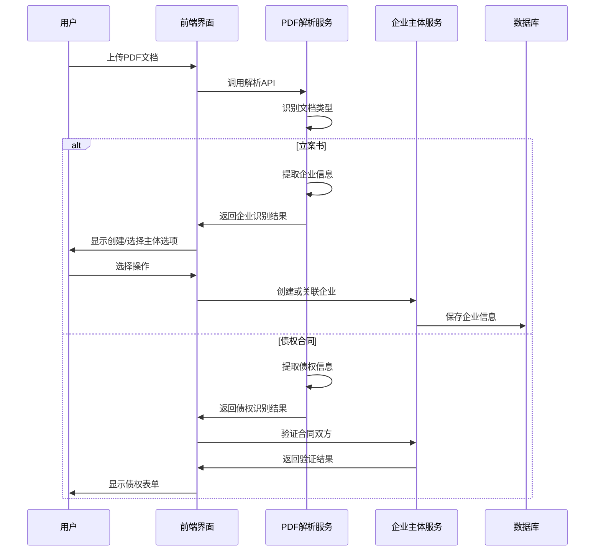

# 破产企业主体管理系统架构文档

## 系统概述

破产企业主体管理系统是CuckooX-Google破产案件管理平台的核心功能模块，通过交互式PDF识别流程，支持从立案书和债权合同中智能识别企业和债权信息，建立企业与案件、债权的关联关系，为破产案件管理提供完整的主体数据支撑。

## 核心架构

### 系统架构图



### 数据流架构



## 数据库设计

### 核心表结构

#### 破产企业表 (bankruptcy_entity)

```sql
-- 破产企业主体表
DEFINE TABLE bankruptcy_entity TYPE NORMAL SCHEMAFULL PERMISSIONS 
  FOR select WHERE $auth.id->has_role->role->can_execute_operation->operation_metadata[WHERE tables CONTAINS 'bankruptcy_entity' AND operation_type = 'read'] OR $auth.id->has_case_role->role->can_execute_operation->operation_metadata[WHERE tables CONTAINS 'bankruptcy_entity' AND operation_type = 'read'],
  FOR create WHERE $auth.id->has_role->role->can_execute_operation->operation_metadata[WHERE tables CONTAINS 'bankruptcy_entity' AND operation_type = 'create'] OR $auth.id->has_case_role->role->can_execute_operation->operation_metadata[WHERE tables CONTAINS 'bankruptcy_entity' AND operation_type = 'create'],
  FOR update WHERE $auth.id->has_role->role->can_execute_operation->operation_metadata[WHERE tables CONTAINS 'bankruptcy_entity' AND operation_type = 'update'] OR $auth.id->has_case_role->role->can_execute_operation->operation_metadata[WHERE tables CONTAINS 'bankruptcy_entity' AND operation_type = 'update'],
  FOR delete WHERE $auth.id->has_role->role->can_execute_operation->operation_metadata[WHERE tables CONTAINS 'bankruptcy_entity' AND operation_type = 'delete'] OR $auth.id->has_case_role->role->can_execute_operation->operation_metadata[WHERE tables CONTAINS 'bankruptcy_entity' AND operation_type = 'delete'];

-- 基本信息字段
DEFINE FIELD name ON bankruptcy_entity TYPE string PERMISSIONS FULL;
DEFINE FIELD unified_social_credit_code ON bankruptcy_entity TYPE option<string> PERMISSIONS FULL;
DEFINE FIELD legal_representative ON bankruptcy_entity TYPE option<string> PERMISSIONS FULL;
DEFINE FIELD registered_address ON bankruptcy_entity TYPE option<string> PERMISSIONS FULL;
DEFINE FIELD business_address ON bankruptcy_entity TYPE option<string> PERMISSIONS FULL;
DEFINE FIELD registered_capital ON bankruptcy_entity TYPE option<decimal> PERMISSIONS FULL;
DEFINE FIELD establishment_date ON bankruptcy_entity TYPE option<datetime> PERMISSIONS FULL;
DEFINE FIELD business_scope ON bankruptcy_entity TYPE option<string> PERMISSIONS FULL;
DEFINE FIELD entity_type ON bankruptcy_entity TYPE string DEFAULT '有限责任公司' PERMISSIONS FULL;
DEFINE FIELD entity_status ON bankruptcy_entity TYPE string DEFAULT '正常' PERMISSIONS FULL;

-- 识别相关字段
DEFINE FIELD source_document_type ON bankruptcy_entity TYPE string ASSERT $value INSIDE ['立案书', '债权合同', '手动创建'] PERMISSIONS FULL;
DEFINE FIELD source_document_id ON bankruptcy_entity TYPE option<record<document>> PERMISSIONS FULL;
DEFINE FIELD recognition_confidence ON bankruptcy_entity TYPE option<decimal> PERMISSIONS FULL;
DEFINE FIELD recognition_data ON bankruptcy_entity TYPE option<object> PERMISSIONS FULL;
DEFINE FIELD is_verified ON bankruptcy_entity TYPE bool DEFAULT false PERMISSIONS FULL;
DEFINE FIELD verified_by ON bankruptcy_entity TYPE option<record<user>> PERMISSIONS FULL;
DEFINE FIELD verified_at ON bankruptcy_entity TYPE option<datetime> PERMISSIONS FULL;

-- 审计字段
DEFINE FIELD created_at ON bankruptcy_entity TYPE datetime DEFAULT time::now() READONLY ASSERT $value != NONE PERMISSIONS FULL;
DEFINE FIELD created_by ON bankruptcy_entity TYPE record<user> DEFAULT $auth.id PERMISSIONS FULL;
DEFINE FIELD updated_at ON bankruptcy_entity TYPE datetime READONLY VALUE time::now() ASSERT $value != NONE PERMISSIONS FULL;
DEFINE FIELD updated_by ON bankruptcy_entity TYPE record<user> VALUE $auth.id PERMISSIONS FULL;

-- 索引定义
DEFINE INDEX bankruptcy_entity_name_idx ON bankruptcy_entity FIELDS name;
DEFINE INDEX bankruptcy_entity_credit_code_idx ON bankruptcy_entity FIELDS unified_social_credit_code UNIQUE;
DEFINE INDEX bankruptcy_entity_legal_rep_idx ON bankruptcy_entity FIELDS legal_representative;
DEFINE INDEX bankruptcy_entity_source_doc_idx ON bankruptcy_entity FIELDS source_document_id;

-- 全文搜索索引
DEFINE ANALYZER entity_search_analyzer TOKENIZERS blank,punct,camel,class FILTERS lowercase,ascii;
DEFINE INDEX bankruptcy_entity_fulltext_name_idx ON bankruptcy_entity FIELDS name SEARCH ANALYZER entity_search_analyzer BM25 HIGHLIGHTS;
DEFINE INDEX bankruptcy_entity_fulltext_address_idx ON bankruptcy_entity FIELDS registered_address SEARCH ANALYZER entity_search_analyzer BM25 HIGHLIGHTS;
```

#### 关系表设计

```sql
-- 案件与破产企业关联关系表 (关系表类型)
DEFINE TABLE has_bankruptcy_entity TYPE RELATION IN case OUT bankruptcy_entity SCHEMAFULL PERMISSIONS 
  FOR select WHERE $auth.id->has_role->role->can_execute_operation->operation_metadata[WHERE tables CONTAINS 'has_bankruptcy_entity' AND operation_type = 'read'] OR $auth.id->has_case_role->role->can_execute_operation->operation_metadata[WHERE tables CONTAINS 'has_bankruptcy_entity' AND operation_type = 'read'],
  FOR create WHERE $auth.id->has_role->role->can_execute_operation->operation_metadata[WHERE tables CONTAINS 'has_bankruptcy_entity' AND operation_type = 'create'] OR $auth.id->has_case_role->role->can_execute_operation->operation_metadata[WHERE tables CONTAINS 'has_bankruptcy_entity' AND operation_type = 'create'],
  FOR update WHERE $auth.id->has_role->role->can_execute_operation->operation_metadata[WHERE tables CONTAINS 'has_bankruptcy_entity' AND operation_type = 'update'] OR $auth.id->has_case_role->role->can_execute_operation->operation_metadata[WHERE tables CONTAINS 'has_bankruptcy_entity' AND operation_type = 'update'],
  FOR delete WHERE $auth.id->has_role->role->can_execute_operation->operation_metadata[WHERE tables CONTAINS 'has_bankruptcy_entity' AND operation_type = 'delete'] OR $auth.id->has_case_role->role->can_execute_operation->operation_metadata[WHERE tables CONTAINS 'has_bankruptcy_entity' AND operation_type = 'delete'];

-- 关系属性字段
DEFINE FIELD relationship_type ON has_bankruptcy_entity TYPE string DEFAULT '主要债务人' ASSERT $value INSIDE ['主要债务人', '关联企业', '担保人'] PERMISSIONS FULL;
DEFINE FIELD associated_at ON has_bankruptcy_entity TYPE datetime DEFAULT time::now() PERMISSIONS FULL;
DEFINE FIELD associated_by ON has_bankruptcy_entity TYPE record<user> DEFAULT $auth.id PERMISSIONS FULL;
DEFINE FIELD is_primary ON has_bankruptcy_entity TYPE bool DEFAULT true PERMISSIONS FULL;
DEFINE FIELD notes ON has_bankruptcy_entity TYPE option<string> PERMISSIONS FULL;

-- 债权与破产企业关联关系表 (关系表类型)
DEFINE TABLE claim_bankruptcy_entity TYPE RELATION IN claim OUT bankruptcy_entity SCHEMAFULL PERMISSIONS 
  FOR select WHERE $auth.id->has_role->role->can_execute_operation->operation_metadata[WHERE tables CONTAINS 'claim_bankruptcy_entity' AND operation_type = 'read'] OR $auth.id->has_case_role->role->can_execute_operation->operation_metadata[WHERE tables CONTAINS 'claim_bankruptcy_entity' AND operation_type = 'read'] OR (in.created_by = $auth.id),
  FOR create WHERE $auth.id->has_role->role->can_execute_operation->operation_metadata[WHERE tables CONTAINS 'claim_bankruptcy_entity' AND operation_type = 'create'] OR $auth.id->has_case_role->role->can_execute_operation->operation_metadata[WHERE tables CONTAINS 'claim_bankruptcy_entity' AND operation_type = 'create'],
  FOR update WHERE $auth.id->has_role->role->can_execute_operation->operation_metadata[WHERE tables CONTAINS 'claim_bankruptcy_entity' AND operation_type = 'update'] OR $auth.id->has_case_role->role->can_execute_operation->operation_metadata[WHERE tables CONTAINS 'claim_bankruptcy_entity' AND operation_type = 'update'],
  FOR delete WHERE $auth.id->has_role->role->can_execute_operation->operation_metadata[WHERE tables CONTAINS 'claim_bankruptcy_entity' AND operation_type = 'delete'] OR $auth.id->has_case_role->role->can_execute_operation->operation_metadata[WHERE tables CONTAINS 'claim_bankruptcy_entity' AND operation_type = 'delete'];

-- 关系属性字段
DEFINE FIELD debt_type ON claim_bankruptcy_entity TYPE string DEFAULT '合同债务' ASSERT $value INSIDE ['合同债务', '侵权债务', '担保债务', '其他债务'] PERMISSIONS FULL;
DEFINE FIELD contract_date ON claim_bankruptcy_entity TYPE option<datetime> PERMISSIONS FULL;
DEFINE FIELD maturity_date ON claim_bankruptcy_entity TYPE option<datetime> PERMISSIONS FULL;
DEFINE FIELD associated_at ON claim_bankruptcy_entity TYPE datetime DEFAULT time::now() PERMISSIONS FULL;
DEFINE FIELD associated_by ON claim_bankruptcy_entity TYPE record<user> DEFAULT $auth.id PERMISSIONS FULL;
```

## 服务层架构

### BankruptcyEntityService

```typescript
interface BankruptcyEntityService {
  // 企业主体管理
  createEntity(entityData: BankruptcyEntityCreateData): Promise<BankruptcyEntity>;
  updateEntity(entityId: string, entityData: BankruptcyEntityUpdateData): Promise<BankruptcyEntity>;
  getEntity(entityId: string): Promise<BankruptcyEntity>;
  searchEntities(searchParams: EntitySearchParams): Promise<BankruptcyEntity[]>;
  
  // 案件关联管理 (使用RELATE语法)
  associateWithCase(entityId: string, caseId: string, relationshipType: string): Promise<void>;
  getCaseEntities(caseId: string): Promise<BankruptcyEntity[]>;
  getEntityCases(entityId: string): Promise<Case[]>;
  updateEntityRelation(caseId: string, entityId: string, relationData: EntityRelationData): Promise<void>;
  removeEntityFromCase(caseId: string, entityId: string): Promise<void>;
  
  // 识别结果处理
  processRecognitionResult(recognitionData: EntityRecognitionData): Promise<EntityProcessResult>;
  verifyEntity(entityId: string, verificationData: EntityVerificationData): Promise<void>;
  
  // 冲突检测
  checkEntityConflicts(entityData: BankruptcyEntityCreateData): Promise<EntityConflictResult>;
  suggestEntityMerge(entityId1: string, entityId2: string): Promise<EntityMergeResult>;
}
```

### PDF解析服务扩展

```typescript
interface ExtendedPDFParseService extends PDFParseService {
  // 文档类型识别
  identifyDocumentType(fileId: string): Promise<DocumentTypeResult>;
  
  // 立案书解析
  parseFilingDocument(fileId: string): Promise<FilingDocumentParseResult>;
  
  // 合同解析
  parseContractDocument(fileId: string): Promise<ContractParseResult>;
  
  // 企业信息提取
  extractEntityInfo(parseResult: ParseResult): Promise<EntityExtractionResult>;
  
  // 债权信息提取
  extractClaimInfo(parseResult: ParseResult): Promise<ClaimExtractionResult>;
}
```

## 前端组件架构

### 核心组件设计

#### EntityRecognitionDialog - 企业识别对话框

```typescript
interface EntityRecognitionDialogProps {
  recognitionResult: EntityRecognitionResult;
  onCreateEntity: (entityData: BankruptcyEntityCreateData) => void;
  onSelectEntity: (entityId: string) => void;
  onCancel: () => void;
}

const EntityRecognitionDialog: React.FC<EntityRecognitionDialogProps> = ({
  recognitionResult,
  onCreateEntity,
  onSelectEntity,
  onCancel
}) => {
  const [selectedAction, setSelectedAction] = useState<'create' | 'select'>('create');
  const [entityFormData, setEntityFormData] = useState(recognitionResult.entityInfo);
  
  return (
    <Dialog open maxWidth="md" fullWidth>
      <DialogTitle>
        企业主体识别结果
        <Chip 
          label={`置信度: ${(recognitionResult.confidence * 100).toFixed(1)}%`}
          color={recognitionResult.confidence > 0.8 ? 'success' : 'warning'}
          size="small"
        />
      </DialogTitle>
      
      <DialogContent>
        <Box sx={{ mb: 2 }}>
          <Typography variant="h6">识别到的企业信息：</Typography>
          <Grid container spacing={2}>
            <Grid size={6}>
              <TextField
                label="企业名称"
                value={entityFormData.name}
                onChange={(e) => setEntityFormData({...entityFormData, name: e.target.value})}
                fullWidth
                variant="outlined"
              />
            </Grid>
            <Grid size={6}>
              <TextField
                label="统一社会信用代码"
                value={entityFormData.unified_social_credit_code || ''}
                onChange={(e) => setEntityFormData({...entityFormData, unified_social_credit_code: e.target.value})}
                fullWidth
                variant="outlined"
              />
            </Grid>
            {/* 更多字段... */}
          </Grid>
        </Box>
        
        <Box sx={{ mb: 2 }}>
          <Typography variant="h6">选择操作：</Typography>
          <RadioGroup
            value={selectedAction}
            onChange={(e) => setSelectedAction(e.target.value as 'create' | 'select')}
          >
            <FormControlLabel value="create" control={<Radio />} label="创建新企业主体" />
            <FormControlLabel value="select" control={<Radio />} label="选择已有企业主体" />
          </RadioGroup>
        </Box>
        
        {selectedAction === 'select' && (
          <EntitySelectionComponent onSelect={onSelectEntity} />
        )}
      </DialogContent>
      
      <DialogActions>
        <Button onClick={onCancel}>取消</Button>
        <Button 
          onClick={() => selectedAction === 'create' ? onCreateEntity(entityFormData) : null}
          variant="contained"
          disabled={selectedAction === 'select'}
        >
          确认
        </Button>
      </DialogActions>
    </Dialog>
  );
};
```

#### EntitySelectionDialog - 企业选择对话框

```typescript
interface EntitySelectionDialogProps {
  entities: BankruptcyEntity[];
  onSelect: (entityId: string) => void;
  onCreateNew: () => void;
  onCancel: () => void;
}

const EntitySelectionDialog: React.FC<EntitySelectionDialogProps> = ({
  entities,
  onSelect,
  onCreateNew,
  onCancel
}) => {
  const [searchTerm, setSearchTerm] = useState('');
  const [selectedEntity, setSelectedEntity] = useState<string | null>(null);
  
  const filteredEntities = entities.filter(entity =>
    entity.name.toLowerCase().includes(searchTerm.toLowerCase()) ||
    entity.unified_social_credit_code?.toLowerCase().includes(searchTerm.toLowerCase())
  );
  
  return (
    <Dialog open maxWidth="md" fullWidth>
      <DialogTitle>选择企业主体</DialogTitle>
      
      <DialogContent>
        <Box sx={{ mb: 2 }}>
          <TextField
            label="搜索企业"
            value={searchTerm}
            onChange={(e) => setSearchTerm(e.target.value)}
            fullWidth
            variant="outlined"
            InputProps={{
              startAdornment: <SearchIcon />
            }}
          />
        </Box>
        
        <List>
          {filteredEntities.map((entity) => (
            <ListItem
              key={entity.id}
              button
              selected={selectedEntity === entity.id}
              onClick={() => setSelectedEntity(entity.id)}
            >
              <ListItemText
                primary={entity.name}
                secondary={
                  <Box>
                    <Typography variant="body2">
                      统一社会信用代码: {entity.unified_social_credit_code || '未知'}
                    </Typography>
                    <Typography variant="body2">
                      法定代表人: {entity.legal_representative || '未知'}
                    </Typography>
                    <Typography variant="body2">
                      注册地址: {entity.registered_address || '未知'}
                    </Typography>
                  </Box>
                }
              />
            </ListItem>
          ))}
        </List>
        
        {filteredEntities.length === 0 && (
          <Box sx={{ textAlign: 'center', py: 4 }}>
            <Typography variant="body1" color="textSecondary">
              未找到匹配的企业主体
            </Typography>
            <Button onClick={onCreateNew} variant="outlined" sx={{ mt: 2 }}>
              创建新企业主体
            </Button>
          </Box>
        )}
      </DialogContent>
      
      <DialogActions>
        <Button onClick={onCancel}>取消</Button>
        <Button onClick={onCreateNew} variant="outlined">创建新主体</Button>
        <Button 
          onClick={() => selectedEntity && onSelect(selectedEntity)}
          variant="contained"
          disabled={!selectedEntity}
        >
          选择
        </Button>
      </DialogActions>
    </Dialog>
  );
};
```

#### CaseMergeDialog - 案件合并对话框

```typescript
interface CaseMergeDialogProps {
  existingCase: Case;
  newCaseData: CaseCreateData;
  onMerge: (mergeStrategy: CaseMergeStrategy) => void;
  onCreateSeparate: () => void;
  onCancel: () => void;
}

const CaseMergeDialog: React.FC<CaseMergeDialogProps> = ({
  existingCase,
  newCaseData,
  onMerge,
  onCreateSeparate,
  onCancel
}) => {
  const [mergeStrategy, setMergeStrategy] = useState<CaseMergeStrategy>({
    action: 'merge_cases'
  });
  
  return (
    <Dialog open maxWidth="md" fullWidth>
      <DialogTitle>
        <WarningIcon color="warning" sx={{ mr: 1 }} />
        检测到案件冲突
      </DialogTitle>
      
      <DialogContent>
        <Alert severity="warning" sx={{ mb: 2 }}>
          该企业主体已存在正在进行中的案件，请选择处理方式。
        </Alert>
        
        <Box sx={{ mb: 3 }}>
          <Typography variant="h6">已存在案件：</Typography>
          <Card sx={{ p: 2, mb: 2 }}>
            <Typography variant="body1"><strong>案件名称：</strong>{existingCase.name}</Typography>
            <Typography variant="body2"><strong>案件编号：</strong>{existingCase.case_number}</Typography>
            <Typography variant="body2"><strong>受理日期：</strong>{existingCase.acceptance_date}</Typography>
            <Typography variant="body2"><strong>当前阶段：</strong>{existingCase.procedure_phase}</Typography>
          </Card>
          
          <Typography variant="h6">新案件信息：</Typography>
          <Card sx={{ p: 2 }}>
            <Typography variant="body1"><strong>案件名称：</strong>{newCaseData.name}</Typography>
            <Typography variant="body2"><strong>案件编号：</strong>{newCaseData.case_number}</Typography>
            <Typography variant="body2"><strong>受理日期：</strong>{newCaseData.acceptance_date}</Typography>
          </Card>
        </Box>
        
        <FormControl component="fieldset">
          <FormLabel component="legend">处理方式：</FormLabel>
          <RadioGroup
            value={mergeStrategy.action}
            onChange={(e) => setMergeStrategy({...mergeStrategy, action: e.target.value as any})}
          >
            <FormControlLabel 
              value="merge_cases" 
              control={<Radio />} 
              label="合并案件（将新案件信息合并到已存在案件）" 
            />
            <FormControlLabel 
              value="create_separate" 
              control={<Radio />} 
              label="创建独立案件（为同一企业创建新的独立案件）" 
            />
            <FormControlLabel 
              value="merge_entities" 
              control={<Radio />} 
              label="仅合并企业主体（使用已存在的企业主体信息）" 
            />
          </RadioGroup>
        </FormControl>
        
        {mergeStrategy.action === 'merge_cases' && (
          <TextField
            label="合并原因"
            value={mergeStrategy.mergeReason || ''}
            onChange={(e) => setMergeStrategy({...mergeStrategy, mergeReason: e.target.value})}
            fullWidth
            multiline
            rows={3}
            sx={{ mt: 2 }}
          />
        )}
      </DialogContent>
      
      <DialogActions>
        <Button onClick={onCancel}>取消</Button>
        <Button onClick={onCreateSeparate} variant="outlined">创建独立案件</Button>
        <Button 
          onClick={() => onMerge(mergeStrategy)}
          variant="contained"
          color="primary"
        >
          确认处理
        </Button>
      </DialogActions>
    </Dialog>
  );
};
```

## 数据模型

### 核心数据类型

```typescript
interface BankruptcyEntity {
  id: string;
  name: string;
  unifiedSocialCreditCode?: string;
  legalRepresentative?: string;
  registeredAddress?: string;
  businessAddress?: string;
  registeredCapital?: number;
  establishmentDate?: Date;
  businessScope?: string;
  entityType: string;
  entityStatus: string;
  sourceDocumentType: '立案书' | '债权合同' | '手动创建';
  sourceDocumentId?: string;
  recognitionConfidence?: number;
  recognitionData?: any;
  isVerified: boolean;
  verifiedBy?: string;
  verifiedAt?: Date;
  createdAt: Date;
  createdBy: string;
  updatedAt: Date;
  updatedBy: string;
}

interface EntityRecognitionResult {
  documentType: '立案书' | '债权合同';
  entityInfo: Partial<BankruptcyEntity>;
  confidence: number;
  extractedFields: ExtractedField[];
  suggestedActions: EntityAction[];
}

interface EntityConflictResult {
  hasConflicts: boolean;
  conflictingEntities: BankruptcyEntity[];
  conflictReasons: string[];
  suggestedResolution: 'merge' | 'create_new' | 'select_existing';
}

interface CaseMergeStrategy {
  action: 'merge_cases' | 'merge_entities' | 'create_separate';
  targetCaseId?: string;
  mergeReason?: string;
}
```

### 解析结果类型

```typescript
interface FilingDocumentParseResult {
  caseInfo: {
    caseName: string;
    caseNumber: string;
    acceptanceDate: Date;
    court: string;
    caseManager: string;
  };
  entityInfo: Partial<BankruptcyEntity>;
  confidence: number;
}

interface ContractParseResult {
  contractInfo: {
    contractAmount: number;
    interestRate: number;
    contractDate: Date;
    maturityDate?: Date;
    contractType: string;
  };
  parties: {
    creditor: Partial<BankruptcyEntity>;
    debtor: Partial<BankruptcyEntity>;
  };
  claimInfo: {
    principal: number;
    interest: number;
    otherAmount?: number;
    totalAmount: number;
    currency: string;
    nature: string;
    briefDescription?: string;
  };
  confidence: number;
}
```

## 智能缓存集成

### 缓存策略配置

破产企业主体管理系统与智能缓存系统深度集成，针对不同数据特征配置优化的缓存策略：

```typescript
// 企业主体数据缓存配置
const entityCacheConfig = {
  bankruptcy_entity: {
    strategy: 'LOCAL_FIRST',
    ttl: 2 * 60 * 60 * 1000, // 2小时
    preload: true,
    consistencyRequirement: 'EVENTUAL'
  },
  has_bankruptcy_entity: {
    strategy: 'HYBRID',
    ttl: 60 * 60 * 1000, // 1小时
    preload: false,
    consistencyRequirement: 'STRONG'
  },
  claim_bankruptcy_entity: {
    strategy: 'REMOTE_FIRST',
    ttl: 30 * 60 * 1000, // 30分钟
    preload: false,
    consistencyRequirement: 'STRONG'
  }
};
```

### 关系查询优化

系统对SurrealDB的关系查询语法进行了特殊优化：

```typescript
// 优化的关系查询缓存
class EntityRelationQueryOptimizer {
  // 案件企业关联查询优化
  async getCaseEntities(caseId: string): Promise<BankruptcyEntity[]> {
    const cacheKey = `case_entities_${caseId}`;
    
    return await this.cacheExecutor.executeWithCache(
      `SELECT *, ->has_bankruptcy_entity.* as relation_info 
       FROM case:${caseId}->has_bankruptcy_entity->bankruptcy_entity
       ORDER BY relation_info.is_primary DESC`,
      {},
      {
        strategy: 'LOCAL_FIRST',
        cacheKey,
        ttl: 60 * 60 * 1000 // 1小时
      }
    );
  }
  
  // 企业案件关联查询优化
  async getEntityCases(entityId: string): Promise<Case[]> {
    const cacheKey = `entity_cases_${entityId}`;
    
    return await this.cacheExecutor.executeWithCache(
      `SELECT *, <-has_bankruptcy_entity.* as relation_info 
       FROM bankruptcy_entity:${entityId}<-has_bankruptcy_entity<-case
       ORDER BY relation_info.associated_at DESC`,
      {},
      {
        strategy: 'HYBRID',
        cacheKey,
        ttl: 30 * 60 * 1000 // 30分钟
      }
    );
  }
}
```

## 安全架构

### 数据安全

1. **敏感信息保护**
   - 企业统一社会信用代码、法定代表人等信息加密存储
   - PDF文档内容在处理后安全删除临时文件
   - 识别结果中的敏感信息进行脱敏处理

2. **访问控制**
   - 基于角色的细粒度权限控制
   - 企业信息访问权限与案件权限关联
   - 审计日志记录所有敏感操作

3. **数据一致性**
   - 企业与案件、债权的关联关系完整性约束
   - 分布式事务确保数据一致性
   - 冲突检测和自动解决机制

### 业务安全

1. **身份验证**
   - 债权合同上传时验证合同双方身份
   - 企业信息修改权限验证
   - 操作审计和异常检测

2. **数据验证**
   - PDF识别结果置信度验证
   - 企业信息格式和完整性验证
   - 重复数据检测和处理

## 性能优化

### 查询性能优化

1. **索引优化**
   - 企业名称、统一社会信用代码等关键字段建立索引
   - 全文搜索索引支持企业信息快速检索
   - 关系查询索引优化

2. **缓存策略**
   - 企业基础信息本地缓存
   - 关系查询结果智能缓存
   - PDF识别结果缓存避免重复处理

3. **查询优化**
   - 批量查询减少数据库访问次数
   - 分页查询支持大数据量处理
   - 异步处理提升用户体验

### 系统性能监控

```typescript
// 性能监控指标
interface EntityManagementMetrics {
  // PDF识别性能
  pdfRecognitionStats: {
    averageProcessingTime: number;
    successRate: number;
    confidenceDistribution: Record<string, number>;
  };
  
  // 查询性能
  queryPerformance: {
    entitySearchTime: number;
    relationQueryTime: number;
    cacheHitRate: number;
  };
  
  // 业务指标
  businessMetrics: {
    entityCreationRate: number;
    conflictDetectionRate: number;
    verificationRate: number;
  };
}
```

## 错误处理和恢复

### 错误类型定义

```typescript
enum EntityManagementErrorCode {
  ENTITY_NOT_FOUND = 'ENTITY_NOT_FOUND',
  DUPLICATE_ENTITY = 'DUPLICATE_ENTITY',
  INVALID_RECOGNITION_DATA = 'INVALID_RECOGNITION_DATA',
  CASE_CONFLICT = 'CASE_CONFLICT',
  VERIFICATION_FAILED = 'VERIFICATION_FAILED',
  PERMISSION_DENIED = 'PERMISSION_DENIED',
  DOCUMENT_TYPE_UNKNOWN = 'DOCUMENT_TYPE_UNKNOWN',
  EXTRACTION_FAILED = 'EXTRACTION_FAILED'
}

interface EntityManagementError {
  code: EntityManagementErrorCode;
  message: string;
  details?: any;
  suggestions?: string[];
}
```

### 错误处理策略

1. **识别失败处理**
   - 提供手动输入选项
   - 记录失败原因用于模型优化
   - 自动重试机制

2. **冲突处理**
   - 提供明确的冲突解决选项
   - 支持用户决策和自动处理
   - 冲突历史记录和分析

3. **系统恢复**
   - 数据备份和恢复机制
   - 事务回滚和数据一致性保证
   - 服务降级和容错处理

## 测试策略

### 单元测试

1. **服务层测试**
   - BankruptcyEntityService各方法功能测试
   - PDF解析扩展功能测试
   - 数据验证和转换测试

2. **组件测试**
   - 企业识别对话框交互测试
   - 企业选择组件功能测试
   - 案件合并对话框测试

### 集成测试

1. **PDF识别流程测试**
   - 立案书识别完整流程
   - 债权合同识别完整流程
   - 错误处理流程测试

2. **数据库集成测试**
   - 企业主体CRUD操作测试
   - 关联关系管理测试
   - 权限控制测试

### 端到端测试

1. **用户场景测试**
   - 案件管理人上传立案书创建企业
   - 债权人上传合同申报债权
   - 企业信息查看和管理

2. **性能测试**
   - 大文件PDF解析性能
   - 批量企业处理性能
   - 并发用户操作测试

## 部署和运维

### 部署架构

1. **微服务部署**
   - PDF解析服务独立部署
   - 企业主体管理服务独立部署
   - 数据库服务高可用部署

2. **容器化部署**
   - Docker容器化部署
   - Kubernetes集群管理
   - 自动扩缩容配置

### 监控和告警

1. **系统监控**
   - 服务健康状态监控
   - 性能指标监控
   - 错误率和响应时间监控

2. **业务监控**
   - PDF识别成功率监控
   - 企业创建和验证率监控
   - 用户操作行为分析

### 运维工具

1. **管理工具**
   - 企业信息批量导入工具
   - 数据清理和修复工具
   - 性能分析和优化工具

2. **调试工具**
   - PDF识别结果调试工具
   - 缓存状态检查工具
   - 数据一致性检查工具

---

*本架构文档将随着系统的发展持续更新，确保技术架构与业务需求保持一致。*