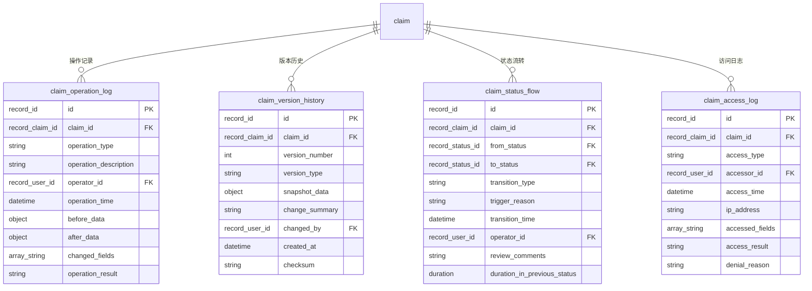
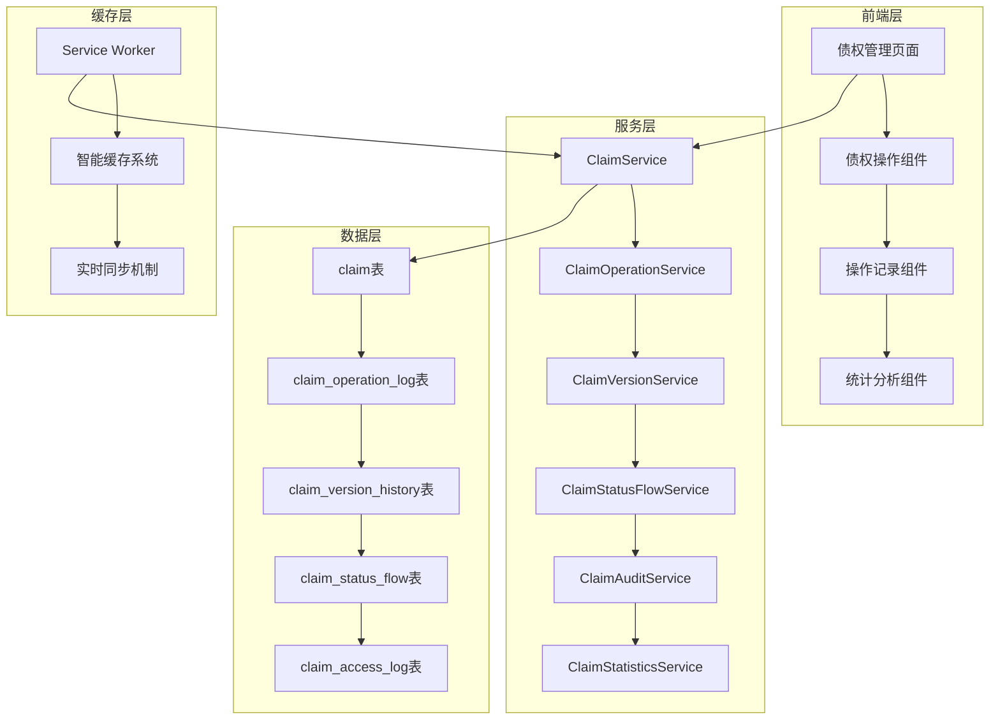

# 债权申报操作记录追踪系统架构文档

## 系统概述

债权申报操作记录追踪系统是CuckooX-Google破产案件管理平台的重要功能模块，旨在提供完整的债权生命周期管理和操作记录追踪能力。系统支持从债权创建、修改、提交、审核到最终确认的全流程操作记录，确保债权处理过程的透明性、可追溯性和合规性。

## 核心功能特性

### 🔍 操作历史记录
- **全生命周期追踪**: 记录债权从创建到最终确认的所有操作
- **详细操作信息**: 包含操作类型、操作人、时间、数据变更等完整信息
- **数据变更对比**: 记录操作前后的具体字段差异
- **附件变更追踪**: 记录附件上传、删除等文件操作

### 📊 状态流转管理
- **状态变更记录**: 完整记录债权状态的每次变更
- **流转原因追踪**: 记录状态变更的触发原因和相关说明
- **审核意见管理**: 保存审核员的审核意见和驳回原因
- **流转时长统计**: 计算债权在各状态的停留时间

### 📝 版本控制系统
- **数据快照保存**: 每次重要操作都保存完整的数据快照
- **版本对比功能**: 支持任意两个版本之间的字段级差异对比
- **版本回溯支持**: 可查看任意历史时点的债权数据状态
- **校验和验证**: 确保历史数据的完整性和一致性

### 🔐 权限审计追踪
- **访问日志记录**: 记录所有用户对债权数据的访问行为
- **敏感操作审计**: 对删除、批量修改等敏感操作进行详细记录
- **权限验证日志**: 记录权限检查结果和拒绝原因
- **异常行为检测**: 识别和记录异常访问模式

## 技术架构设计

### 数据层架构

#### 核心数据表结构



#### 数据库权限控制

系统基于SurrealDB的原生权限系统，实现细粒度的数据访问控制：

```sql
-- 操作日志表权限示例
DEFINE TABLE claim_operation_log TYPE NORMAL SCHEMAFULL PERMISSIONS 
  FOR select WHERE $auth.id->has_role->role->can_execute_operation->operation_metadata[WHERE tables CONTAINS 'claim_operation_log' AND operation_type = 'read'],
  FOR create WHERE $auth.id->has_role->role->can_execute_operation->operation_metadata[WHERE tables CONTAINS 'claim_operation_log' AND operation_type = 'create'],
  FOR update NONE,
  FOR delete WHERE $auth.id->has_role->role.name CONTAINS 'admin';
```

### 服务层架构

#### 核心服务组件



#### 服务接口设计

**ClaimOperationService** - 操作记录服务
```typescript
interface ClaimOperationService {
  // 记录操作日志
  logOperation(params: LogOperationParams): Promise<void>;
  
  // 获取操作历史
  getOperationHistory(claimId: string, options?: QueryOptions): Promise<ClaimOperationLog[]>;
  
  // 获取操作统计
  getOperationStatistics(params: StatisticsParams): Promise<OperationStatistics>;
}
```

**ClaimVersionService** - 版本控制服务
```typescript
interface ClaimVersionService {
  // 创建版本快照
  createVersionSnapshot(params: VersionSnapshotParams): Promise<ClaimVersionHistory>;
  
  // 获取版本历史
  getVersionHistory(claimId: string): Promise<ClaimVersionHistory[]>;
  
  // 版本对比
  compareVersions(params: CompareVersionsParams): Promise<VersionDiff>;
  
  // 恢复到指定版本
  revertToVersion(params: RevertVersionParams): Promise<void>;
}
```

### 前端组件架构

#### 核心UI组件

**ClaimOperationHistory** - 操作历史组件
```typescript
interface ClaimOperationHistoryProps {
  claimId: string;
  showFilters?: boolean;
  maxHeight?: number;
  onOperationClick?: (operation: ClaimOperationLog) => void;
}
```

**ClaimVersionComparison** - 版本对比组件
```typescript
interface ClaimVersionComparisonProps {
  claimId: string;
  fromVersion: number;
  toVersion: number;
  onClose: () => void;
}
```

**ClaimStatusFlowChart** - 状态流转图表组件
```typescript
interface ClaimStatusFlowChartProps {
  claimId: string;
  interactive?: boolean;
  showTimeline?: boolean;
}
```

## 缓存策略集成

### 智能缓存配置

系统与现有的智能缓存系统深度集成，提供优化的数据访问性能：

```typescript
const claimTrackingCacheConfig = {
  tables: ['claim_operation_log', 'claim_version_history', 'claim_status_flow'],
  strategy: 'HYBRID',
  ttl: 300000, // 5分钟
  preload: true,
  subscriptions: {
    'claim_operation_log': {
      condition: 'claim_id = $current_claim_id',
      autoRefresh: true,
      refreshInterval: 30000
    },
    'claim_version_history': {
      condition: 'claim_id = $current_claim_id',
      autoRefresh: false
    },
    'claim_status_flow': {
      condition: 'claim_id = $current_claim_id',
      autoRefresh: true,
      refreshInterval: 60000
    }
  }
};
```

### 实时同步机制

```typescript
class ClaimTrackingSync {
  async handleClaimOperationUpdate(data: any) {
    // 更新本地缓存
    await this.updateLocalCache('claim_operation_log', data);
    
    // 通知相关页面
    await this.notifyPages('claim_operation_updated', {
      claimId: data.claim_id,
      operationType: data.operation_type
    });
    
    // 触发相关统计更新
    await this.updateStatisticsCache(data.claim_id);
  }
}
```

## 通知系统集成

### 通知触发规则

系统集成现有的业务通知服务，支持多种通知场景：

```typescript
const notificationRules = {
  'claim_submitted': {
    recipients: ['case_lead', 'claim_reviewers'],
    template: 'claim_submitted_notification',
    priority: 'NORMAL'
  },
  'claim_approved': {
    recipients: ['claim_creator'],
    template: 'claim_approved_notification',
    priority: 'HIGH'
  },
  'claim_rejected': {
    recipients: ['claim_creator'],
    template: 'claim_rejected_notification',
    priority: 'HIGH'
  }
};
```

### 通知模板系统

```typescript
const notificationTemplates = {
  claim_submitted_notification: {
    title: '新债权申报提交 - {claim_number}',
    content: '债权人 {creditor_name} 提交了新的债权申报，请及时审核。',
    actionLink: '/claims/{claim_id}/review'
  },
  claim_approved_notification: {
    title: '债权审核通过 - {claim_number}',
    content: '您的债权申报已审核通过。',
    actionLink: '/my-claims/{claim_id}'
  }
};
```

## 性能优化策略

### 查询优化

#### 索引策略
```sql
-- 操作日志查询优化索引
DEFINE INDEX claim_operation_claim_time_idx ON claim_operation_log FIELDS claim_id, operation_time DESC;
DEFINE INDEX claim_operation_operator_idx ON claim_operation_log FIELDS operator_id, operation_time DESC;
DEFINE INDEX claim_operation_type_idx ON claim_operation_log FIELDS operation_type, operation_time DESC;

-- 版本历史查询优化索引
DEFINE INDEX claim_version_claim_version_idx ON claim_version_history FIELDS claim_id, version_number UNIQUE;
DEFINE INDEX claim_version_claim_time_idx ON claim_version_history FIELDS claim_id, created_at DESC;
```

#### 分页查询优化
```typescript
const getOperationHistoryOptimized = async (claimId: string, options: {
  page: number;
  pageSize: number;
  operationType?: string;
}) => {
  const offset = (options.page - 1) * options.pageSize;
  
  let whereClause = 'claim_id = $claimId';
  const params: any = { claimId, limit: options.pageSize, offset };
  
  if (options.operationType) {
    whereClause += ' AND operation_type = $operationType';
    params.operationType = options.operationType;
  }
  
  const query = `
    SELECT * FROM claim_operation_log 
    WHERE ${whereClause}
    ORDER BY operation_time DESC
    LIMIT $limit START $offset
  `;
  
  return await queryWithAuth(query, params);
};
```

### 数据归档策略

```sql
-- 历史数据归档事件
DEFINE EVENT archive_old_operation_logs ON DATABASE WHEN time::now() > time::now() - 1y THEN {
  -- 归档一年前的操作日志
  CREATE claim_operation_log_archive SELECT * FROM claim_operation_log 
  WHERE operation_time < time::now() - 1y;
  
  DELETE FROM claim_operation_log 
  WHERE operation_time < time::now() - 1y;
};
```

## 安全性设计

### 数据脱敏

```typescript
const sensitiveFields = ['creditor_legal_id', 'contact_phone', 'contact_email'];

const sanitizeLogData = (data: any): any => {
  const sanitized = { ...data };
  
  sensitiveFields.forEach(field => {
    if (sanitized[field]) {
      sanitized[field] = maskSensitiveData(sanitized[field]);
    }
  });
  
  return sanitized;
};
```

### 访问控制

```typescript
const checkOperationLogAccess = async (userId: string, claimId: string): Promise<boolean> => {
  // 检查用户是否有权限查看该债权的操作日志
  const hasPermission = await permissionService.checkClaimAccess(userId, claimId, 'read_operation_log');
  
  if (!hasPermission) {
    await auditService.logAccess({
      claimId,
      accessType: 'view',
      accessResult: 'denied',
      denialReason: 'insufficient_permissions'
    });
  }
  
  return hasPermission;
};
```

## 统计分析功能

### 处理效率统计

```typescript
interface ProcessingEfficiencyStats {
  averageProcessingTime: number;
  medianProcessingTime: number;
  processingTimeByStatus: Record<string, number>;
  bottleneckAnalysis: BottleneckInfo[];
}
```

### 审核质量统计

```typescript
interface ReviewQualityStats {
  firstPassRate: number;
  rejectionRate: number;
  averageReviewCycles: number;
  reviewerPerformance: ReviewerStats[];
}
```

### 工作量统计

```typescript
interface WorkloadStats {
  totalClaimsProcessed: number;
  claimsProcessedByReviewer: Record<string, number>;
  averageClaimsPerDay: number;
  workloadDistribution: WorkloadDistribution[];
}
```

## 错误处理和恢复

### 操作失败处理

```typescript
class ClaimOperationHandler {
  async executeWithLogging<T>(
    operation: () => Promise<T>,
    logParams: LogParams
  ): Promise<T> {
    const startTime = Date.now();
    let result: T;
    let error: Error | null = null;
    
    try {
      result = await operation();
      
      // 记录成功操作
      await this.logOperation({
        ...logParams,
        operationResult: 'success',
        operationDetails: {
          duration: Date.now() - startTime
        }
      });
      
      return result;
    } catch (err) {
      error = err as Error;
      
      // 记录失败操作
      await this.logOperation({
        ...logParams,
        operationResult: 'failed',
        errorMessage: error.message,
        operationDetails: {
          duration: Date.now() - startTime,
          stackTrace: error.stack
        }
      });
      
      throw error;
    }
  }
}
```

## 测试策略

### 单元测试

```typescript
describe('ClaimOperationService', () => {
  test('should log operation correctly', async () => {
    const service = new ClaimOperationService(mockClient);
    
    await service.logOperation({
      claimId: 'claim:test',
      operationType: 'submit',
      description: '提交债权申报',
      beforeData: { status: 'draft' },
      afterData: { status: 'submitted' }
    });
    
    expect(mockClient.query).toHaveBeenCalledWith(
      expect.stringContaining('CREATE claim_operation_log'),
      expect.objectContaining({
        claimId: 'claim:test',
        operationType: 'submit'
      })
    );
  });
});
```

### 集成测试

```typescript
describe('Claim Operation Tracking Integration', () => {
  test('should track complete claim lifecycle', async () => {
    // 创建债权
    const claim = await claimService.createClaim(mockClaimData);
    
    // 验证创建操作被记录
    const createLog = await operationService.getOperationHistory(claim.id);
    expect(createLog[0].operationType).toBe('create');
    
    // 提交债权
    await claimService.submitClaim(claim.id);
    
    // 验证提交操作被记录
    const submitLog = await operationService.getOperationHistory(claim.id);
    expect(submitLog[0].operationType).toBe('submit');
    
    // 验证状态流转被记录
    const statusFlow = await statusFlowService.getStatusFlowHistory(claim.id);
    expect(statusFlow).toHaveLength(2); // 创建 + 提交
  });
});
```

## 部署和维护

### 数据库迁移

```sql
-- 创建操作追踪相关表的迁移脚本
BEGIN TRANSACTION;

-- 创建操作日志表
DEFINE TABLE claim_operation_log TYPE NORMAL SCHEMAFULL;
-- ... 完整的表定义

-- 创建版本历史表
DEFINE TABLE claim_version_history TYPE NORMAL SCHEMAFULL;
-- ... 完整的表定义

-- 创建状态流转表
DEFINE TABLE claim_status_flow TYPE NORMAL SCHEMAFULL;
-- ... 完整的表定义

-- 创建访问日志表
DEFINE TABLE claim_access_log TYPE NORMAL SCHEMAFULL;
-- ... 完整的表定义

COMMIT TRANSACTION;
```

### 监控和告警

```typescript
// 性能监控指标
const performanceMetrics = {
  operationLogWriteLatency: 'avg_operation_log_write_time',
  versionSnapshotSize: 'avg_version_snapshot_size',
  queryResponseTime: 'avg_query_response_time',
  cacheHitRate: 'operation_tracking_cache_hit_rate'
};

// 告警规则
const alertRules = {
  highOperationLogWriteLatency: {
    threshold: 1000, // 1秒
    action: 'notify_admin'
  },
  lowCacheHitRate: {
    threshold: 0.5, // 50%
    action: 'optimize_cache_strategy'
  }
};
```

## 未来扩展规划

### 机器学习集成

- **异常检测**: 基于历史操作模式检测异常行为
- **智能推荐**: 根据操作历史推荐最佳处理方案
- **预测分析**: 预测债权处理时间和可能的问题

### 高级分析功能

- **操作模式分析**: 识别用户操作习惯和效率瓶颈
- **质量趋势分析**: 分析审核质量的长期趋势
- **自动化建议**: 基于数据分析提供流程优化建议

### 集成扩展

- **外部系统集成**: 与法院系统、银行系统等外部系统的操作记录同步
- **API开放**: 提供标准化API供第三方系统集成
- **数据导出**: 支持更多格式的数据导出和报告生成

## 当前实现状态

### 🔄 数据库表结构 (20% 完成)
- ✅ **claim表优化**: 已添加版本控制字段 (`current_version`, `last_operation_time`, `operation_count`)
- ✅ **索引创建**: 已创建版本控制相关索引 (`claim_version_idx`, `claim_last_operation_idx`)
- ❌ **追踪表创建**: 4个核心追踪表 (`claim_operation_log`, `claim_version_history`, `claim_status_flow`, `claim_access_log`) 待实现

### 🔄 服务层实现 (60% 完成)
- ✅ **类型定义**: 完整的TypeScript类型定义已创建 (`src/types/claimTracking.ts`)
- ✅ **核心服务**: 4个核心服务类已实现
  - `ClaimOperationService` - 操作记录服务
  - `ClaimVersionService` - 版本控制服务  
  - `ClaimStatusFlowService` - 状态流转服务
  - `ClaimAuditService` - 审计服务
- ✅ **单元测试**: 对应的测试文件已创建
- ❌ **服务集成**: 现有ClaimService的操作追踪集成待完成

### 🔄 前端组件 (75% 完成)
- ✅ **操作历史组件**: `ClaimOperationHistory` 已实现
- ✅ **版本对比组件**: `ClaimVersionComparison` 已实现
- ✅ **状态流转图表**: `ClaimStatusFlowChart` 已实现
- ❌ **审计日志组件**: `ClaimAuditLog` 进行中

### 📋 系统集成 (0% 完成)
- ❌ **缓存系统集成**: 债权追踪数据的智能缓存配置待实现
- ❌ **通知系统集成**: 状态变更通知机制待实现（暂缓实施）
- ❌ **权限系统集成**: 操作追踪数据的权限控制待实现（暂缓实施）

### 下一步计划
1. **优先级1**: 完成数据库表结构创建，使服务层能够正常工作
2. **优先级2**: 完成ClaimAuditLog组件实现
3. **优先级3**: 在现有ClaimService中集成操作追踪功能
4. **优先级4**: 完成缓存系统集成，实现完整的功能体验

---

*本文档描述了债权申报操作记录追踪系统的完整技术架构，为系统开发、部署和维护提供详细的技术指导。*