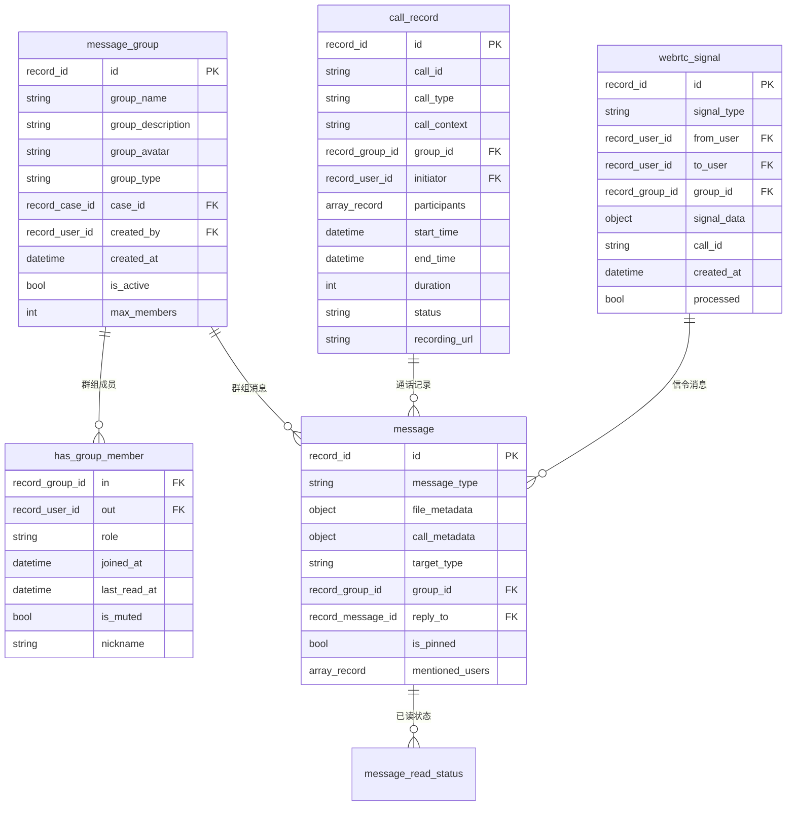
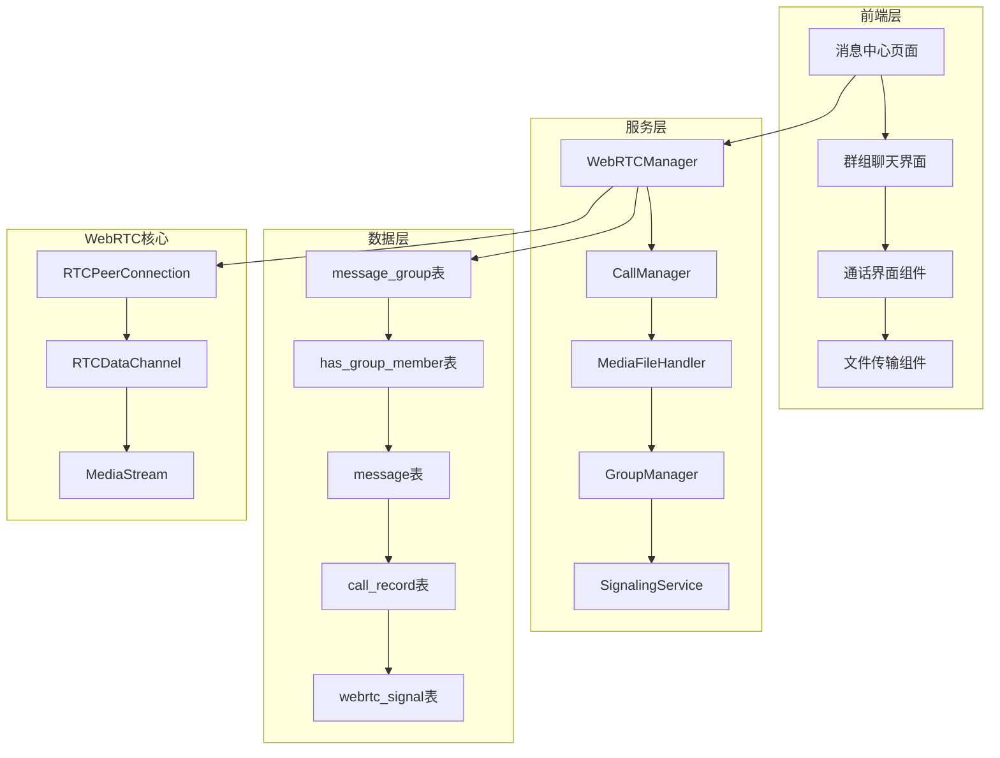

# WebRTC消息中心系统开发状态

## 系统概述

WebRTC消息中心系统是CuckooX-Google破产案件管理平台的重要功能模块，旨在为用户提供完整的实时通信解决方案。系统支持多媒体文件传输、实时音视频通话、群组协作和多人会议等功能，增强用户在破产案件管理过程中的沟通协作能力。

## 核心功能特性

### 🔍 多媒体文件传输
- **P2P直传**: 基于RTCDataChannel的文件分片传输，支持图片、视频、音频文件
- **文件预处理**: 图片压缩、缩略图生成、文件类型验证等预处理功能
- **传输进度**: 实时传输进度监控和状态管理
- **文件预览**: 在线预览和下载功能

### 📞 实时音视频通话
- **私聊通话**: 支持一对一的语音和视频通话
- **群组通话**: 支持群组内的多人音视频会议
- **媒体控制**: 摄像头开关、麦克风静音、屏幕共享等功能
- **通话质量**: 根据网络状况自动调整媒体质量

### 👥 群组协作功能
- **群组管理**: 群组创建、成员管理、权限控制
- **群组消息**: @提及、消息置顶、已读状态管理
- **群组类型**: 普通群组、案件相关群组、部门群组
- **成员权限**: 群主、管理员、普通成员三级权限体系

### 🎥 多人会议支持
- **会议创建**: 支持最多8人同时进行视频会议
- **会议管理**: 参与者管理、会议录制、屏幕共享
- **会议邀请**: 会议邀请发送、接收、响应功能
- **会议控制**: 静音所有参与者、踢出参与者等管理功能

### 📱 移动端适配
- **文件选择**: 支持从相机、相册、文件管理器选择文件
- **通话适配**: 前后摄像头切换、横竖屏适配、蓝牙耳机支持
- **后台通话**: 应用后台时保持通话连接和悬浮窗口
- **网络切换**: WiFi/4G/5G网络切换时的自动重连

### 🌐 网络适应性
- **质量调整**: 根据网络带宽自动调整视频质量和帧率
- **连接优化**: P2P优先，TURN服务器中继备用的混合架构
- **错误处理**: 网络异常时的自动重连和状态同步
- **诊断工具**: 网络质量检测和优化建议

## 技术架构设计

### 数据层架构

#### 核心数据表结构

### 服务层架构

#### 核心服务组件

## 📊 当前实现状态

### 🔄 需求分析和设计 (100% 完成)

**完成时间**: 2025年1月31日

**文档位置**: 
- `.kiro/specs/250806-webrtc-message-center/requirements.md`
- `.kiro/specs/250806-webrtc-message-center/design.md`
- `.kiro/specs/250806-webrtc-message-center/tasks.md`

**核心需求领域**:
1. **多媒体文件传输** - 图片、视频、音频文件的发送和预览功能
2. **实时语音通话** - 一对一语音通话和通话控制功能
3. **实时视频通话** - 视频通话、摄像头控制、屏幕共享功能
4. **多人会议功能** - 群组会议、参与者管理、会议录制功能
5. **权限管理控制** - WebRTC功能权限和设置管理
6. **移动端适配** - 移动设备上的WebRTC功能支持
7. **网络适应性** - 不同网络环境下的通信质量保证

**设计完成内容**:
- **技术栈选择**: WebRTC API、SurrealDB Live Query信令、VP8/VP9编解码
- **组件架构**: WebRTCManager、CallManager、GroupManager等核心组件设计
- **数据模型**: 群组表、消息表扩展、通话记录表等完整设计
- **群组功能**: 群组类型、权限控制、消息路由策略详细设计
- **移动端适配**: 触摸友好界面、横竖屏切换、后台通话支持
- **网络优化**: P2P优先、TURN中继、质量自适应策略

### 🔄 数据库表结构设计 (100% 完成)

**设计状态**: 完整的数据库表结构已在设计文档中定义

**核心表结构**:
- ✅ **message_group表**: 群组基本信息表，支持多种群组类型
- ✅ **has_group_member关联表**: 群组成员关系表，支持角色权限管理
- ✅ **message表扩展**: 扩展现有消息表支持群组消息和多媒体类型
- ✅ **message_read_status表**: 群组消息已读状态管理表
- ✅ **call_record表**: 通话记录表，支持私聊和群组通话记录
- ✅ **webrtc_signal表**: WebRTC信令消息表
- ✅ **user_webrtc_status表**: 用户WebRTC在线状态表

**权限控制设计**:
- 基于SurrealDB原生权限系统的细粒度访问控制
- 群组成员只能查看自己的群组关系
- 管理员可以管理所有群组关系
- 案件相关群组权限与案件角色权限联动

### 🔄 任务分解和规划 (100% 完成)

**任务分解**: 12个主要任务模块，40+个具体实施任务

**主要任务模块**:
1. **WebRTC数据库架构和配置管理** - 数据表创建和配置服务实现
2. **WebRTC核心管理器和信令服务** - 核心WebRTC功能实现
3. **P2P文件传输功能** - 多媒体文件传输实现
4. **语音通话功能** - 实时语音通话实现
5. **视频通话功能** - 视频通话和屏幕共享实现
6. **多人会议功能** - 群组会议和管理功能实现
7. **群组功能** - 群组管理和协作功能实现
8. **消息中心界面集成** - 现有界面的WebRTC功能集成
9. **移动端适配和优化** - 移动设备支持和优化
10. **网络适应性和错误处理** - 网络优化和异常处理
11. **权限管理和安全控制** - 权限系统集成和安全控制
12. **测试用例编写** - 完整的测试覆盖

**需求映射**: 每个任务都明确映射到具体的需求条目，确保完整覆盖

### 📋 核心实现 (0% 完成)

**当前状态**: 所有核心功能待实现

**待实现组件**:
- ❌ **WebRTC核心服务**: WebRTCManager、CallManager、MediaFileHandler、SignalingService
- ❌ **群组管理服务**: GroupManager群组管理器
- ❌ **前端界面组件**: GroupChatInterface、AudioCallInterface、VideoCallInterface等
- ❌ **数据库表实现**: 需要在surreal_schemas.surql中添加设计的表结构
- ❌ **配置管理**: RTCConfigService配置管理服务
- ❌ **移动端适配**: 移动端专用组件和优化
- ❌ **网络优化**: 网络适应性和错误处理机制
- ❌ **权限集成**: WebRTC功能的权限控制集成
- ❌ **测试覆盖**: 单元测试、集成测试、端到端测试

## 🎯 里程碑和时间线

### 第一阶段：基础设施建设 (2025年2月)

**目标**: 完成数据库表结构和WebRTC核心服务实现

**关键里程碑**:
- 2025年2月7日: WebRTC数据库表结构创建完成
- 2025年2月14日: WebRTC核心管理器和信令服务50%完成
- 2025年2月21日: P2P文件传输功能完成
- 2025年2月28日: 语音通话功能基本实现

### 第二阶段：核心功能开发 (2025年3月)

**目标**: 完成视频通话、群组功能和界面组件实现

**关键里程碑**:
- 2025年3月7日: 视频通话功能完成
- 2025年3月14日: 多人会议功能完成
- 2025年3月21日: 群组功能完整实现
- 2025年3月28日: 消息中心界面集成完成

### 第三阶段：优化和完善 (2025年4月)

**目标**: 移动端适配、网络优化和权限集成

**关键里程碑**:
- 2025年4月7日: 移动端适配完成
- 2025年4月14日: 网络适应性和错误处理完成
- 2025年4月21日: 权限管理和安全控制完成
- 2025年4月30日: 测试用例编写和系统测试完成

## 🚨 风险和挑战

### 技术风险

1. **WebRTC兼容性风险**
   - **风险**: 不同浏览器和设备的WebRTC API兼容性问题
   - **缓解措施**: 使用标准WebRTC API，实施全面的兼容性测试

2. **P2P连接建立风险**
   - **风险**: 防火墙和NAT环境下的P2P连接失败
   - **缓解措施**: 实施TURN服务器中继机制，确保连接可靠性

3. **媒体质量控制风险**
   - **风险**: 网络波动导致的音视频质量问题
   - **缓解措施**: 实施自适应码率和质量降级机制

### 业务风险

1. **用户体验风险**
   - **风险**: 复杂的WebRTC功能可能影响用户体验
   - **缓解措施**: 进行充分的用户体验测试和界面优化

2. **性能影响风险**
   - **风险**: WebRTC功能可能影响整体系统性能
   - **缓解措施**: 实施性能监控和资源管理机制

### 项目风险

1. **开发复杂度风险**
   - **风险**: WebRTC技术复杂度高，开发时间可能超出预期
   - **缓解措施**: 采用分阶段开发，优先实现核心功能

2. **集成风险**
   - **风险**: 与现有系统的集成可能遇到兼容性问题
   - **缓解措施**: 早期进行集成测试，及时发现和解决问题

## 📈 成功指标

### 功能完整性指标

- [ ] 7个核心需求100%实现
- [ ] 12个主要任务模块100%完成
- [ ] 单元测试覆盖率 > 90%
- [ ] 集成测试通过率 100%

### 性能指标

- [ ] P2P文件传输成功率 > 95%
- [ ] 音视频通话连接成功率 > 98%
- [ ] 群组消息实时同步延迟 < 100ms
- [ ] 移动端通话质量满意度 > 4.5/5

### 用户体验指标

- [ ] 用户满意度 > 4.5/5
- [ ] 功能使用率 > 80%
- [ ] 用户反馈问题 < 5个/月
- [ ] 培训时间 < 1小时

## 📞 联系和支持

### 开发团队

- **项目负责人**: WebRTC系统架构师
- **前端开发**: WebRTC界面和组件开发
- **后端开发**: 信令服务和数据库开发
- **测试工程师**: WebRTC功能测试和质量保证

### 沟通渠道

- **日常沟通**: 开发团队内部会议
- **进度汇报**: 每周项目状态报告
- **问题反馈**: GitHub Issues
- **技术讨论**: WebRTC技术评审会议

## 📊 当前实现状态总览

### 🔄 需求分析和设计 (100% 完成)
- ✅ **需求文档**: 7个核心需求领域，包含完整的用户故事和验收标准
- ✅ **技术设计**: 完整的架构设计、组件接口、数据模型设计
- ✅ **任务分解**: 12个主要任务模块，40+个具体实施任务

### 🔄 数据库设计 (100% 完成)
- ✅ **群组表设计**: message_group、has_group_member关联表结构完整
- ✅ **消息表扩展**: 支持群组消息、多媒体类型、@提及功能
- ✅ **通话记录表**: call_record、webrtc_signal表设计完成
- ✅ **权限控制**: 基于SurrealDB的细粒度权限控制设计

### 📋 核心实现 (0% 完成)
- ❌ **WebRTC核心服务**: WebRTCManager、CallManager、MediaFileHandler待实现
- ❌ **群组管理服务**: GroupManager群组管理器待实现
- ❌ **前端界面组件**: 所有WebRTC相关界面组件待实现
- ❌ **数据库表实现**: 需要在surreal_schemas.surql中添加表结构
- ❌ **系统集成**: 与现有消息系统的集成待实现

### 🎯 下一步计划
1. **优先级1**: 完成数据库表结构实现，在surreal_schemas.surql中添加设计的表
2. **优先级2**: 实现WebRTC核心管理器和信令服务
3. **优先级3**: 实现群组管理器和基础群组功能
4. **优先级4**: 开发P2P文件传输和语音通话功能

### ⚠️ 重要说明
WebRTC消息中心系统目前处于设计完成阶段，所有需求分析、技术设计和任务分解已完成。系统设计采用了现代化的WebRTC技术栈，与现有系统架构深度集成，确保了技术可行性和扩展性。下一步将进入核心功能实现阶段，预计在2025年4月底完成整个系统的开发和测试。

---

*本文档将随着项目进展持续更新，确保所有相关人员了解最新的开发状态和计划。*